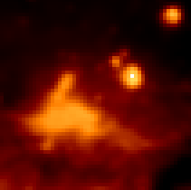

.. _astropy_convolve:

*************************************************
Convolution and filtering (`astropy.convolution`)
*************************************************

Introduction
============

`astropy.convolution` provides convolution functions and kernels that offers
improvements compared to the scipy `scipy.ndimage` convolution routines,
including:

* Proper treatment of NaN values

* A single function for 1-D, 2-D, and 3-D convolution

* Improved options for the treatment of edges

* Both direct and Fast Fourier Transform (FFT) versions

* Built-in kernels that are commonly used in Astronomy

The following thumbnails show the difference between Scipy's and
Astropy's convolve functions on an Astronomical image that contains NaN
values. Scipy's function essentially returns NaN for all pixels that are
within a kernel of any NaN value, which is often not the desired result.

.. |original| image:: images/original.png
.. |scipy| image:: images/scipy.png

+------------+--------------------+----------------------+
| Original   | Scipy ``convolve`` | Astropy ``convolve`` |
+------------+--------------------+----------------------+
| |original| | |scipy|            | |astropy|            |
+------------+--------------------+----------------------+

The following sections describe how to make use of the convolution functions,
and how to use built-in convolution kernels:

Getting started
===============

Two convolution functions are provided.  They are imported as::

    from astropy.convolution import convolve, convolve_fft

and are both used as::

    result = convolve(image, kernel)
    result = convolve_fft(image, kernel)

:func:`~astropy.convolution.convolve` is implemented as a
direct convolution algorithm, while
:func:`~astropy.convolution.convolve_fft` uses a fast Fourier
transform (FFT). Thus, the former is better for small kernels, while the latter
is much more efficient for larger kernels.

For example, to convolve a 1-d dataset with a user-specified kernel, you can do::

    >>> from astropy.convolution import convolve
    >>> convolve([1, 4, 5, 6, 5, 7, 8], [0.2, 0.6, 0.2])
    array([ 1.4,  3.6,  5. ,  5.6,  5.6,  6.8,  6.2])

Notice that the end points are set to zero - by default, points that are too
close to the boundary to have a convolved value calculated are set to zero.
However, the :func:`~astropy.convolution.convolve` function allows for a
``boundary`` argument that can be used to specify alternate behaviors. For
example, setting ``boundary='extend'`` causes values near the edges to be
computed, assuming the original data is simply extended using a constant
extrapolation beyond the boundary::

    >>> from astropy.convolution import convolve
    >>> convolve([1, 4, 5, 6, 5, 7, 8], [0.2, 0.6, 0.2], boundary='extend')
    array([ 1.6,  3.6,  5. ,  5.6,  5.6,  6.8,  7.8])

The values at the end are computed assuming that any value below the first
point is ``1``, and any value above the last point is ``8``. For a more
detailed discussion of boundary treatment, see :doc:`using`.

This module also includes built-in kernels that can be imported as e.g.::

    >>> from astropy.convolution import Gaussian1DKernel

To use a kernel, first create a specific instance of the kernel::

    >>> gauss = Gaussian1DKernel(stddev=2)

``gauss`` is not an array, but a kernel object. The underlying array can be retrieved with::

    >>> gauss.array
    array([  6.69151129e-05,   4.36341348e-04,   2.21592421e-03,
             8.76415025e-03,   2.69954833e-02,   6.47587978e-02,
             1.20985362e-01,   1.76032663e-01,   1.99471140e-01,
             1.76032663e-01,   1.20985362e-01,   6.47587978e-02,
             2.69954833e-02,   8.76415025e-03,   2.21592421e-03,
             4.36341348e-04,   6.69151129e-05])

The kernel can then be used directly when calling
:func:`~astropy.convolution.convolve`:

.. plot::
   :include-source:

    import numpy as np
    import matplotlib.pyplot as plt

    from astropy.convolution import Gaussian1DKernel, convolve

    # Generate fake data
    x = np.arange(1000).astype(float)
    y = np.sin(x / 100.) + np.random.normal(0., 1., x.shape)

    # Create kernel
    g = Gaussian1DKernel(stddev=50)

    # Convolve data
    z = convolve(y, g, boundary='extend')

    # Plot data before and after convolution
    plt.plot(x, y, 'k.')
    plt.plot(x, z, 'r-', lw=3)
    plt.show()

Using `astropy.convolution`
===========================

.. toctree::
   :maxdepth: 2

   using.rst
   kernels.rst

Reference/API
=============

.. automodapi:: astropy.convolution
    :no-inheritance-diagram:
