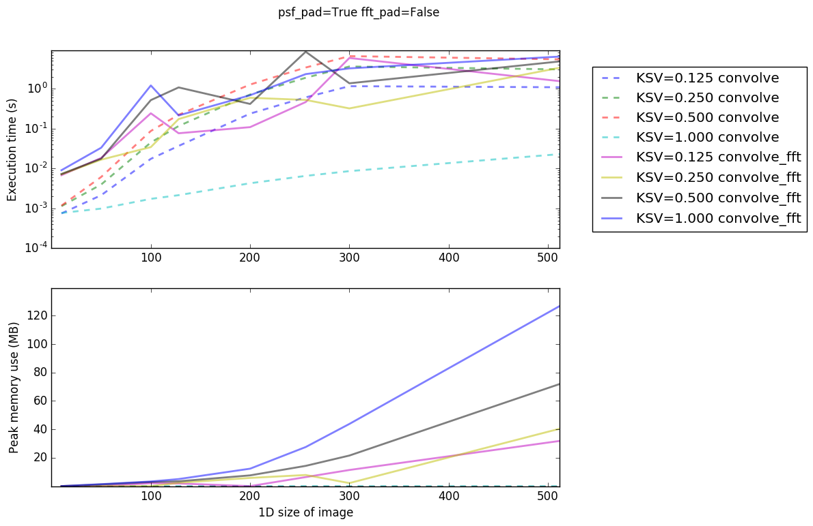

Convolution Performance
=======================

Convolution can be costly in terms of memory use or computation.  These
considerations are usually in some tension with one another.

For convolution with a small kernel, `~astropy.convolution.convolve` is
generally faster than FFT-based convolution
(`~astropy.convolution.convolve_fft`), while for large kernels, i.e.,
those where the kernel size approaches the array size, FFT-based convolution
is often faster.  However, the FFT-based approach requires having two full-sized
arrays in memory, and so even when it is faster, it can sometimes impose
a prohibitive memory requirement.

FFT-based convolution is also strongly dependent on array size.  Images with
sizes factorable into multiples of 2, 3, and 5 are more efficient than others,
and images with prime sizes are much more expensive.  For example, convolving
two arrays with size [59,59] or [61,61] is about 3-4x more expensive than
convolving two arrays with size [60,60] on a modern Intel processor.

Because of the cost associated with awkward array sizes,
`~astropy.convolution.convolve_fft` has an ``fft_pad`` option that will
increase the size of the array to the nearest "fast" size using scipy's
`next_fast_len
<https://docs.scipy.org/doc/scipy/reference/generated/scipy.fftpack.next_fast_len.html>`_.
This option increases the memory usage but will often speed up the execution of
a convolution operation.

Performance Tests
-----------------

To help inform your choice of convolver, you can use the performance tests in
`astropy.convolution.utils`.  We provide some examples and analysis below.

This figure shows the timing (top panel) and memory cost (bottom panel)
for convolutions of images with sizes specified on the X-axis.  The images
tested are square 2D images.  The legend specifies the "Kernel size fraction",
i.e., how big the kernel is with respect to the image.  For example,
for a 400-pixel image, a kernel with KSV=0.125 (one eighth) would be 50 pixels
on a side.   Solid lines show FFT-based convolution and dashed lines show
direct convolution.

Two main features are evident: First, direct convolution exhibits a stronger
execution-time dependence on kernel size than FFT convolution: for bigger
kernels, FFTs are usuall faster.  Second, FFTs almost always require more
memory than direct convolutions.

In this first example, both of the padding options, ``psf_pad`` and ``fft_pad``
are set to ``True`` in the FFT-based convolver.  This is the most
memory-intensive option, but possibly the fastest.

In this next example, ``fft_pad=False``, but ``psf_pad=True``.  That means
that the image is padded with zeros of at least the PSF's size, but not to
an optimal FFT size.  This example illustrates that ``fft_pad`` should generally
be set to ``True`` unless your memory is very limited.

The next example has ``fft_pad=True`` and ``psf_pad=False``.  These parameters
are probably the most efficient, though it can result in strange edge effects;
failing to pad the edges by the PSF size means that the boundary conditions may
be violated (for ``boundary='fill'``, ``psf_pad`` is required).  While scientifically
somewhat useless, these parameters helpfully illustrate the FFT's weak dependence
on kernel size:

Finally, with both ``fft_pad=False`` and ``psf_pad=False``, the memory
requirement is minimized.  However, as with the previous example, such
convolutions are likely to be scientifically useless, at least around their
edges.

Performance Comparison with other packages
------------------------------------------
If you perform FFT convolution yourself, using numpy or scipy's fft functions
directly on your own data / kernels, you will probably find that it is somewhat
faster.  Astropy's fft convolution is performing additional steps to account
for missing data, and these steps are expensive.  If you have images with no
missing or bad data, you may be able to achieve better performance without
using astropy's convolution.
