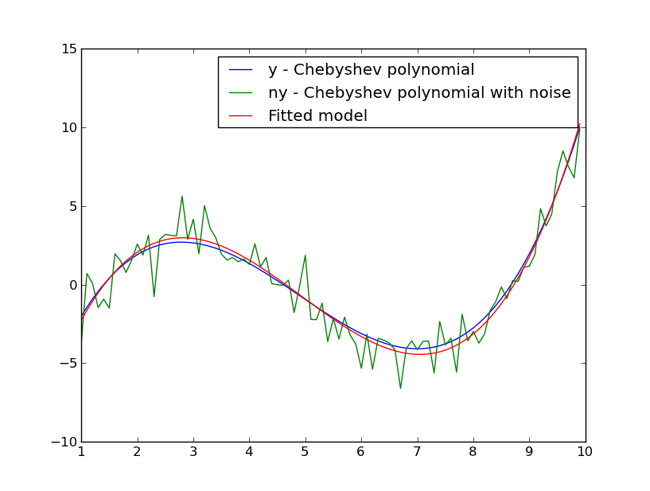

**************************
Models  (`astropy.models`)
**************************

.. currentmodule:: astropy.models

Introduction
============
The **`models`** and **`fitting`** modules described here are designed to work as 
peers with each other. The goal is to be able to add models without 
explicit reference to fitting algorithms (though exceptions are 
sometimes necessary) and likewise, add different fitting algorithms 
without changing the existing models. The mechanism that allows this 
is the special **`parameters`** module that both models and fitters use to 
interact with each other. Nevertheless, most users won't need to 
interact with this module unless they wish to add new models or 
fitters (the term used hereafter for specific fitting algorithms) to 
the existing suites of models and fitters.

Furthermore, the models are designed to be combined in many ways. It
is possible, for example, to combine models serially **`models.SCompositeModel`**,
so that the output values of one model are used as input values to another. It is 
also possible to form a new model by combining models in parallel (each model is
evaluated separately with the original input and the deltas are summed), 
**`models.PCompositeModel`**. Since models may have 
multiple input values, machinery is provided that allows assigning 
outputs from one model into the appropriate input of another in a
flexible way, **`models.LabeledInput`**. Finally, it is permitted to combine any
number of models using all of these mechanisms simultaneously. A composite
model can be used to make further composite models. The goal is to eventually 
provide a rich toolset of models and fitters such that most users will 
not need to define new model classes, nor special purpose fitting 
routines (but not making that hard to do if it is necessary).

While this system is initially being developed to support WCS models, 
its generality extends well beyond WCS cases, and thus the initial 
examples are not specifically geared to WCS problems.

Getting Started
===============

All examples assume the following modules have been imported

>>> import numpy as np
>>> from astropy.models import models, fitting

Working with 1D models
======================

Create data using 1D Chebyshev model

>>> x = np.arange(1,10,.1)
>>> ch1 = models.ChebyshevModel(3, domain=[x.min(), x.max()])
>>> ch1.parameters
[0.0, 0.0, 0.0, 0.0]
>>> ch1.parameters = [1,2,3,4]
>>> ch1.parameters
[1.0, 2.0, 3.0, 4.0]
>>> print ch1
Model: ChebyshevModel
Dim:   1
Degree: 3
Parameter sets: 1
Parameters: 
           c0:  [1.0]
           c1:  [2.0]
           c2:  [3.0]
           c3:  [4.0]
>>> y = ch1(x)

Add some noise

>>> n=np.random.randn(90)
>>> ny = y + n 

Fit a Chebyshev polynomial to the data

>>> ch2 = models.ChebyshevModel(3)
>>> chfit = fitting.LinearLSQFitter(ch2)
>>> chfit(x, ny)
>>> ch2.parameters
[0.957, 1.931, 3.029, 4.305]

:scale: 75 %

Fit a data set with a gaussian model.

>>> g1 = models.Gauss1DModel(10., xsigma=2.1, xcen=4.2)
>>> g1
<Gauss1DModel(amplitude= [10.0],xcen= [4.2000000000000002],xsigma= [2.1000000000000001],paramdim=1)>
>>> y = g1(x)
>>> n = np.random.randn(90)
>>> ny = y + n
>>> gfit = fitting.NonLinearLSQFitter(g1)
>>> gfit(x, ny)
>>> print g1
Model: Gauss1DModel
Dim:   1
Degree: N/A
Parameter sets: 1
Parameters: 
           amplitude:  [10.141697966089579]
           xcen:  [4.2140429078454309]
           xsigma:  [2.0780002458907352]

Working with 2D models
======================

First create some data to be fitted with a 2D polynomial

>>> x, y = np.mgrid[:10, :10]
>>> def poly2(x, y):
        return 1+2*x+3*x**2+4*y+5*y**2+6*x*y
>>> z = poly2(x, y)

Fit a 2D polynomial to the data

>>> p2 = models.Poly2DModel(2)
>>> print p2
Model: Poly2DModel
Dim:   2
Degree: 2
Parameter sets: 1
Parameters: 
           c0_0:  [0.0]
           c1_0:  [0.0]
           c2_0:  [0.0]
           c0_1:  [0.0]
           c0_2:  [0.0]
           c1_1:  [0.0]
>>>pfit = fitting.LinearLSQFitter(p2)
>>>n = np.random.randn(100)
>>>n.shape = (10, 10)
>>>pfit(x, y, z+n)
>>>fitter = fitting.LinearLSQFitter(self.model)
>>> p2.parameters
[0.6354845, 2.016544, 3.0035796, 4.0907439, 4.989999, 6.000127]

Using `models`
==============

.. toctree::
    parameters
    models
    fitting
    util
    new
    algorithms

Reference/API
=============

.. automodapi:: astropy.models.models
.. automodapi:: astropy.models.projections
.. automodapi:: astropy.models.rotations
.. automodapi:: astropy.models.fitting
.. automodapi:: astropy.models.parameters

