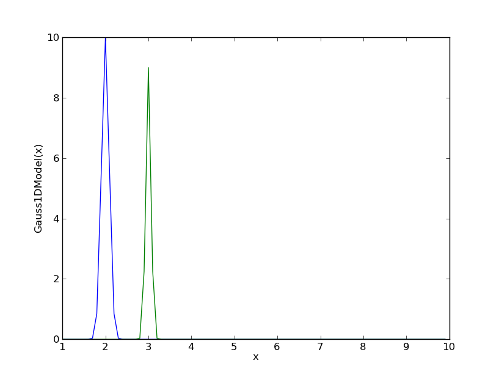

.. _models:

******
Models
******

The base class of all models is `~fitting.models.Model`.
A `~fitting.models.ParametricModel` is a fittable `~fitting.models.Model`. Parametric 
models can be linear or nonlinear in a regression analysis sense.

All models provide a `__call__` method which performs the transformation in a 
purely mathematical way, i.e. the models are unitless. In addition, when possible the 
transformation is done using multiple parameter sets, `psets`.
The number of parameter sets is stored in an attribute `pdim`. 

Parametric models also store a flat list of all parameters as an instance of 
`~fitting.parameters.Parameters`. When fitting, this list-like object is
modified by a subclass of `~fitting.fitting.Fitter`. When fitting nonlinear models,
the values of the parameters are used as initial guesses by the fitting class.

Models have dimensions, `ndim`  attribute, which show how many coordinates the 
model expects as an input. All models expect coordinates as separate arguments.
For example a 2D model expects x and y to be passed separately, 
e.g. as two arrays or two lists. When a model has multiple parameter sets and x, y are 
2D arrays, the model is evaluated with each of the parameter sets and the same x, y as 
input. The shape of the  output array is (pdim, xsh, ysh) where pdim is the number 
of parameter sets and xsh, ysh is the shape of the input array.
In all other cases the shape of the output array is the same as the shape of the 
input arrays. Evaluating a model with one parameter set when the rank of the input 
array is bigger than the dimension of the model is an error.

Models also have an attribute  `outdim`, which shows the number of output 
coordinates. The `ndim` and `outdim` attributes are used to chain transforms by
adding models (in series or in  parallel), to form an 
instance of `~fitting.models._CompositeModel`.  Because composite models can 
be nested within other composite models, creating 
theoretically infinetely complex models, a mechanism to map input data to models 
is needed. In this case the input may be wrapped in a `~fitting.models.LabeledInput` 
object - a dict like object whose items are {label: data} pairs.

Models Examples
---------------

- Create a 1D Gaussian with 2 parameter sets

>>> x=np.arange(1,10,.1)
>>> g1=models.Gauss1DModel(amplitude=[10, 9], xcen=[2,3], fwhm=[.3,.2])
>>> g1.parnames
['amplitude', 'xcen', 'xsigma']
>>> g1.psets
array([[ 10.      ,   9.      ],
       [  2.      ,   3.      ],
       [  0.127398,   0.084932]])

Evaluate the model on one data set

>>> y = g1(x)
>>> print y.shape
(90, 2)

or two data sets (any other number would be an error)

>>> y=g1(np.array([x,x]).T)
>>> print y.shape
(90, 2)

- Evaluating polynomial models with multiple parameter sets with one input data set creates multiple output data sets

>>> p1 = models.Poly1DModel(1, pdim=5)
>>> len(p1.parameters)
10
>>> p1.c1=[0, 1, 2, 3, 4]
>>> p1.psets
array([[ 0.,  0.,  0.,  0.,  0.],
       [ 0.,  1.,  2.,  3.,  4.]])
>>> y = p1(x)

- When passed a 2D array, the same polynomial will map parameter sets to array columns

>>> x = np.ones((10,5))
>>> y = p1(x)
>>> print y
array([[ 0.,  1.,  2.,  3.,  4.],
       [ 0.,  1.,  2.,  3.,  4.],
       [ 0.,  1.,  2.,  3.,  4.],
       [ 0.,  1.,  2.,  3.,  4.],
       [ 0.,  1.,  2.,  3.,  4.],
       [ 0.,  1.,  2.,  3.,  4.],
       [ 0.,  1.,  2.,  3.,  4.],
       [ 0.,  1.,  2.,  3.,  4.],
       [ 0.,  1.,  2.,  3.,  4.],
       [ 0.,  1.,  2.,  3.,  4.]])
>>> print y.shape
(10,5)

- unless it is passed an argument 'multiple=False', in which case the input array is treated as one input

>>> p1 = models.Poly1DModel(1, pdim=5, multiple=False)
>>> p1.c1=[0, 1, 2, 3, 4]
>>> y = p1(x)
>>> print y.shape
(5, 50)
>>> print y
array([[ 0.,  0.,  0.,  0.,  0.,  0.,  0.,  0.,  0.,  0.,  0.,  0.,  0.,
         0.,  0.,  0.,  0.,  0.,  0.,  0.,  0.,  0.,  0.,  0.,  0.,  0.,
         0.,  0.,  0.,  0.,  0.,  0.,  0.,  0.,  0.,  0.,  0.,  0.,  0.,
         0.,  0.,  0.,  0.,  0.,  0.,  0.,  0.,  0.,  0.,  0.],
       [ 1.,  1.,  1.,  1.,  1.,  1.,  1.,  1.,  1.,  1.,  1.,  1.,  1.,
         1.,  1.,  1.,  1.,  1.,  1.,  1.,  1.,  1.,  1.,  1.,  1.,  1.,
         1.,  1.,  1.,  1.,  1.,  1.,  1.,  1.,  1.,  1.,  1.,  1.,  1.,
         1.,  1.,  1.,  1.,  1.,  1.,  1.,  1.,  1.,  1.,  1.],
       [ 2.,  2.,  2.,  2.,  2.,  2.,  2.,  2.,  2.,  2.,  2.,  2.,  2.,
         2.,  2.,  2.,  2.,  2.,  2.,  2.,  2.,  2.,  2.,  2.,  2.,  2.,
         2.,  2.,  2.,  2.,  2.,  2.,  2.,  2.,  2.,  2.,  2.,  2.,  2.,
         2.,  2.,  2.,  2.,  2.,  2.,  2.,  2.,  2.,  2.,  2.],
       [ 3.,  3.,  3.,  3.,  3.,  3.,  3.,  3.,  3.,  3.,  3.,  3.,  3.,
         3.,  3.,  3.,  3.,  3.,  3.,  3.,  3.,  3.,  3.,  3.,  3.,  3.,
         3.,  3.,  3.,  3.,  3.,  3.,  3.,  3.,  3.,  3.,  3.,  3.,  3.,
         3.,  3.,  3.,  3.,  3.,  3.,  3.,  3.,  3.,  3.,  3.],
       [ 4.,  4.,  4.,  4.,  4.,  4.,  4.,  4.,  4.,  4.,  4.,  4.,  4.,
         4.,  4.,  4.,  4.,  4.,  4.,  4.,  4.,  4.,  4.,  4.,  4.,  4.,
         4.,  4.,  4.,  4.,  4.,  4.,  4.,  4.,  4.,  4.,  4.,  4.,  4.,
         4.,  4.,  4.,  4.,  4.,  4.,  4.,  4.,  4.,  4.,  4.]])

Models API
----------

.. automodule:: fitting.models
    :members:

Projections API
---------------

.. automodule:: fitting.projections
    :members:

Rotations API
-------------
 
.. automodule:: fitting.rotations
    :members: