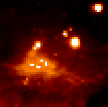
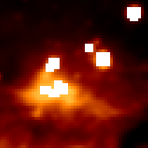
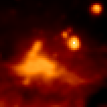

Convolution
===========

Introduction
------------

``astropy.nddata`` includes a convolution function that offers
improvements compared to the scipy ``astropy.ndimage`` convolution
routines, including:

* Proper treatment of NaN values

* A single function for 1-D, 2-D, and 3-D convolution

* Improved options for the treatment of edges

* Both direct and Fast Fourier Transform (FFT) versions

The following thumbnails show the difference between Scipy's and
Astropy's convolve functions on an Astronomical image that contains NaN
values. Scipy's function essentially returns NaN for all pixels that are
within a kernel of any NaN value, which is often not the desired result.

+-----------------------+--------------------+----------------------+
|        Original       | Scipy ``convolve`` | Astropy ``convolve`` |
+-----------------------+--------------------+----------------------+
|       |original|      |       |scipy|      |      |astropy|       |
+-----------------------+--------------------+----------------------+

Usage
-----

Two convolution functions are provided.  They are imported as::

    from astropy.nddata import convolve, convolve_fft

and are both used as::

    result = convolve(image, kernel)
    result = convolve_fft(image, kernel)

`~astropy.nddata.convolution.convolve.convolve` is implemented as a direct
convolution algorithm, while `~astropy.nddata.convolution.convolve.convolve_fft`
uses an FFT.  Thus, the former is better for small kernels, while the latter
is much more efficient for larger kernels.

The input images and kernels should be lists or Numpy arrays with either both 1, 2, or 3 dimensions (and the number of dimensions should be the same for the image and kernel). The result is a Numpy array with the same dimensions as the input image. The convolution is always done as floating point.

The ``convolve`` function takes an optional ``boundary=`` argument describing how to perform the convolution at the edge of the array. The values for ``boundary`` can be:

* ``None``: set the result values to zero where the kernel extends beyond the edge of the array (default)

* ``'fill'``: set values outside the array boundary to a constant. If this option is specified, the constant should be specified using the ``fill_value=`` argument, which defaults to zero.

* ``'wrap'``: assume that the boundaries are periodic

* ``'extend'`` : set values outside the array to the nearest array value

By default, the kernel is not normalized. To normalize it prior to convolution, use::

    result = convolve(image, kernel, normalize_kernel=True)

Examples
--------

Smooth a 1D array with a custom kernel and no boundary treatment::

    >>> convolve([1, 4, 5, 6, 5, 7, 8], [0.2, 0.6, 0.2])
    array([ 0. ,  3.4,  5. ,  5.6,  5.6,  5.2,  0. ])

As above, but using the 'extend' algorithm for boundaries::

    >>> convolve([1, 4, 5, 6, 5, 7, 8], [0.2, 0.6, 0.2], boundary='extend')
    array([ 1.6,  3.6,  5. ,  5.6,  5.6,  6.8,  7.8])

If a NaN value is present in the original array, it will be interpolated using the kernel::

    >>> convolve([1, 4, 5, 6, np.nan, 7, 8], [0.2, 0.6, 0.2], boundary='extend')
    array([ 1.6,  3.6,  5. ,  5.9,  6.5,  7.1,  7.8])

Kernels and arrays can be specified either as lists or as Numpy arrays. The following examples show how to construct a 1-d array as a list::

    >>> kernel = [0, 1, 0]
    >>> result = convolve(spectrum, kernel)

a 2-d array as a list::

    >>> kernel = [[0, 1, 0], \
                  [1, 2, 1], \
                  [0, 1, 0]]
    >>> result = convolve(image, kernel)

and a 3-d array as a list::

    >>> kernel = [[[0, 0, 0], [0, 2, 0], [0, 0, 0]], \
                  [[0, 1, 0], [2, 3, 2], [0, 1, 0]], \
                  [[0, 0, 0], [0, 2, 0], [0, 0, 0]]]
    >>> result = convolve(cube, kernel)

You can also use `~astropy.nddata.convolution.make_kernel.make_kernel`
to generate common n-dimensional kernels::

    >>> make_kernel([3,3], 1, 'boxcar')
    array([[ 0.  0.  0.]
           [ 0.  1.  0.]
           [ 0.  0.  0.]])
