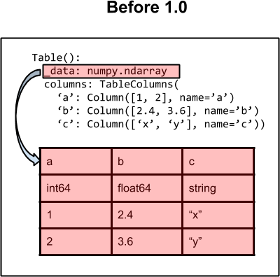
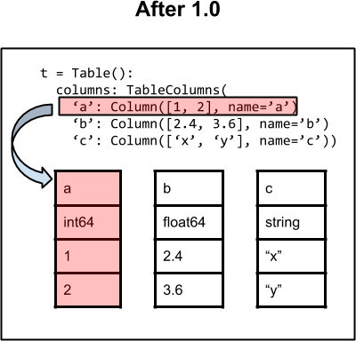
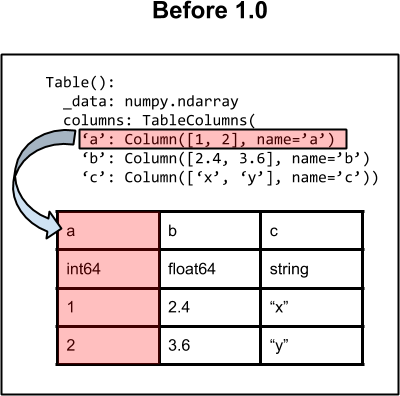
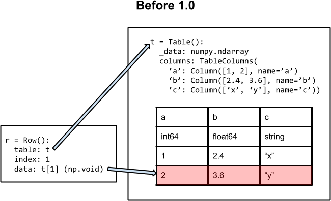
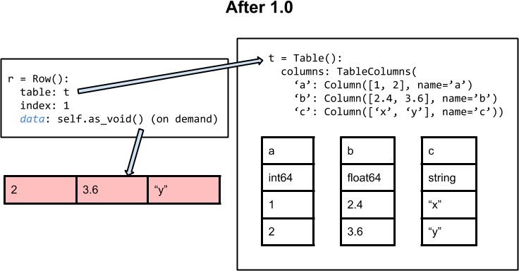

.. include:: references.txt

.. |column_after| image:: table_column_after_1.0.png
   :width: 45%

.. _table_implementation_change:

Table implementation change in 1.0
----------------------------------

This page discusses the change in the internal implementation of the |Table|
class which took place starting from version 1.0 of astropy.  The motivation
for making this change is discussed in the `Benefits`_ section.

Architecture
^^^^^^^^^^^^^^

Data container
""""""""""""""

The images below illustrate the basic architecture of the |Table| class for
astropy versions 0.4.x and earlier (left) and after version 1.0 (right).

On the left side (before 1.0) the fundamental data container is a numpy
structured array referenced as an internal attribute ``_data``.  All public
methods and operations (e.g. column access, row indexing) are done via this
internal `~numpy.ndarray` object.  The ``columns`` attribute is used to manage
table columns and provide access.  It is a |TableColumns| object which is
essentially an ordered dictionary of |Column| or |MaskedColumn| objects which
provide views of the ``_data`` array.

On the right side (after 1.0) the fundamental data container is now the
collection of individual column objects and there is no longer a structured
array associated with the table.  Each |Column| object is the sole owner of its
data.  As before, the ``columns`` attribute is used to manage columns and
provide access.

|table_before| |table_after|

Columns
""""""""

For versions before 1.0 the |Column| object is an `~numpy.ndarray` subclass with
a *memory view* of the corresponding column in the ``_data`` array.  This means
that the physical memory for the |Column| object data is exactly the same as
the memory storing the ``_data`` array. Therefore updating an element in the
column results in the corresponding update in the ``_data`` value.  This model
is convenient in many ways, but also has drawbacks.  In particular, astropy
tables are easily mutable (e.g. you can add or remove columns) while numpy
structured arrays are not.  This means that key operations require
regenerating the entire ``_data`` structured array and likewise regenerating
all the |Column| view objects.  This is relatively slow and results in
additional code complexity to always ensure correspondence.

Starting with version 1.0 the |Column| object is the same `~numpy.ndarray`
subclass but it is sole owner of the data.  This simplifies table management
considerably along with making operations like adding or removing columns
*much* faster because there is no structured array to regenerate.

|column_before| |column_after|

Rows
"""""

A |Row| object corresponds to a single row in the table.  For versions before
1.0, when a |Row| object is requested it uses numpy indexing into the table
``_data`` array to generate a ``numpy.void`` or ``numpy.ma.mvoid`` object as the
``data`` attribute [#]_.  This delegates most of the row access functionality like
``row['a']`` to the numpy void classes. For unmasked tables this ``data``
attribute is a memory view of the parent table row, though for masked tables
(due to the implementation of numpy masked arrays), the ``data`` attribute is
*not* a view.

|row_before|

For version 1.0 and later, the |Row| object does not create a view of the full
row at any point.  Instead it manages access (like ``row['a']``) dynamically in
a way that maintains the same interface.  Due to improved implementation this
is actually faster.

The row ``data`` attribute is part of the public API before 1.0, therefore it
is still available in 1.0 but as a *deprecated* property.  In this case
accessing ``data`` runs the `~astropy.table.Row.as_void()` method to dynamically
create and return a ``numpy.void`` or ``numpy.ma.mvoid`` object.  This provides a
copy of the original data, not a view.  Code which was relying on the row
``data`` attribute as a *view* into the parent table will need to be modified.

|row_after|

.. [#] ``numpy.void`` is a ``dtype`` that can be used to represent structures
         of arbitrary byte width.

Differences
^^^^^^^^^^^

``Row.data``
""""""""""""

The ``data`` property of the |Row| object is deprecated in version 1.0 and
may be removed in a later version.  Code which requires access to a
``numpy.void`` or ``numpy.ma.mvoid`` object corresponding to a table row
can now use the `~astropy.table.Row.as_void()` method.  This is public and
stable, with the caveat that it is relatively slow and returns a copy of the
row data, not a view.

``Table._data``
"""""""""""""""

While the ``_data`` property of the |Table| object is not part of the public
API in any astropy release, some users may have let this creep into their
code as back-door access to the numpy object.  In version 1.0 this attribute is
formally deprecated and will generate a warning.

From 1.0 the public method for getting the corresponding numpy structured array
or masked array version of a table is the |Table| method
`~astropy.table.Table.as_array()`.  This dynamically generates the requested
object, making a copy of the table data.  Be aware that the ``_data`` property
calls `~astropy.table.Table.as_array()`, so accessing ``_data`` will
effectively double the memory usage of the table.

An alternative is to use `~numpy.array` to do the conversion, e.g. for an
astropy |Table| object named ``dat`` use ``np_dat = np.array(dat)``.  Be aware that
for a masked table this operation always returns a pure `~numpy.ndarray`
with data corresponding to the unmasked values.

High-level operations
"""""""""""""""""""""

In version 1.0 the operations described in :ref:`table_operations` rely on
`~astropy.table.Table.as_array()` to create numpy structured arrays which
are used in the actual array manipulations.  This creates temporary copies of
the tables.

Performance regressions
"""""""""""""""""""""""

From version 1.0 most common operations run at the same speed or are faster
(sometimes significantly faster).  The only operations which are noticeably
slower are adding a row in a masked table (~2 times slower) and setting a
column like ``dat['a'][:] = 10`` in a masked table (~6 times slower).

Benefits
^^^^^^^^

The key benefits of the version 1.0 change are as follows:

- Allows for much faster addition or removal of columns.  A common idiom is
  creating a table and then adding columns::

    >>> from astropy.table import Table
    >>> import numpy as np
    >>> t = Table()
    >>> t['a'] = np.arange(100)
    >>> t['b'] = np.random.uniform(size=100)
    >>> t['c'] = t['a'] + t['b']

  Prior to 1.0 this idiom was extremely inefficient because the underlying
  structured array was being entirely regenerated with each column addition.
  From 1.0 forward this is fast and a good way to write code.

- Provides the infrastructure to allow for Tables to easily hold column types
  beyond just |Column| and |MaskedColumn|.  This includes
  `~astropy.units.Quantity`, `~astropy.time.Time`, and
  `~astropy.coordinates.SkyCoord` objects.  Other ideas like nested |Table|
  objects are also possible.

- Generally faster because of improved implementation in key areas.
  Column-based access is faster because the column data are held in contiguous
  memory instead of being strided within the numpy structure array.

- Reduces code complexity in a number of core table routines.
