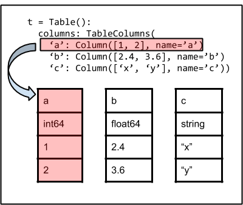
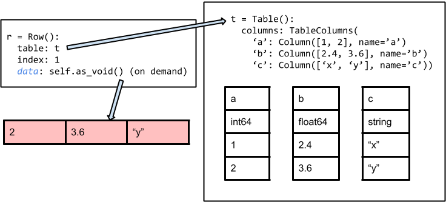

.. include:: references.txt

.. _table_implementation_details:

Table implementation details
*****************************

This page provides a brief overview of the |Table| class implementation, in
particular highlighting the internal data storage architecture.  This is aimed
at developers and/or users who are interested in optimal use of the |Table|
class.  Note that this applies to astropy version 1.0 and later.

The image below illustrates the basic architecture of the |Table| class.
The fundamental data container is an ordered dictionary of individual column
objects maintained as the ``columns`` attribute.  It is via this container
that columns are managed and accessed.

Each |Column| (or |MaskedColumn|) object is an `~numpy.ndarray` subclass and is
the sole owner of its data.  Maintaining the table as separate columns
simplifies table management considerably.  It also makes operations like adding
or removing columns much faster in comparison to implementations using a numpy
structured array container.

As shown below, a |Row| object corresponds to a single row in the table.  The
|Row| object does not create a view of the full row at any point.  Instead it
manages access (e.g. ``row['a']``) dynamically by referencing the appropriate
elements of the parent table.

In some cases it is desirable to have a static copy of the full row.  This is
available via the `~astropy.table.Row.as_void()` method, which creates and
returns a ``numpy.void`` or ``numpy.ma.mvoid`` object with a copy of the
original data.

