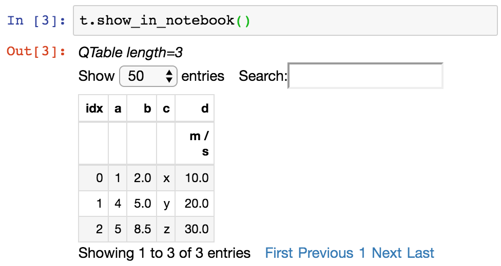

.. include:: references.txt

.. _astropy-table:

*****************************
Data Tables (`astropy.table`)
*****************************

Introduction
============

`astropy.table` provides functionality for storing and manipulating
heterogeneous tables of data in a way that is familiar to `numpy` users.  A few
notable capabilities of this package are:

* Initialize a table from a wide variety of input data structures and types.
* Modify a table by adding or removing columns, changing column names,
  or adding new rows of data.
* Handle tables containing missing values.
* Include table and column metadata as flexible data structures.
* Specify a description, units and output formatting for columns.
* Interactively scroll through long tables similar to using ``more``.
* Create a new table by selecting rows or columns from a table.
* Perform :ref:`table_operations` like database joins, concatenation, and binning.
* Maintain a table index for fast retrieval of table items or ranges.
* Manipulate multidimensional columns.
* Handle non-native (mixin) column types within table.
* Methods for :ref:`read_write_tables` to files.
* Hooks for :ref:`subclassing_table` and its component classes.

Getting Started
===============

The basic workflow for creating a table, accessing table elements,
and modifying the table is shown below.  These examples show a very simple
case, while the full `astropy.table` documentation is available from the
:ref:`using_astropy_table` section.

First create a simple table with columns of data named ``a``, ``b``, ``c``, and
``d``.  These columns have integer, float, string, and |Quantity| values
respectively::

  >>> from astropy.table import QTable
  >>> import astropy.units as u
  >>> import numpy as np

  >>> a = np.array([1, 4, 5], dtype=np.int32)
  >>> b = [2.0, 5.0, 8.5]
  >>> c = ['x', 'y', 'z']
  >>> d = [10, 20, 30] * u.m / u.s

  >>> t = QTable([a, b, c, d],
  ...            names=('a', 'b', 'c', 'd'),
  ...            meta={'name': 'first table'})

Comments:

- Column ``a`` is a numpy array with a specified dtype of ``int32``. If the data
  type is not provided, the default type for integers is ``int64`` on Mac and
  linux and ``int32`` on Windows.
- Column ``b`` is a list of ``float`` values, represented as ``float64``.
- Column ``c`` is a list of ``str`` values, represented as unicode.
  See :ref:`bytestring-columns-python-3` for more information.
- Column ``d`` is a |Quantity| array.  Since we used |QTable| this stores a
  native |Quantity| within the table and brings the full power of
  :ref:`astropy-units` to this column in the table.

.. Note::

   If the table data have no units or you prefer to not use |Quantity| then you
   can use the |Table| class to create tables. The **only** difference between
   |QTable| and |Table| is the behavior when adding a column that has units.
   See :ref:`quantity_and_qtable` and :ref:`columns_with_units` for details on
   the differences and use cases.

There are many other ways of :ref:`construct_table`, including from a list of
rows (either tuples or dicts), from a numpy structured or 2-d array, by adding
columns or rows incrementally, or even from a :class:`pandas.DataFrame`.

There are a few ways of :ref:`access_table`.  You can get detailed information
about the table values and column definitions as follows::

  >>> t
  <QTable length=3>
    a      b     c      d
                      m / s
  int32 float64 str1 float64
  ----- ------- ---- -------
      1     2.0    x    10.0
      4     5.0    y    20.0
      5     8.5    z    30.0

You can get summary information about the table as follows::

  >>> t.info
  <QTable length=3>
  name  dtype   unit  class
  ---- ------- ----- --------
     a   int32         Column
     b float64         Column
     c    str1         Column
     d float64 m / s Quantity

From within a Jupyter notebook, the table is displayed as a formatted HTML
table (details of how it appears can be changed by altering the
``astropy.table.default_notebook_table_class`` configuration item):

.. image:: table_repr_html.png
   :width: 450px

Or you can get a fancier notebook interface with in-browser search and sort
using `~astropy.table.Table.show_in_notebook`:

If you print the table (either from the notebook or in a text console session)
then a formatted version appears::

  >>> print(t)
   a   b   c    d
              m / s
  --- --- --- -----
    1 2.0   x  10.0
    4 5.0   y  20.0
    5 8.5   z  30.0

If you do not like the format of a particular column, you can change it::

  >>> t['b'].info.format = '7.3f'
  >>> print(t)
   a     b     c    d
                  m / s
  --- ------- --- -----
    1   2.000   x  10.0
    4   5.000   y  20.0
    5   8.500   z  30.0

For a long table you can scroll up and down through the table one page at
time::

  >>> t.more()  # doctest: +SKIP

You can also display it as an HTML-formatted table in the browser::

  >>> t.show_in_browser()  # doctest: +SKIP

or as an interactive (searchable & sortable) javascript table::

  >>> t.show_in_browser(jsviewer=True)  # doctest: +SKIP

Now examine some high-level information about the table::

  >>> t.colnames
  ['a', 'b', 'c', 'd']
  >>> len(t)
  3
  >>> t.meta
  {'name': 'first table'}

Access the data by column or row using familiar `numpy` structured array syntax::

  >>> t['a']       # Column 'a'
  <Column name='a' dtype='int32' length=3>
  1
  4
  5

  >>> t['a'][1]    # Row 1 of column 'a'
  4

  >>> t[1]         # Row object for table row index=1
  <Row index=1>
    a      b     c      d
                      m / s
  int32 float64 str1 float64
  ----- ------- ---- -------
      4   5.000    y    20.0

  >>> t[1]['a']    # Column 'a' of row 1
  4

You can retrieve a subset of a table by rows (using a slice) or
columns (using column names), where the subset is returned as a new table::

  >>> print(t[0:2])      # Table object with rows 0 and 1
   a     b     c    d
                  m / s
  --- ------- --- -----
    1   2.000   x  10.0
    4   5.000   y  20.0

  >>> print(t['a', 'c'])  # Table with cols 'a', 'c'
   a   c
  --- ---
    1   x
    4   y
    5   z

:ref:`modify_table` in place is flexible and works as one would expect::

  >>> t['a'][:] = [-1, -2, -3]    # Set all column values in place
  >>> t['a'][2] = 30              # Set row 2 of column 'a'
  >>> t[1] = (8, 9.0, "W", 4 * u.m / u.s) # Set all row values
  >>> t[1]['b'] = -9              # Set column 'b' of row 1
  >>> t[0:2]['b'] = 100.0         # Set column 'b' of rows 0 and 1
  >>> print(t)
   a     b     c    d
                  m / s
  --- ------- --- -----
   -1 100.000   x  10.0
    8 100.000   W   4.0
   30   8.500   z  30.0

Replace, add, remove, and rename columns with the following::

  >>> t['b'] = ['a', 'new', 'dtype']   # Replace column b (different from in-place)
  >>> t['e'] = [1, 2, 3]               # Add column d
  >>> del t['c']                       # Delete column c
  >>> t.rename_column('a', 'A')        # Rename column a to A
  >>> t.colnames
  ['A', 'b', 'd', 'e']

Adding a new row of data to the table is as follows.  Note that the unit
value is given in ``cm / s`` but will be added to the table as ``0.1 m / s`` in
accord with the existing unit.

  >>> t.add_row([-8, 'string', 10 * u.cm / u.s, 10])
  >>> len(t)
  4

You can create a table with support for missing values, for example by setting
``masked=True``::

  >>> t = QTable([a, b, c], names=('a', 'b', 'c'), masked=True, dtype=('i4', 'f8', 'U1'))
  >>> t['a'].mask = [True, True, False]
  >>> t
  <QTable masked=True length=3>
    a      b     c
  int32 float64 str1
  ----- ------- ----
     --     2.0    x
     --     5.0    y
      5     8.5    z

In addition to |Quantity|, you can include certain object types like
`~astropy.time.Time`, `~astropy.coordinates.SkyCoord`, and
`~astropy.table.NdarrayMixin` in your table.  These "mixin" columns behave like
a hybrid of a regular `~astropy.table.Column` and the native object type (see
:ref:`mixin_columns`).  For example::

  >>> from astropy.time import Time
  >>> from astropy.coordinates import SkyCoord
  >>> tm = Time(['2000:002', '2002:345'])
  >>> sc = SkyCoord([10, 20], [-45, +40], unit='deg')
  >>> t = QTable([tm, sc], names=['time', 'skycoord'])
  >>> t
  <QTable length=2>
           time          skycoord
                         deg,deg
          object          object
  --------------------- ----------
  2000:002:00:00:00.000 10.0,-45.0
  2002:345:00:00:00.000  20.0,40.0

Now let's compute the interval since the launch of the `Chandra X-ray Observatory
<https://en.wikipedia.org/wiki/Chandra_X-ray_Observatory>`_ aboard `STS-93
<https://en.wikipedia.org/wiki/STS-93>`_ and store this in our table as a
|Quantity| in days::

  >>> dt = t['time'] - Time('1999-07-23 04:30:59.984')
  >>> t['dt_cxo'] = dt.to(u.d)
  >>> t['dt_cxo'].info.format = '.3f'
  >>> print(t)
           time          skycoord   dt_cxo
                         deg,deg      d
  --------------------- ---------- --------
  2000:002:00:00:00.000 10.0,-45.0  162.812
  2002:345:00:00:00.000  20.0,40.0 1236.812

.. _using_astropy_table:

Using ``table``
===============

The details of using `astropy.table` are provided in the following sections:

Construct table
---------------

.. toctree::
   :maxdepth: 2

   construct_table.rst

Access table
---------------

.. toctree::
   :maxdepth: 2

   access_table.rst

Modify table
---------------

.. toctree::
   :maxdepth: 2

   modify_table.rst

Table operations
-----------------

.. toctree::
   :maxdepth: 2

   operations.rst

Indexing
--------

.. toctree::
   :maxdepth: 2

   indexing.rst

Masking
---------------

.. toctree::
   :maxdepth: 2

   masking.rst

I/O with tables
----------------

.. toctree::
   :maxdepth: 2

   io.rst
   pandas.rst

Mixin columns
----------------

.. toctree::
   :maxdepth: 2

   mixin_columns.rst

Implementation
----------------

.. toctree::
   :maxdepth: 2

   implementation_details.rst

.. note that if this section gets too long, it should be moved to a separate
   doc page - see the top of performance.inc.rst for the instructions on how to do
   that
.. include:: performance.inc.rst

Reference/API
=============

.. automodapi:: astropy.table
