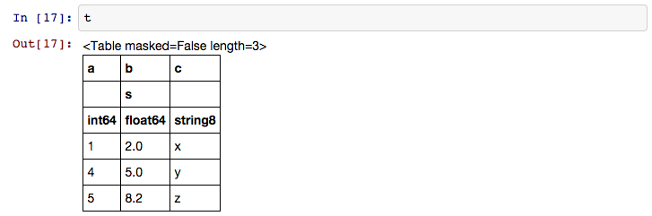

.. include:: references.txt

.. _astropy-table:

*****************************
Data Tables (`astropy.table`)
*****************************

Introduction
============

`astropy.table` provides functionality for storing and manipulating
heterogeneous tables of data in a way that is familiar to `numpy` users.  A few
notable features of this package are:

* Initialize a table from a wide variety of input data structures and types.
* Modify a table by adding or removing columns, changing column names,
  or adding new rows of data.
* Handle tables containing missing values.
* Include table and column metadata as flexible data structures.
* Specify a description, units and output formatting for columns.
* Interactively scroll through long tables similar to using ``more``.
* Create a new table by selecting rows or columns from a table.
* Perform :ref:`table_operations` like database joins and concatenation.
* Manipulate multidimensional columns.
* Methods for :ref:`read_write_tables` to files
* Hooks for :ref:`subclassing_table` and its component classes

Currently `astropy.table` is used when reading an ASCII table using
`astropy.io.ascii`.  Future releases of AstroPy are expected to use
the |Table| class for other subpackages such as `astropy.io.votable` and `astropy.io.fits` .

.. Note::

   Starting with version 1.0 of astropy the internal implementation of the
   |Table| class changed so that it no longer uses numpy structured arrays as
   the core table data container.  Instead the table is stored as a collection
   of individual column objects.  *For most users there is NO CHANGE to the
   interface and behavior of |Table| objects.*

   The page on :ref:`table_implementation_change` provides details about the
   change.  This includes discussion of the table architecture, key differences,
   and benefits of the change.

Getting Started
===============

The basic workflow for creating a table, accessing table elements,
and modifying the table is shown below.  These examples show a very simple
case, while the full `astropy.table` documentation is available from the
:ref:`using_astropy_table` section.

First create a simple table with three columns of data named ``a``, ``b``,
and ``c``.  These columns have integer, float, and string values respectively::

  >>> from astropy.table import Table
  >>> a = [1, 4, 5]
  >>> b = [2.0, 5.0, 8.2]
  >>> c = ['x', 'y', 'z']
  >>> t = Table([a, b, c], names=('a', 'b', 'c'), meta={'name': 'first table'})

If you have row-oriented input data such as a list of records, use the ``rows``
keyword.  In this example we also explicitly set the data types for each column::

  >>> data_rows = [(1, 2.0, 'x'),
  ...              (4, 5.0, 'y'),
  ...              (5, 8.2, 'z')]
  >>> t = Table(rows=data_rows, names=('a', 'b', 'c'), meta={'name': 'first table'},
  ...           dtype=('i4', 'f8', 'S1'))

There are a few ways to examine the table.  You can get detailed information
about the table values and column definitions as follows::

  >>> t
  <Table masked=False length=3>
    a      b       c
  int32 float64 string8
  ----- ------- -------
      1     2.0       x
      4     5.0       y
      5     8.2       z

You can also assign a unit to the columns. If any column has a unit
assigned, all units would be shown as follows::

  >>> t['b'].unit = 's'
  >>> t
  <Table masked=False length=3>
    a      b       c
           s
  int32 float64 string8
  ----- ------- -------
      1     2.0       x
      4     5.0       y
      5     8.2       z

A column with a unit works with and can be easily converted to an
`~astropy.units.Quantity` object::

  >>> t['b'].quantity
  <Quantity [ 2. , 5. , 8.2] s>
  >>> t['b'].to('min')  # doctest: +FLOAT_CMP
  <Quantity [ 0.03333333, 0.08333333, 0.13666667] min>

From within the IPython notebook, the table is displayed as a formatted HTML table:

If you print the table (either from the notebook or in a text console session)
then a formatted version appears::

  >>> print(t)
   a   b   c
       s
  --- --- ---
    1 2.0   x
    4 5.0   y
    5 8.2   z

If you do not like the format of a particular column, you can change it::

  >>> t['b'].format = '7.3f'
  >>> print(t)
   a     b     c
         s
  --- ------- ---
    1   2.000   x
    4   5.000   y
    5   8.200   z

For a long table you can scroll up and down through the table one page at
time::

  >>> t.more()  # doctest: +SKIP

You can also display it as an HTML-formatted table in the browser::

  >>> t.show_in_browser()  # doctest: +SKIP

or as an interactive (searchable & sortable) javascript table::

  >>> t.show_in_browser(jsviewer=True)  # doctest: +SKIP

Now examine some high-level information about the table::

  >>> t.colnames
  ['a', 'b', 'c']
  >>> len(t)
  3
  >>> t.meta
  {'name': 'first table'}

Access the data by column or row using familiar `numpy` structured array syntax::

  >>> t['a']       # Column 'a'
  <Column name='a' dtype='int32' length=3>
  1
  4
  5

  >>> t['a'][1]    # Row 1 of column 'a'
  4

  >>> t[1]         # Row obj for with row 1 values
  <Row 1 of table
   values=(4, 5.0, 'y')
   dtype=[('a', '<i4'), ('b', '<f8'), ('c', 'S1')]>

  >>> t[1]['a']    # Column 'a' of row 1
  4

You can retrieve a subset of a table by rows (using a slice) or
columns (using column names), where the subset is returned as a new table::

  >>> print(t[0:2])      # Table object with rows 0 and 1
   a     b     c
         s
  --- ------- ---
    1   2.000   x
    4   5.000   y

  >>> print(t['a', 'c'])  # Table with cols 'a', 'c'
   a   c
  --- ---
    1   x
    4   y
    5   z

Modifying table values in place is flexible and works as one would expect::

  >>> t['a'] = [-1, -2, -3]       # Set all column values
  >>> t['a'][2] = 30              # Set row 2 of column 'a'
  >>> t[1] = (8, 9.0, "W")        # Set all row values
  >>> t[1]['b'] = -9              # Set column 'b' of row 1
  >>> t[0:2]['b'] = 100.0         # Set column 'b' of rows 0 and 1
  >>> print(t)
   a     b     c
         s
  --- ------- ---
   -1 100.000   x
    8 100.000   W
   30   8.200   z

Add, remove, and rename columns with the following::

  >>> t['d'] = [1, 2, 3]
  >>> del t['c']
  >>> t.rename_column('a', 'A')
  >>> t.colnames
  ['A', 'b', 'd']

Adding a new row of data to the table is as follows::

  >>> t.add_row([-8, -9, 10])
  >>> len(t)
  4

Lastly, you can create a table with support for missing values, for example by setting
``masked=True``::

  >>> t = Table([a, b, c], names=('a', 'b', 'c'), masked=True, dtype=('i4', 'f8', 'S1'))
  >>> t['a'].mask = [True, True, False]
  >>> t
  <Table masked=True length=3>
    a      b       c
  int32 float64 string8
  ----- ------- -------
     --     2.0       x
     --     5.0       y
      5     8.2       z

.. _using_astropy_table:

Using ``table``
===============

The details of using `astropy.table` are provided in the following sections:

Construct table
---------------

.. toctree::
   :maxdepth: 2

   construct_table.rst

Access table
---------------

.. toctree::
   :maxdepth: 2

   access_table.rst

Modify table
---------------

.. toctree::
   :maxdepth: 2

   modify_table.rst

Table operations
-----------------

.. toctree::
   :maxdepth: 2

   operations.rst

Masking
---------------

.. toctree::
   :maxdepth: 2

   masking.rst

I/O with tables
----------------

.. toctree::
   :maxdepth: 2

   io.rst

Implementation
----------------

.. toctree::
   :maxdepth: 2

   implementation_details.rst
   implementation_change_1.0.rst

Reference/API
=============

.. automodapi:: astropy.table
