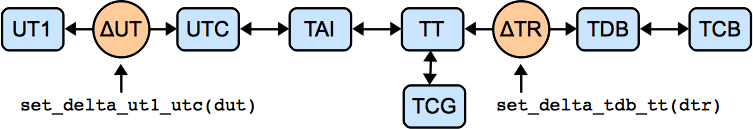

.. include:: references.txt

.. _astropy-time:

****************************************************
Time and Dates (`astropy.time`)
****************************************************

.. |Quantity| replace:: :class:`~astropy.units.Quantity`
.. |Longitude| replace:: :class:`~astropy.coordinates.Longitude`
.. |EarthLocation| replace:: :class:`~astropy.coordinates.EarthLocation`

Introduction
============

The `astropy.time` package provides functionality for manipulating times and
dates.  Specific emphasis is placed on supporting time scales (e.g. UTC, TAI,
UT1, TDB) and time representations (e.g. JD, MJD, ISO 8601) that are used in
astronomy and required to calculate, e.g., sidereal times and barycentric
corrections.
It uses Cython to wrap the C language `ERFA`_ time and calendar
routines, using a fast and memory efficient vectorization scheme.

All time manipulations and arithmetic operations are done internally using two
64-bit floats to represent time.  Floating point algorithms from [#]_ are used so
that the |Time| object maintains sub-nanosecond precision over times spanning
the age of the universe.

.. [#] `Shewchuk, 1997, Discrete & Computational Geometry 18(3):305-363
        <http://www.cs.berkeley.edu/~jrs/papers/robustr.pdf>`_

Getting Started
===============

The basic way to use `astropy.time` is to create a |Time|
object by supplying one or more input time values as well as the `time format`_ and
`time scale`_ of those values.  The input time(s) can either be a single scalar like
``"2010-01-01 00:00:00"`` or a list or a `numpy` array of values as shown below.
In general any output values have the same shape (scalar or array) as the input.

  >>> from astropy.time import Time
  >>> times = ['1999-01-01T00:00:00.123456789', '2010-01-01T00:00:00']
  >>> t = Time(times, format='isot', scale='utc')
  >>> t
  <Time object: scale='utc' format='isot' value=['1999-01-01T00:00:00.123' '2010-01-01T00:00:00.000']>
  >>> t[1]
  <Time object: scale='utc' format='isot' value=2010-01-01T00:00:00.000>

The ``format`` argument specifies how to interpret the input values,
e.g. ISO or JD or Unix time.  The ``scale`` argument specifies the `time scale`_ for the
values, e.g. UTC or TT or UT1.  The ``scale`` argument is optional and
defaults to UTC except for `Time from epoch formats`_.
We could have written the above as::

  >>> t = Time(times, format='isot')

When the format of the input can be unambiguously determined then the
``format`` argument is not required, so we can simplify even further::

  >>> t = Time(times)

Now let's get the representation of these times in the JD and MJD
formats by requesting the corresponding |Time| attributes::

  >>> t.jd
  array([ 2451179.50000143,  2455197.5       ])
  >>> t.mjd
  array([ 51179.00000143,  55197.        ])

We can also convert to a different time scale, for instance from UTC to
TT.  This uses the same attribute mechanism as above but now returns a new
|Time| object::

  >>> t2 = t.tt
  >>> t2
  <Time object: scale='tt' format='isot' value=['1999-01-01T00:01:04.307' '2010-01-01T00:01:06.184']>
  >>> t2.jd
  array([ 2451179.5007443 ,  2455197.50076602])

Note that both the ISO (ISOT) and JD representations of ``t2`` are different
than for ``t`` because they are expressed relative to the TT time scale.  Of
course, from the numbers or strings one could not tell; one format in which
this information is kept is the ``fits`` format::

  >>> t2.fits
  array(['1999-01-01T00:01:04.307(TT)', '2010-01-01T00:01:06.184(TT)'],
        dtype='|S27')
  
Finally, some further examples of what is possible.  For details, see
the API documentation below.

  >>> dt = t[1] - t[0]
  >>> dt  # doctest: +FLOAT_CMP
  <TimeDelta object: scale='tai' format='jd' value=4018.00002172>

Here, note the conversion of the timescale to TAI.  Time differences
can only have scales in which one day is always equal to 86400 seconds.

  >>> import numpy as np
  >>> t[0] + dt * np.linspace(0.,1.,12)
  <Time object: scale='utc' format='isot' value=['1999-01-01T00:00:00.123' '2000-01-01T06:32:43.930'
   '2000-12-31T13:05:27.737' '2001-12-31T19:38:11.544'
   '2003-01-01T02:10:55.351' '2004-01-01T08:43:39.158'
   '2004-12-31T15:16:22.965' '2005-12-31T21:49:06.772'
   '2007-01-01T04:21:49.579' '2008-01-01T10:54:33.386'
   '2008-12-31T17:27:17.193' '2010-01-01T00:00:00.000']>

  >>> t.sidereal_time('apparent', 'greenwich')
  <Longitude [ 6.68050179, 6.70281947] hourangle>

Using `astropy.time`
=====================

Time object basics
-------------------

In `astropy.time` a "time" is a single instant of time which is
independent of the way the time is represented (the "format") and the time
"scale" which specifies the offset and scaling relation of the unit of time.
There is no distinction made between a "date" and a "time" since both concepts
(as loosely defined in common usage) are just different representations of a
moment in time.

Once a |Time| object is created it cannot be altered internally.  In code lingo
it is "immutable."  In particular the common operation of "converting" to a
different `time scale`_ is always performed by returning a copy of the original
|Time| object which has been converted to the new time scale.

.. _time-format:

Time Format
^^^^^^^^^^^

The time format specifies how an instant of time is represented.  The currently
available formats are can be found in the ``Time.FORMATS`` dict and
are listed in the table below.  Each of these formats is implemented as a class
that derives from the base :class:`~astropy.time.TimeFormat` class.
This class structure can be easily adapted and extended by users for
specialized time formats not supplied in `astropy.time`.

===========  =================================================  ==============================
Format            Class                                         Example argument
===========  =================================================  ==============================
byear        :class:`~astropy.time.TimeBesselianEpoch`          1950.0
byear_str    :class:`~astropy.time.TimeBesselianEpochString`    'B1950.0'
cxcsec       :class:`~astropy.time.TimeCxcSec`                  63072064.184
datetime     :class:`~astropy.time.TimeDatetime`                datetime(2000, 1, 2, 12, 0, 0)
decimalyear  :class:`~astropy.time.TimeDecimalYear`             2000.45
fits         :class:`~astropy.time.TimeFITS`                    '2000-01-01T00:00:00.000(TAI)'
gps          :class:`~astropy.time.TimeGPS`                     630720013.0
iso          :class:`~astropy.time.TimeISO`                     '2000-01-01 00:00:00.000'
isot         :class:`~astropy.time.TimeISOT`                    '2000-01-01T00:00:00.000'
jd           :class:`~astropy.time.TimeJD`                      2451544.5
jyear        :class:`~astropy.time.TimeJulianEpoch`             2000.0
jyear_str    :class:`~astropy.time.TimeJulianEpochString`       'J2000.0'
mjd          :class:`~astropy.time.TimeMJD`                     51544.0
plot_date    :class:`~astropy.time.TimePlotDate`                730120.0003703703
unix         :class:`~astropy.time.TimeUnix`                    946684800.0
yday         :class:`~astropy.time.TimeYearDayTime`             2000:001:00:00:00.000
===========  =================================================  ==============================

.. note:: The :class:`~astropy.time.TimeFITS` format allows for most
   but not all of the the FITS standard [#]_. Not implemented (yet) is
   support for a ``LOCAL`` timescale. Furthermore, FITS supports some deprecated
   names for timescales; these are translated to the formal names upon
   initialization.  Furthermore, any specific realization information,
   such as ``UT(NIST)`` is stored only as long as the time scale is not changed.
.. [#] `Rots et al. 2015, A&A 574:A36 <http://adsabs.harvard.edu/abs/2015A%26A...574A..36R>`_
	  
Subformat
"""""""""

The time format classes :class:`~astropy.time.TimeISO`,
:class:`~astropy.time.TimeISOT`, :class:`~astropy.time.TimeFITS`, and
:class:`~astropy.time.TimeYearDayTime` support the concept of
subformats.  This allows for variations on the basic theme of a format in both
the input string parsing and the output.

The supported subformats are ``date_hms``, ``date_hm``, and ``date``
for all but the :class:`~astropy.time.TimeFITS` format; the latter
does not support ``data_hm`` but does support ``longdate_hms`` and
``longdate`` for years before the year 0 and after the year 10000.  The
table below illustrates these subformats for ``iso``, ``fits``, ``yday``
formats:

========  ============ ==============================
Format    Subformat    Input / output
========  ============ ==============================
``iso``   date_hms     2001-01-02 03:04:05.678
``iso``   date_hm      2001-01-02 03:04
``iso``   date         2001-01-02
``fits``  date_hms     2001-01-02T03:04:05.678(UTC)
``fits``  longdate_hms +02001-01-02T03:04:05.678(UTC)
``fits``  longdate     +02001-01-02(UTC)
``yday``  date_hms     2001:032:03:04:05.678
``yday``  date_hm      2001:032:03:04
``yday``  date         2001:032
========  ============ ==============================

Time from epoch formats
"""""""""""""""""""""""

The formats ``cxcsec``, ``gps``, and ``unix`` are a little special in
that they provide a floating point representation of the elapsed
time in seconds since a particular reference date.  These formats have
a intrinsic time scale which is used to compute the elapsed seconds
since the reference date.

========== ====== ========================
Format      Scale  Reference date
========== ====== ========================
``cxcsec``   TT   ``1998-01-01 00:00:00``
``unix``    UTC   ``1970-01-01 00:00:00``
``gps``     TAI   ``1980-01-06 00:00:19``
========== ====== ========================

Unlike the other formats which default to UTC, if no ``scale`` is provided when
initializing a |Time| object then the above intrinsic scale is used.
This is done for computational efficiency.

.. _time-scale:

Time Scale
^^^^^^^^^^

The time scale (or `time standard
<http://en.wikipedia.org/wiki/Time_standard>`_) is "a specification for
measuring time: either the rate at which time passes; or points in time; or
both" [#]_. See also [#]_ and [#]_.
::

  >>> Time.SCALES
  ('tai', 'tcb', 'tcg', 'tdb', 'tt', 'ut1', 'utc')

====== =================================
Scale        Description
====== =================================
tai    International Atomic Time   (TAI)
tcb    Barycentric Coordinate Time (TCB)
tcg    Geocentric Coordinate Time  (TCG)
tdb    Barycentric Dynamical Time  (TDB)
tt     Terrestrial Time            (TT)
ut1    Universal Time              (UT1)
utc    Coordinated Universal Time  (UTC)
====== =================================

.. [#] Wikipedia `time standard <http://en.wikipedia.org/wiki/Time_standard>`_ article
.. [#] SOFA Time Scale and Calendar Tools
       `(PDF) <http://www.iausofa.org/2012_0301_C/sofa/sofa_ts_c.pdf>`_
.. [#] `<http://www.ucolick.org/~sla/leapsecs/timescales.html>`_

The system of transformation between supported time scales is shown in the
figure below.  Further details are provided in the `Convert time scale`_ section.

Scalar or Array
^^^^^^^^^^^^^^^

A |Time| object can hold either a single time value or an array of time values.
The distinction is made entirely by the form of the input time(s).  If a |Time|
object holds a single value then any format outputs will be a single scalar
value, and likewise for arrays.  Like other arrays and lists, |Time| objects
holding arrays are subscriptable, returning scalar or array objects as
appropriate::

  >>> from astropy.time import Time
  >>> t = Time(100.0, format='mjd')
  >>> t.jd
  2400100.5
  >>> t = Time([100.0, 200.0, 300.], format='mjd')
  >>> t.jd
  array([ 2400100.5,  2400200.5,  2400300.5])
  >>> t[:2]
  <Time object: scale='utc' format='mjd' value=[ 100.  200.]>
  >>> t[2]
  <Time object: scale='utc' format='mjd' value=300.0>
  >>> t = Time(np.arange(50000., 50003.)[:, np.newaxis],
  ...          np.arange(0., 1., 0.5), format='mjd') 
  >>> t
  <Time object: scale='utc' format='mjd' value=[[ 50000.   50000.5]
   [ 50001.   50001.5]
   [ 50002.   50002.5]]>
  >>> t[0]
  <Time object: scale='utc' format='mjd' value=[ 50000.   50000.5]>

.. _astropy-time-inferring-input:

Inferring input format
^^^^^^^^^^^^^^^^^^^^^^

The |Time| class initializer will not accept ambiguous inputs,
but it will make automatic inferences in cases where the inputs are
unambiguous.  This can apply when the times are supplied as `~datetime.datetime`
objects or strings.  In the latter case
it is not required to specify the format because the available
string formats have no overlap.  However, if the format is known in advance
the string parsing will be faster if the format is provided.
::

  >>> from datetime import datetime
  >>> t = Time(datetime(2010, 1, 2, 1, 2, 3))
  >>> t.format
  'datetime'
  >>> t = Time('2010-01-02 01:02:03')
  >>> t.format
  'iso'

Internal representation
^^^^^^^^^^^^^^^^^^^^^^^

The |Time| object maintains an internal representation of time as a pair of
double precision numbers expressing Julian days. The sum of the two numbers is
the Julian Date for that time relative to the given `time scale`_.  Users
requiring no better than microsecond precision over human time scales (~100
years) can safely ignore the internal representation details and skip this section.

This representation is driven by the underlying ERFA C-library implementation.
The ERFA routines take care throughout to maintain overall precision of the
double pair.  The user is free to choose the way in which total JD is
provided, though internally one part contains integer days and the
other the fraction of the day, as this ensures optimal accuracy for
all conversions.  The internal JD pair is available via the ``jd1``
and ``jd2`` attributes::

  >>> t = Time('2010-01-01 00:00:00', scale='utc')
  >>> t.jd1, t.jd2
  (2455197.5, 0.0)
  >>> t2 = t.tai
  >>> t2.jd1, t2.jd2  # doctest: +FLOAT_CMP
  (2455197.5, 0.0003935185185185185)

Creating a Time object
----------------------

The allowed |Time| arguments to create a time object are listed below:

**val** : numpy ndarray, list, str, or number
    Data to initialize table.
**val2** : numpy ndarray, list, str, or number; optional
    Data to initialize table.
**format** : str, optional
    Format of input value(s)
**scale** : str, optional
    Time scale of input value(s)
**precision** : int between 0 and 9 inclusive
    Decimal precision when outputting seconds as floating point
**in_subfmt** : str
    Unix glob to select subformats for parsing string input times
**out_subfmt** : str
    Unix glob to select subformats for outputting string times
**location** : |EarthLocation| or tuple, optional
    If a tuple, 3 |Quantity| items with length units for geocentric coordinates,
    or a longitude, latitude, and optional height for geodetic coordinates.
    Can be a single location, or one for each input time.

val
^^^

The ``val`` argument  specifies the input time or times and
can be a single string or number, or it can be a Python list or `numpy` array
of strings or numbers. To initialize a |Time| object based on a specified time,
it *must* be present.  If ``val`` is absent (or `None`), the |Time| object will
be created for the time corresponding to the instant the object is created.

In most situations one also needs to specify the `time scale`_ via the
``scale`` argument.  The |Time| class will never guess the `time scale`_,
so a simple example would be::

  >>> t1 = Time(50100.0, scale='tt', format='mjd')
  >>> t2 = Time('2010-01-01 00:00:00', scale='utc')

It is possible to create a new |Time| object from one or more existing time
objects.  In this case the format and scale will be inferred from the
first object unless explicitly specified.
::

  >>> Time([t1, t2])
  <Time object: scale='tt' format='mjd' value=[ 50100.  55197.00076602]>

val2
^^^^

The ``val2`` argument is available for specialized situations where extremely
high precision is required.  Recall that the internal representation of time
within `astropy.time` is two double-precision numbers that when summed give
the Julian date.  If provided the ``val2`` argument is used in combination with
``val`` to set the second the internal time values.  The exact interpretation of
``val2`` is determined by the input format class.  As of this release all
string-valued formats ignore ``val2`` and all numeric inputs effectively add
the two values in a way that maintains the highest precision.  Example::

  >>> t = Time(100.0, 0.000001, format='mjd', scale='tt')
  >>> t.jd, t.jd1, t.jd2  # doctest: +FLOAT_CMP
  (2400100.500001, 2400100.5, 1e-06)

format
^^^^^^

The `format` argument sets the time `time format`_, and as mentioned it is
required unless the format can be unambiguously determined from the input times.

scale
^^^^^

The ``scale`` argument sets the `time scale`_ and is required except for time
formats such as ``plot_date`` (:class:`~astropy.time.TimePlotDate`) and ``unix``
(:class:`~astropy.time.TimeUnix`).  These formats represent the duration
in SI seconds since a fixed instant in time which is independent of time scale.

precision
^^^^^^^^^^

The ``precision`` setting affects string formats when outputting a value that
includes seconds.  It must be an integer between 0 and 9.  There is no effect
when inputting time values from strings.  The default precision is 3.  Note
that the limit of 9 digits is driven by the way that ERFA handles fractional
seconds.  In practice this should should not be an issue.  ::

  >>> t = Time('B1950.0', scale='utc', precision=3)
  >>> t.byear_str
  'B1950.000'
  >>> t.precision = 0
  >>> t.byear_str
  'B1950'

in_subfmt
^^^^^^^^^

The ``in_subfmt`` argument provides a mechanism to select one or more
`subformat`_ values from the available subformats for string input.  Multiple
allowed subformats can be selected using Unix-style wildcard characters, in
particular ``*`` and ``?``, as documented in the Python `fnmatch
<http://docs.python.org/library/fnmatch.html>`_ module.

The default value for ``in_subfmt`` is ``*`` which matches any available
subformat.  This allows for convenient input of values with unknown or
heterogeneous subformat::

  >>> Time(['2000:001', '2000:002:03:04', '2001:003:04:05:06.789'])
  <Time object: scale='utc' format='yday'
   value=['2000:001:00:00:00.000' '2000:002:03:04:00.000' '2001:003:04:05:06.789']>

One can explicitly specify ``in_subfmt`` in order to strictly require a
certain subformat::

  >>> t = Time('2000:002:03:04', in_subfmt='date_hm')
  >>> t = Time('2000:002', in_subfmt='date_hm')  # doctest: +SKIP
  Traceback (most recent call last):
    ...
  ValueError: Input values did not match any of the formats where the
  format keyword is optional ['astropy_time', 'datetime',
  'byear_str', 'iso', 'isot', 'jyear_str', 'yday']

out_subfmt
^^^^^^^^^^

The ``out_subfmt`` argument is similar to ``in_subfmt`` except that it applies
to output formatting.  In the case of multiple matching subformats the first
matching subformat is used.

  >>> Time('2000-01-01 02:03:04', out_subfmt='date').iso
  '2000-01-01'
  >>> Time('2000-01-01 02:03:04', out_subfmt='date_hms').iso
  '2000-01-01 02:03:04.000'
  >>> Time('2000-01-01 02:03:04', out_subfmt='date*').iso
  '2000-01-01 02:03:04.000'

location
^^^^^^^^

This optional parameter specifies the observer location, using an
|EarthLocation| object or a tuple containing any form that can initialize one:
either a tuple with geocentric coordinates (X, Y, Z), or a tuple with geodetic
coordinates (longitude, latitude, height; with height defaulting to zero).
They are used for time scales that are sensitive to observer location
(currently, only TDB, which relies on the ERFA routine ``eraDtdb`` to
determine the time offset between TDB and TT), as well as for sidereal time if
no explicit longitude is given.

  >>> t = Time('2001-03-22 00:01:44.732327132980', scale='utc',
  ...          location=('120d', '40d'))
  >>> t.sidereal_time('apparent', 'greenwich')  # doctest: +FLOAT_CMP
  <Longitude 12.00000000000001 hourangle>
  >>> t.sidereal_time('apparent')  # doctest: +FLOAT_CMP
  <Longitude 20.00000000000001 hourangle>

.. note:: In future versions, we hope to add the possibility to add observatory
          objects and/or names.

Getting the Current Time
^^^^^^^^^^^^^^^^^^^^^^^^

The current time can be determined as a |Time| object using the
`~astropy.time.Time.now` class method::

  >>> nt = Time.now()
  >>> ut = Time(datetime.utcnow(), scale='utc')

The two should be very close to each other.

Using Time objects
-------------------

There are four basic operations available with |Time| objects:

- Get the representation of the time value(s) in a particular `time format`_.
- Get a new time object for the same time value(s) but referenced to a different
  `time scale`_.
- Calculate the `sidereal time`_ corresponding to the time value(s).
- Do time arithmetic involving |Time| and/or |TimeDelta| objects.

Get representation
^^^^^^^^^^^^^^^^^^^

Instants of time can be represented in different ways, for instance as an
ISO-format date string (``'1999-07-23 04:31:00'``) or seconds since 1998.0
(``49091460.0``) or Modified Julian Date (``51382.187451574``).

The representation of a |Time| object in a particular format is available
by getting the object attribute corresponding to the format name.  The list of
available format names is in the `time format`_ section.

  >>> t = Time('2010-01-01 00:00:00', format='iso', scale='utc')
  >>> t.jd        # JD representation of time in current scale (UTC)
  2455197.5
  >>> t.iso       # ISO representation of time in current scale (UTC)
  '2010-01-01 00:00:00.000'
  >>> t.unix      # seconds since 1970.0 (UTC)
  1262304000.0
  >>> t.plot_date # Date value for plotting with matplotlib plot_date()
  733773.0
  >>> t.datetime  # Representation as datetime.datetime object
  datetime.datetime(2010, 1, 1, 0, 0)

Example::

  >>> import matplotlib.pyplot as plt  # doctest: +SKIP
  >>> jyear = np.linspace(2000, 2001, 20)  # doctest: +SKIP
  >>> t = Time(jyear, format='jyear')  # doctest: +SKIP
  >>> plt.plot_date(t.plot_date, jyear)  # doctest: +SKIP
  >>> plt.gcf().autofmt_xdate()  # orient date labels at a slant  # doctest: +SKIP
  >>> plt.draw()  # doctest: +SKIP

Convert time scale
^^^^^^^^^^^^^^^^^^^^

A new |Time| object for the same time value(s) but referenced to a new `time
scale`_ can be created getting the object attribute corresponding to the time
scale name.  The list of available time scale names is in the `time scale`_
section and in the figure below illustrating the network of time scale
transformations.

Examples::

  >>> t = Time('2010-01-01 00:00:00', format='iso', scale='utc')
  >>> t.tt        # TT scale
  <Time object: scale='tt' format='iso' value=2010-01-01 00:01:06.184>
  >>> t.tai
  <Time object: scale='tai' format='iso' value=2010-01-01 00:00:34.000>

In this process the ``format`` and other object attributes like ``lon``,
``lat``, and ``precision`` are also propagated to the new object.

As noted in the ``Time object basics`` section, a |Time| object is immutable and
the internal time values cannot be altered once the object is created.  The
process of changing the time scale therefore begins by making a copy of the
original object and then converting the internal time values in the copy to the
new time scale.  The new |Time| object is returned by the attribute access.

Transformation offsets
""""""""""""""""""""""

Time scale transformations that cross one of the orange circles in the image
above require an additional offset time value that is model or
observation-dependent.  See `SOFA Time Scale and Calendar Tools
<http://www.iausofa.org/2012_0301_C/sofa/sofa_ts_c.pdf>`_ for further details.

The two attributes :attr:`~astropy.time.Time.delta_ut1_utc` and
:attr:`~astropy.time.Time.delta_tdb_tt` provide a way to set
these offset times explicitly.  These represent the time scale offsets
UT1 - UTC and TDB - TT, respectively.  As an example::

  >>> t = Time('2010-01-01 00:00:00', format='iso', scale='utc')
  >>> t.delta_ut1_utc = 0.334  # Explicitly set one part of the transformation
  >>> t.ut1.iso    # ISO representation of time in UT1 scale
  '2010-01-01 00:00:00.334'

For the UT1 to UTC offset, one has to interpolate in observed values provided
by the `International Earth Rotation and Reference Systems Service
<http://www.iers.org>`_.  By default, Astropy is shipped with the final
values provided in Bulletin B, which cover the period from 1962 to shortly
before an astropy release, and these will be used to compute the offset if the
:attr:`~astropy.time.Time.delta_ut1_utc` attribute is not set explicitly.  For
more recent times, one can download an updated version of `IERS B
<http://hpiers.obspm.fr/iers/eop/eopc04/eopc04_IAU2000.62-now>`_ or `IERS A
<http://maia.usno.navy.mil/ser7/finals2000A.all>`_ (which also has
predictions), and set :attr:`~astropy.time.Time.delta_ut1_utc` as described in
`~astropy.time.Time.get_delta_ut1_utc`::

  >>> from astropy.utils.iers import IERS_A, IERS_A_URL
  >>> from astropy.utils.data import download_file
  >>> iers_a_file = download_file(IERS_A_URL, cache=True)  # doctest: +SKIP
  >>> iers_a = IERS_A.open(iers_a_file)                     # doctest: +SKIP
  >>> t.delta_ut1_utc = t.get_delta_ut1_utc(iers_a)         # doctest: +SKIP

In the case of the TDB to TT offset, most users need only provide the ``lon``
and ``lat`` values when creating the |Time| object.  If the
:attr:`~astropy.time.Time.delta_tdb_tt` attribute is not explicitly set then
the ERFA C-library routine ``eraDtdb`` will be used to compute the TDB to TT
offset.  Note that if ``lon`` and ``lat`` are not explicitly initialized,
values of 0.0 degrees for both will be used.

The following code replicates an example in the `SOFA Time Scale and Calendar
Tools <http://www.iausofa.org/2012_0301_C/sofa/sofa_ts_c.pdf>`_ document.  It
does the transform from UTC to all supported time scales (TAI, TCB, TCG, TDB,
TT, UT1, UTC).  This requires an observer location (here, latitude and
longitude).::

  >>> import astropy.units as u
  >>> t = Time('2006-01-15 21:24:37.5', format='iso', scale='utc',
  ...          location=(-155.933222*u.deg, 19.48125*u.deg), precision=6)
  >>> t.utc.iso
  '2006-01-15 21:24:37.500000'
  >>> t.ut1.iso
  '2006-01-15 21:24:37.834078'
  >>> t.tai.iso
  '2006-01-15 21:25:10.500000'
  >>> t.tt.iso
  '2006-01-15 21:25:42.684000'
  >>> t.tcg.iso
  '2006-01-15 21:25:43.322690'
  >>> t.tdb.iso
  '2006-01-15 21:25:42.684373'
  >>> t.tcb.iso
  '2006-01-15 21:25:56.893952'

Sidereal Time
-------------

Apparent or mean sidereal time can be calculated using
:meth:`~astropy.time.Time.sidereal_time`.  The method returns a |Longitude|
with units of hourangle, which by default is for the longitude corresponding to
the location with which the |Time| object is initialized.  Like the scale
transformations, ERFA C-library routines are used under the hood, which support
calculations following different IAU resolutions.  Sample usage::

  >>> t = Time('2006-01-15 21:24:37.5', scale='utc', location=('120d', '45d'))
  >>> t.sidereal_time('mean')  # doctest: +FLOAT_CMP
  <Longitude 13.089521870640212 hourangle>
  >>> t.sidereal_time('apparent')  # doctest: +FLOAT_CMP
  <Longitude 13.089503675087027 hourangle>
  >>> t.sidereal_time('apparent', 'greenwich')  # doctest: +FLOAT_CMP
  <Longitude 5.089503675087027 hourangle>
  >>> t.sidereal_time('apparent', '-90d')  # doctest: +FLOAT_CMP
  <Longitude 23.08950367508703 hourangle>
  >>> t.sidereal_time('apparent', '-90d', 'IAU1994')  # doctest: +FLOAT_CMP
  <Longitude 23.08950365423405 hourangle>

Time Deltas
-----------

Simple time arithmetic is supported using the |TimeDelta| class.  The
following operations are available:

- Create a TimeDelta explicitly by instantiating a class object
- Create a TimeDelta by subtracting two Times
- Add a TimeDelta to a Time object to get a new Time
- Subtract a TimeDelta from a Time object to get a new Time
- Add two TimeDelta objects to get a new TimeDelta
- Negate a TimeDelta or take its absolute value
- Multiply or divide a TimeDelta by a constant or array
- Convert TimeDelta objects to and from time-like Quantities

The |TimeDelta| class is derived from the |Time| class and shares many of its
properties.  One difference is that the time scale has to be one for which one
day is exactly 86400 seconds.  Hence, the scale cannot be UTC.

The available time formats are:

=========  ===================================================
Format            Class
=========  ===================================================
sec        :class:`~astropy.time.TimeDeltaSec`
jd         :class:`~astropy.time.TimeDeltaJD`
=========  ===================================================

Examples
^^^^^^^^^

Use of the |TimeDelta| object is easily illustrated in the few examples below::

  >>> t1 = Time('2010-01-01 00:00:00')
  >>> t2 = Time('2010-02-01 00:00:00')
  >>> dt = t2 - t1  # Difference between two Times
  >>> dt
  <TimeDelta object: scale='tai' format='jd' value=31.0>
  >>> dt.sec
  2678400.0

  >>> from astropy.time import TimeDelta
  >>> dt2 = TimeDelta(50.0, format='sec')
  >>> t3 = t2 + dt2  # Add a TimeDelta to a Time
  >>> t3.iso
  '2010-02-01 00:00:50.000'

  >>> t2 - dt2  # Subtract a TimeDelta from a Time
  <Time object: scale='utc' format='iso' value=2010-01-31 23:59:10.000>

  >>> dt + dt2
  <TimeDelta object: scale='tai' format='jd' value=31.0005787037>

  >>> import numpy as np
  >>> t1 + dt * np.linspace(0, 1, 5)
  <Time object: scale='utc' format='iso' value=['2010-01-01 00:00:00.000'
  '2010-01-08 18:00:00.000' '2010-01-16 12:00:00.000' '2010-01-24 06:00:00.000'
  '2010-02-01 00:00:00.000']>

Time Scales for Time Deltas
---------------------------

Above, one sees that the difference between two UTC times is a |TimeDelta|
with a scale of TAI.  This is because a UTC time difference cannot be uniquely
defined unless one knows the two times that were differenced (because of leap
seconds, a day does not always have 86400 seconds).  For all other time
scales, the |TimeDelta| inherits the scale of the first |Time| object::

  >>> t1 = Time('2010-01-01 00:00:00', scale='tcg')
  >>> t2 = Time('2011-01-01 00:00:00', scale='tcg')
  >>> dt = t2 - t1
  >>> dt
  <TimeDelta object: scale='tcg' format='jd' value=365.0>

When |TimeDelta| objects are added or subtracted from |Time| objects, scales
are converted appropriately, with the final scale being that of the |Time|
object::

  >>> t2 + dt
  <Time object: scale='tcg' format='iso' value=2012-01-01 00:00:00.000>
  >>> t2.tai
  <Time object: scale='tai' format='iso' value=2010-12-31 23:59:27.068>
  >>> t2.tai + dt
  <Time object: scale='tai' format='iso' value=2011-12-31 23:59:27.046>

|TimeDelta| objects can be converted only to objects with compatible scales,
i.e., scales for which it is not necessary to know the times that were
differenced::

  >>> dt.tt  # doctest: +FLOAT_CMP
  <TimeDelta object: scale='tt' format='jd' value=364.999999746>
  >>> dt.tdb
  Traceback (most recent call last):
    ...
  ScaleValueError: Cannot convert TimeDelta with scale 'tcg' to scale 'tdb'

|TimeDelta| objects can also have an undefined scale, in which case it is
assumed that there scale matches that of the other |Time| or |TimeDelta|
object (or is TAI in case of a UTC time)::

  >>> t2.tai + TimeDelta(365., format='jd', scale=None)
  <Time object: scale='tai' format='iso' value=2011-12-31 23:59:27.068>

Interaction with Time-like Quantities
-------------------------------------

Where possible, |Quantity| objects with units of time are treated as TimeDelta
objects with undefined scale (though necessarily with lower precision). They
can also be used as input in constructing |Time| and |TimeDelta| objects, and
|TimeDelta| objects can be converted to |Quantity| objects of arbitrary units
of time.  Usage is most easily illustrated by examples::

  >>> import astropy.units as u
  >>> Time(10.*u.yr, format='gps')   # time-valued quantities can be used for
  ...                                # for formats requiring a time offset
  <Time object: scale='tai' format='gps' value=315576000.0>
  >>> Time(10.*u.yr, 1.*u.s, format='gps')
  <Time object: scale='tai' format='gps' value=315576001.0>
  >>> Time(2000.*u.yr, scale='utc', format='jyear')
  <Time object: scale='utc' format='jyear' value=2000.0>
  >>> Time(2000.*u.yr, scale='utc', format='byear')
  ...                                # but not for Besselian year, which implies
  ...                                # a different time scale
  ...
  Traceback (most recent call last):
    ...
  ValueError: Input values did not match the format class byear

  >>> TimeDelta(10.*u.yr)            # With a quantity, no format is required
  <TimeDelta object: scale='None' format='jd' value=3652.5>

  >>> dt = TimeDelta([10., 20., 30.], format='jd')
  >>> dt.to(u.hr)                    # can convert TimeDelta to a quantity
  <Quantity [ 240., 480., 720.] h>
  >>> dt > 400. * u.hr               # and compare to quantities with units of time
  array([False,  True,  True], dtype=bool)
  >>> dt + 1.*u.hr                   # can also add/subtract such quantities
  <TimeDelta object: scale='None' format='jd' value=[ 10.04166667  20.04166667  30.04166667]>
  >>> Time(50000., format='mjd', scale='utc') + 1.*u.hr  # doctest: +FLOAT_CMP
  <Time object: scale='utc' format='mjd' value=50000.0416667>
  >>> dt * 10.*u.km/u.s              # for multiplication and division with a
  ...                                # Quantity, TimeDelta is converted
  <Quantity [ 100., 200., 300.] d km / s>
  >>> dt * 10.*u.Unit(1)             # unless the Quantity is dimensionless
  <TimeDelta object: scale='None' format='jd' value=[ 100.  200.  300.]>

Reference/API
=============

.. automodapi:: astropy.time

Acknowledgments and Licenses
============================

This package makes use of the `ERFA Software
<https://github.com/liberfa/erfa>`_ ANSI C library. The copyright of the ERFA
software belongs to the NumFOCUS Foundation. The library is made available
under the terms of the "BSD-three clauses" license.

The ERFA library is derived, with permission, from the International
Astronomical Union's "Standards of Fundamental Astronomy" library,
available from http://www.iausofa.org.
