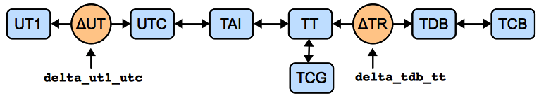

.. include:: references.txt

.. _astropy-time:

*******************************
Time and Dates (`astropy.time`)
*******************************

.. |Quantity| replace:: :class:`~astropy.units.Quantity`
.. |Longitude| replace:: :class:`~astropy.coordinates.Longitude`
.. |EarthLocation| replace:: :class:`~astropy.coordinates.EarthLocation`
.. |SkyCoord| replace:: :class:`~astropy.coordinates.SkyCoord`

Introduction
============

The `astropy.time` package provides functionality for manipulating times and
dates. Specific emphasis is placed on supporting time scales (e.g., UTC, TAI,
UT1, TDB) and time representations (e.g., JD, MJD, ISO 8601) that are used in
astronomy and required to calculate, for example, sidereal times and barycentric
corrections. The `astropy.time` package is based on fast and memory efficient
wrappers around the `ERFA`_ time and calendar routines.

All time manipulations and arithmetic operations are done internally using two
64-bit floats to represent time. Floating point algorithms from [#]_ are used so
that the |Time| object maintains sub-nanosecond precision over times spanning
the age of the universe.

.. [#] Shewchuk, 1997, Discrete & Computational Geometry 18(3):305-363

Getting Started
===============

The usual way to use `astropy.time` is to create a |Time| object by
supplying one or more input time values as well as the `time format`_ and `time
scale`_ of those values. The input time(s) can either be a single scalar like
``"2010-01-01 00:00:00"`` or a list or a ```numpy`` array of values as shown
below. In general, any output values have the same shape (scalar or array) as
the input.

Examples
--------

.. EXAMPLE START: Creating a Time Object with astropy.time

To create a |Time| object:

  >>> import numpy as np
  >>> from astropy.time import Time
  >>> times = ['1999-01-01T00:00:00.123456789', '2010-01-01T00:00:00']
  >>> t = Time(times, format='isot', scale='utc')
  >>> t
  <Time object: scale='utc' format='isot' value=['1999-01-01T00:00:00.123' '2010-01-01T00:00:00.000']>
  >>> t[1]
  <Time object: scale='utc' format='isot' value=2010-01-01T00:00:00.000>

The ``format`` argument specifies how to interpret the input values (e.g., ISO,
JD, or Unix time). The ``scale`` argument specifies the `time scale`_ for the
values (e.g., UTC, TT, or UT1). The ``scale`` argument is optional and defaults
to UTC except for `Time from Epoch Formats`_.

.. EXAMPLE END

We could have written the above as::

  >>> t = Time(times, format='isot')

When the format of the input can be unambiguously determined, the
``format`` argument is not required, so we can then simplify even further::

  >>> t = Time(times)

Now we can get the representation of these times in the JD and MJD
formats by requesting the corresponding |Time| attributes::

  >>> t.jd  # doctest: +FLOAT_CMP
  array([2451179.50000143, 2455197.5       ])
  >>> t.mjd  # doctest: +FLOAT_CMP
  array([51179.00000143, 55197.        ])

The full power of output representation is available via the
`~astropy.time.Time.to_value` method which also allows controlling the
`subformat`_. For instance, using ``numpy.longdouble`` as the output type
for higher precision::

  >>> t.to_value('mjd', 'long')  # doctest: +SKIP
  array([51179.00000143, 55197.        ], dtype=float128)

The default representation can be changed by setting the ``format`` attribute::

  >>> t.format = 'fits'
  >>> t
  <Time object: scale='utc' format='fits' value=['1999-01-01T00:00:00.123'
                                                 '2010-01-01T00:00:00.000']>
  >>> t.format = 'isot'

We can also convert to a different time scale, for instance from UTC to
TT. This uses the same attribute mechanism as above but now returns a new
|Time| object::

  >>> t2 = t.tt
  >>> t2
  <Time object: scale='tt' format='isot' value=['1999-01-01T00:01:04.307' '2010-01-01T00:01:06.184']>
  >>> t2.jd  # doctest: +FLOAT_CMP
  array([2451179.5007443 , 2455197.50076602])

Note that both the ISO (ISOT) and JD representations of ``t2`` are different
than for ``t`` because they are expressed relative to the TT time scale. Of
course, from the numbers or strings you would not be able to tell this was the
case::

  >>> print(t2.fits)
  ['1999-01-01T00:01:04.307' '2010-01-01T00:01:06.184']

You can set the time values in place using the usual ``numpy`` array setting
item syntax::

  >>> t2 = t.tt.copy()  # Copy required if transformed Time will be modified
  >>> t2[1] = '2014-12-25'
  >>> print(t2)
  ['1999-01-01T00:01:04.307' '2014-12-25T00:00:00.000']

The |Time| object also has support for missing values, which is particularly
useful for :ref:`table_operations` such as joining and stacking::

  >>> t2[0] = np.ma.masked  # Declare that first time is missing or invalid
  >>> print(t2)
  [-- '2014-12-25T00:00:00.000']

Finally, some further examples of what is possible. For details, see
the API documentation below.

  >>> dt = t[1] - t[0]
  >>> dt  # doctest: +FLOAT_CMP
  <TimeDelta object: scale='tai' format='jd' value=4018.00002172>

Here, note the conversion of the timescale to TAI. Time differences
can only have scales in which one day is always equal to 86400 seconds.

  >>> import numpy as np
  >>> t[0] + dt * np.linspace(0.,1.,12)
  <Time object: scale='utc' format='isot' value=['1999-01-01T00:00:00.123' '2000-01-01T06:32:43.930'
   '2000-12-31T13:05:27.737' '2001-12-31T19:38:11.544'
   '2003-01-01T02:10:55.351' '2004-01-01T08:43:39.158'
   '2004-12-31T15:16:22.965' '2005-12-31T21:49:06.772'
   '2007-01-01T04:21:49.579' '2008-01-01T10:54:33.386'
   '2008-12-31T17:27:17.193' '2010-01-01T00:00:00.000']>

  >>> t.sidereal_time('apparent', 'greenwich')  # doctest: +FLOAT_CMP +REMOTE_DATA
  <Longitude [6.68050179, 6.70281947] hourangle>

Using `astropy.time`
====================

Time Object Basics
------------------

In `astropy.time` a "time" is a single instant of time which is
independent of the way the time is represented (the "format") and the time
"scale" which specifies the offset and scaling relation of the unit of time.
There is no distinction made between a "date" and a "time" since both concepts
(as loosely defined in common usage) are just different representations of a
moment in time.

.. _time-format:

Time Format
^^^^^^^^^^^

The time format specifies how an instant of time is represented. The currently
available formats are can be found in the ``Time.FORMATS`` dict and are listed
in the table below. Each of these formats is implemented as a class that derives
from the base :class:`~astropy.time.TimeFormat` class. This class structure can
be adapted and extended by users for specialized time formats not supplied in
`astropy.time`.

===========  =================================================  =====================================
Format            Class                                         Example Argument
===========  =================================================  =====================================
byear        :class:`~astropy.time.TimeBesselianEpoch`          1950.0
byear_str    :class:`~astropy.time.TimeBesselianEpochString`    'B1950.0'
cxcsec       :class:`~astropy.time.TimeCxcSec`                  63072064.184
datetime     :class:`~astropy.time.TimeDatetime`                datetime(2000, 1, 2, 12, 0, 0)
decimalyear  :class:`~astropy.time.TimeDecimalYear`             2000.45
fits         :class:`~astropy.time.TimeFITS`                    '2000-01-01T00:00:00.000'
gps          :class:`~astropy.time.TimeGPS`                     630720013.0
iso          :class:`~astropy.time.TimeISO`                     '2000-01-01 00:00:00.000'
isot         :class:`~astropy.time.TimeISOT`                    '2000-01-01T00:00:00.000'
jd           :class:`~astropy.time.TimeJD`                      2451544.5
jyear        :class:`~astropy.time.TimeJulianEpoch`             2000.0
jyear_str    :class:`~astropy.time.TimeJulianEpochString`       'J2000.0'
mjd          :class:`~astropy.time.TimeMJD`                     51544.0
plot_date    :class:`~astropy.time.TimePlotDate`                730120.0003703703
unix         :class:`~astropy.time.TimeUnix`                    946684800.0
yday         :class:`~astropy.time.TimeYearDayTime`             2000:001:00:00:00.000
ymdhms       :class:`~astropy.time.TimeYMDHMS`                  {'year': 2010, 'month': 3, 'day': 1}
datetime64   :class:`~astropy.time.TimeDatetime64`              np.datetime64('2000-01-01T01:01:01')
===========  =================================================  =====================================

.. note:: The :class:`~astropy.time.TimeFITS` format implements most
   of the FITS standard [#]_, including support for the ``LOCAL`` timescale.
   Note, though, that FITS supports some deprecated names for timescales;
   these are translated to the formal names upon initialization. Furthermore,
   any specific realization information, such as ``UT(NIST)`` is stored only as
   long as the time scale is not changed.
.. [#] `Rots et al. 2015, A&A 574:A36 <https://ui.adsabs.harvard.edu/abs/2015A%26A...574A..36R>`_

Changing Format
"""""""""""""""

.. EXAMPLE START: Changing Time Format

The default representation can be changed by setting the ``format`` attribute::

  >>> t = Time('2000-01-02')
  >>> t.format = 'jd'
  >>> t
  <Time object: scale='utc' format='jd' value=2451545.5>

Be aware that when changing format, the current output subformat (see section
below) may not exist in the new format. In this case, the subformat will not be
preserved::

  >>> t = Time('2000-01-02', format='fits', out_subfmt='longdate')
  >>> t.value
  '+02000-01-02'
  >>> t.format = 'iso'
  >>> t.out_subfmt
  u'*'
  >>> t.format = 'fits'
  >>> t.value
  '2000-01-02T00:00:00.000'

.. EXAMPLE END

Subformat
"""""""""

Many of the available time format classes support the concept of a subformat.
This allows for variations on the basic theme of a format in both the input
parsing/validation and the output.

The table below illustrates available subformats for the string formats
 ``iso``, ``fits``, and ``yday`` formats:

========  ============ ==============================
Format    Subformat    Input / Output
========  ============ ==============================
``iso``   date_hms     2001-01-02 03:04:05.678
``iso``   date_hm      2001-01-02 03:04
``iso``   date         2001-01-02
``fits``  date_hms     2001-01-02T03:04:05.678
``fits``  longdate_hms +02001-01-02T03:04:05.678
``fits``  longdate     +02001-01-02
``yday``  date_hms     2001:032:03:04:05.678
``yday``  date_hm      2001:032:03:04
``yday``  date         2001:032
========  ============ ==============================

Numerical formats such as ``mjd``, ``jyear``, or ``cxcsec`` all support the
subformats: ``'float'``, ``'long'``, ``'decimal'``, ``'str'``, and ``'bytes'``.
Here, ``'long'`` uses ``numpy.longdouble`` for somewhat enhanced precision (with
the enhancement depending on platform), and ``'decimal'`` instances of
:class:`decimal.Decimal` for full precision. For the ``'str'`` and ``'bytes'``
subformats, the number of digits is also chosen such that time values are
represented accurately.

When used on input, these formats allow creating a time using a single input
value that accurately captures the value to the full available precision in
|Time|. Conversely, the single value on output using |Time|
`~astropy.time.Time.to_value` or |TimeDelta| `~astropy.time.TimeDelta.to_value`
can have higher precision than the standard 64-bit float::

  >>> tm = Time('51544.000000000000001', format='mjd')  # String input
  >>> tm.mjd  # float64 output loses last digit but Decimal gets it
  51544.0
  >>> tm.to_value('mjd', subfmt='decimal')  # doctest: +SKIP
  Decimal('51544.00000000000000099920072216264')
  >>> tm.to_value('mjd', subfmt='str')
  '51544.000000000000001'

The complete list of subformat options for the |Time| formats that
have them is:

================ ========================================
Format           Subformats
================ ========================================
``byear``        float, long, decimal, str, bytes
``cxcsec``       float, long, decimal, str, bytes
``datetime64``   date_hms, date_hm, date
``decimalyear``  float, long, decimal, str, bytes
``fits``         date_hms, date, longdate_hms, longdate
``gps``          float, long, decimal, str, bytes
``iso``          date_hms, date_hm, date
``isot``         date_hms, date_hm, date
``jd``           float, long, decimal, str, bytes
``jyear``        float, long, decimal, str, bytes
``mjd``          float, long, decimal, str, bytes
``plot_date``    float, long, decimal, str, bytes
``unix``         float, long, decimal, str, bytes
``yday``         date_hms, date_hm, date
================ ========================================

The complete list of subformat options for the |TimeDelta| formats
that have them is:

================ ========================================
Format           Subformats
================ ========================================
``jd``           float, long, decimal, str, bytes
``sec``          float, long, decimal, str, bytes
================ ========================================

Time from Epoch Formats
"""""""""""""""""""""""

The formats ``cxcsec``, ``gps``, and ``unix`` are special in that
they provide a floating point representation of the elapsed time in seconds
since a particular reference date. These formats have a intrinsic time scale
which is used to compute the elapsed seconds since the reference date.

========== ====== ========================
Format      Scale  Reference date
========== ====== ========================
``cxcsec``   TT   ``1998-01-01 00:00:00``
``unix``    UTC   ``1970-01-01 00:00:00``
``gps``     TAI   ``1980-01-06 00:00:19``
========== ====== ========================

Unlike the other formats which default to UTC, if no ``scale`` is provided when
initializing a |Time| object then the above intrinsic scale is used.
This is done for computational efficiency.

.. _time-scale:

Time Scale
^^^^^^^^^^

The time scale (or `time standard
<https://en.wikipedia.org/wiki/Time_standard>`_) is "a specification for
measuring time: either the rate at which time passes; or points in time; or
both" [#]_. See also [#]_ and [#]_.
::

  >>> Time.SCALES
  ('tai', 'tcb', 'tcg', 'tdb', 'tt', 'ut1', 'utc', 'local')

====== =================================
Scale  Description
====== =================================
tai    International Atomic Time   (TAI)
tcb    Barycentric Coordinate Time (TCB)
tcg    Geocentric Coordinate Time  (TCG)
tdb    Barycentric Dynamical Time  (TDB)
tt     Terrestrial Time             (TT)
ut1    Universal Time              (UT1)
utc    Coordinated Universal Time  (UTC)
local  Local Time Scale          (LOCAL)
====== =================================

.. [#] Wikipedia `time standard <https://en.wikipedia.org/wiki/Time_standard>`_ article
.. [#] SOFA Time Scale and Calendar Tools
       `(PDF) <http://www.iausofa.org/sofa_ts_c.pdf>`_
.. [#] `<https://www.ucolick.org/~sla/leapsecs/timescales.html>`_

.. note:: The ``local`` time scale is meant for free-running clocks or
   simulation times (i.e., to represent a time without a properly defined
   scale). This means it cannot be converted to any other time scale, and
   arithmetic is possible only with |Time| instances with scale ``local`` and
   with |TimeDelta| instances with scale ``local`` or `None`.

The system of transformation between supported time scales (i.e., all but
``local``) is shown in the figure below. Further details are provided in the
`Convert time scale`_ section.



Scalar or Array
^^^^^^^^^^^^^^^

A |Time| object can hold either a single time value or an array of time values.
The distinction is made entirely by the form of the input time(s). If a |Time|
object holds a single value then any format outputs will be a single scalar
value, and likewise for arrays.

Example
"""""""

.. EXAMPLE START: Time Objects Holding Scalar or Array Values

Like other arrays and lists, |Time| objects holding arrays are subscriptable,
returning scalar or array objects as appropriate::

  >>> from astropy.time import Time
  >>> t = Time(100.0, format='mjd')
  >>> t.jd
  2400100.5
  >>> t = Time([100.0, 200.0, 300.], format='mjd')
  >>> t.jd  # doctest: +FLOAT_CMP
  array([2400100.5, 2400200.5, 2400300.5])
  >>> t[:2]  # doctest: +FLOAT_CMP
  <Time object: scale='utc' format='mjd' value=[100. 200.]>
  >>> t[2]
  <Time object: scale='utc' format='mjd' value=300.0>
  >>> t = Time(np.arange(50000., 50003.)[:, np.newaxis],
  ...          np.arange(0., 1., 0.5), format='mjd')
  >>> t  # doctest: +FLOAT_CMP
  <Time object: scale='utc' format='mjd' value=[[50000.  50000.5]
   [50001.  50001.5]
   [50002.  50002.5]]>
  >>> t[0]  # doctest: +FLOAT_CMP
  <Time object: scale='utc' format='mjd' value=[50000.  50000.5]>

.. EXAMPLE END

.. _astropy-time-shape-methods:

NumPy Method Analogs
^^^^^^^^^^^^^^^^^^^^

For |Time| instances holding arrays, many of the same methods and attributes
that work on `~numpy.ndarray` instances can be used. For example, you can
reshape |Time| instances and take specific parts using
:meth:`~astropy.time.Time.reshape`, :meth:`~astropy.time.Time.ravel`,
:meth:`~astropy.time.Time.flatten`, :attr:`~astropy.time.Time.T`,
:meth:`~astropy.time.Time.transpose`, :meth:`~astropy.time.Time.swapaxes`,
:meth:`~astropy.time.Time.diagonal`, :meth:`~astropy.time.Time.squeeze`, or
:meth:`~astropy.time.Time.take`.

Examples
""""""""

.. EXAMPLE START: Reshaping Time Instances Using NumPy Method Analogs

To reshape |Time| instances::

  >>> t.reshape(2, 3)  # doctest: +FLOAT_CMP
  <Time object: scale='utc' format='mjd' value=[[50000.  50000.5 50001. ]
   [50001.5 50002.  50002.5]]>
  >>> t.T  # doctest: +FLOAT_CMP
  <Time object: scale='utc' format='mjd' value=[[50000.  50001.  50002. ]
   [50000.5 50001.5 50002.5]]>

Note that similarly to the `~numpy.ndarray` methods, all but
:meth:`~astropy.time.Time.flatten` try to use new views of the data,
with the data copied only if that is impossible (as discussed, for example, in
the documentation for ``numpy`` :func:`~numpy.reshape`).

.. EXAMPLE END

Some arithmetic methods are supported as well: :meth:`~astropy.time.Time.min`,
:meth:`~astropy.time.Time.max`, :meth:`~astropy.time.Time.ptp`,
:meth:`~astropy.time.Time.sort`, :meth:`~astropy.time.Time.argmin`,
:meth:`~astropy.time.Time.argmax`, and :meth:`~astropy.time.Time.argsort`.

.. EXAMPLE START: Applying Arithmetic Methods to Time Instances

To apply arithmetic methods to |Time| instances::

  >> t.max()
  <Time object: scale='utc' format='mjd' value=50002.5>
  >> t.ptp(axis=0)  # doctest: +FLOAT_CMP
  <TimeDelta object: scale='tai' format='jd' value=[2. 2.]>

.. EXAMPLE END

.. _astropy-time-inferring-input:

Inferring Input Format
^^^^^^^^^^^^^^^^^^^^^^

The |Time| class initializer will not accept ambiguous inputs, but it will make
automatic inferences in cases where the inputs are unambiguous. This can apply
when the times are supplied as objects, inputs for ``ymdhms``, or strings. In
the latter case it is not required to specify the format because the available
string formats have no overlap. However, if the format is known in advance the
string parsing will be faster if the format is provided.

Example
"""""""

.. EXAMPLE START: Inferring Input Format in the Time Class

To infer input format::

  >>> from datetime import datetime
  >>> t = Time(datetime(2010, 1, 2, 1, 2, 3))
  >>> t.format
  'datetime'
  >>> t = Time('2010-01-02 01:02:03')
  >>> t.format
  'iso'

.. EXAMPLE END

Internal Representation
^^^^^^^^^^^^^^^^^^^^^^^

The |Time| object maintains an internal representation of time as a pair of
double precision numbers expressing Julian days. The sum of the two numbers is
the Julian Date for that time relative to the given `time scale`_. Users
requiring no better than microsecond precision over human time scales (~100
years) can safely ignore the internal representation details and skip this
section.

This representation is driven by the underlying ERFA C-library implementation.
The ERFA routines take care throughout to maintain overall precision of the
double pair. Users are free to choose the way in which total JD is
provided, though internally one part contains integer days and the
other the fraction of the day, as this ensures optimal accuracy for
all conversions. The internal JD pair is available via the ``jd1``
and ``jd2`` attributes::

  >>> t = Time('2010-01-01 00:00:00', scale='utc')
  >>> t.jd1, t.jd2
  (2455198.0, -0.5)
  >>> t2 = t.tai
  >>> t2.jd1, t2.jd2  # doctest: +FLOAT_CMP
  (2455198., -0.49960648148148146)

Creating a Time Object
----------------------

The allowed |Time| arguments to create a time object are listed below:

**val** : numpy ndarray, list, str, or number
    Data to initialize table.
**val2** : numpy ndarray, list, str, or number; optional
    Data to initialize table.
**format** : str, optional
    Format of input value(s).
**scale** : str, optional
    Time scale of input value(s).
**precision** : int between 0 and 9 inclusive
    Decimal precision when outputting seconds as floating point.
**in_subfmt** : str
    Unix glob to select subformats for parsing input times.
**out_subfmt** : str
    Unix glob to select subformat for output times.
**location** : |EarthLocation| or tuple, optional
    If a tuple, three |Quantity| items with length units for geocentric
    coordinates, or a longitude, latitude, and optional height for geodetic
    coordinates. Can be a single location, or one for each input time.

val
^^^

The ``val`` argument specifies the input time or times and can be a single
string or number, or it can be a Python list or ```numpy`` array of strings or
numbers. To initialize a |Time| object based on a specified time, it *must* be
present.

In most situations, you also need to specify the `time scale`_ via the
``scale`` argument. The |Time| class will never guess the `time scale`_,
so a concise example would be::

  >>> t1 = Time(50100.0, scale='tt', format='mjd')
  >>> t2 = Time('2010-01-01 00:00:00', scale='utc')

It is possible to create a new |Time| object from one or more existing time
objects. In this case, the format and scale will be inferred from the
first object unless explicitly specified.
::

  >>> Time([t1, t2])  # doctest: +FLOAT_CMP
  <Time object: scale='tt' format='mjd' value=[50100. 55197.00076602]>

val2
^^^^

The ``val2`` argument is available for those situations where high precision is
required. Recall that the internal representation of time within `astropy.time`
is two double-precision numbers that when summed give the Julian date. If
provided, the ``val2`` argument is used in combination with ``val`` to set the
second of the internal time values. The exact interpretation of ``val2`` is
determined by the input format class. All string-valued formats ignore ``val2``
and all numeric inputs effectively add the two values in a way that maintains
the highest precision. For example::

  >>> t = Time(100.0, 0.000001, format='mjd', scale='tt')
  >>> t.jd, t.jd1, t.jd2  # doctest: +FLOAT_CMP
  (2400100.500001, 2400101.0, -0.499999)

format
^^^^^^

The ```format`` argument sets the time `time format`_, and as mentioned it is
required unless the format can be unambiguously determined from the input times.


scale
^^^^^

The ``scale`` argument sets the `time scale`_ and is required except for time
formats such as ``plot_date`` (:class:`~astropy.time.TimePlotDate`) and ``unix``
(:class:`~astropy.time.TimeUnix`). These formats represent the duration
in SI seconds since a fixed instant in time is independent of time scale. See
the `Time from Epoch Formats`_ for more details.

precision
^^^^^^^^^

The ``precision`` setting affects string formats when outputting a value that
includes seconds. It must be an integer between 0 and 9. There is no effect
when inputting time values from strings. The default precision is 3. Note
that the limit of 9 digits is driven by the way that ERFA handles fractional
seconds. In practice this should should not be an issue.  ::

  >>> t = Time('B1950.0', precision=3)
  >>> t.byear_str
  'B1950.000'
  >>> t.precision = 0
  >>> t.byear_str
  'B1950'

in_subfmt
^^^^^^^^^

The ``in_subfmt`` argument provides a mechanism to select one or more
`subformat`_ values from the available subformats for input. Multiple
allowed subformats can be selected using Unix-style wildcard characters, in
particular ``*`` and ``?``, as documented in the Python `fnmatch
<https://docs.python.org/3/library/fnmatch.html>`_ module.

The default value for ``in_subfmt`` is ``*`` which matches any available
subformat. This allows for convenient input of values with unknown or
heterogeneous subformat::

  >>> Time(['2000:001', '2000:002:03:04', '2001:003:04:05:06.789'])
  <Time object: scale='utc' format='yday'
   value=['2000:001:00:00:00.000' '2000:002:03:04:00.000' '2001:003:04:05:06.789']>

You can explicitly specify ``in_subfmt`` in order to strictly require a
certain subformat::

  >>> t = Time('2000:002:03:04', in_subfmt='date_hm')
  >>> t = Time('2000:002', in_subfmt='date_hm')  # doctest: +SKIP
  Traceback (most recent call last):
    ...
  ValueError: Input values did not match any of the formats where the
  format keyword is optional ['astropy_time', 'datetime',
  'byear_str', 'iso', 'isot', 'jyear_str', 'yday']

out_subfmt
^^^^^^^^^^

The ``out_subfmt`` argument is similar to ``in_subfmt`` except that it applies
to output formatting. In the case of multiple matching subformats, the first
matching subformat is used.

  >>> Time('2000-01-01 02:03:04', out_subfmt='date').iso
  '2000-01-01'
  >>> Time('2000-01-01 02:03:04', out_subfmt='date_hms').iso
  '2000-01-01 02:03:04.000'
  >>> Time('2000-01-01 02:03:04', out_subfmt='date*').iso
  '2000-01-01 02:03:04.000'
  >>> Time('50814.123456789012345', format='mjd', out_subfmt='str').mjd
  '50814.123456789012345'

See also the `subformat`_ section.

location
^^^^^^^^

This optional parameter specifies the observer location, using an
|EarthLocation| object or a tuple containing any form that can initialize one:
either a tuple with geocentric coordinates (X, Y, Z), or a tuple with geodetic
coordinates (longitude, latitude, height; with height defaulting to zero).
They are used for time scales that are sensitive to observer location
(currently, only TDB, which relies on the ERFA routine ``eraDtdb`` to
determine the time offset between TDB and TT), as well as for sidereal time if
no explicit longitude is given.

  >>> t = Time('2001-03-22 00:01:44.732327132980', scale='utc',
  ...          location=('120d', '40d'))
  >>> t.sidereal_time('apparent', 'greenwich')  # doctest: +FLOAT_CMP +REMOTE_DATA
  <Longitude 12. hourangle>
  >>> t.sidereal_time('apparent')  # doctest: +FLOAT_CMP +REMOTE_DATA
  <Longitude 20. hourangle>

.. note:: In future versions, we hope to add the possibility to add observatory
          objects and/or names.

Getting the Current Time
^^^^^^^^^^^^^^^^^^^^^^^^

The current time can be determined as a |Time| object using the
`~astropy.time.Time.now` class method::

  >>> nt = Time.now()
  >>> ut = Time(datetime.utcnow(), scale='utc')

The two should be very close to each other.


Using Time Objects
------------------

The operations available with |Time| objects include:

- Get and set time value(s) for an array-valued |Time| object.
- Set missing (masked) values.
- Get the representation of the time value(s) in a particular `time format`_.
- Get a new time object for the same time value(s) but referenced to a different
  `time scale`_.
- Calculate the `sidereal time`_ corresponding to the time value(s).
- Do time arithmetic involving |Time| and/or |TimeDelta| objects.

Get and Set Values
^^^^^^^^^^^^^^^^^^

For an existing |Time| object which is array-valued, you can use the
usual ``numpy`` array item syntax to get either a single item or a subset
of items. The returned value is a |Time| object with all the same
attributes.

Examples
""""""""

.. EXAMPLE START: Get and Set Values for Time Objects

To get an item or a subset of items::

  >>> t = Time(['2001:020', '2001:040', '2001:060', '2001:080'],
  ...          out_subfmt='date')
  >>> print(t[1])
  2001:040
  >>> print(t[1:])
  ['2001:040' '2001:060' '2001:080']
  >>> print(t[[2, 0]])
  ['2001:060' '2001:020']

You can also set values in place for an array-valued |Time| object::

  >>> t = Time(['2001:020', '2001:040', '2001:060', '2001:080'],
  ...          out_subfmt='date')
  >>> t[1] = '2010:001'
  >>> print(t)
  ['2001:020' '2010:001' '2001:060' '2001:080']
  >>> t[[2, 0]] = '1990:123'
  >>> print(t)
  ['1990:123' '2010:001' '1990:123' '2001:080']

.. EXAMPLE END

The new value (on the right hand side) when setting can be one of three
possibilities:

- Scalar string value or array of string values where each value
  is in a valid time format that can be automatically parsed and
  used to create a |Time| object.
- Value or array of values where each value has the same ``format`` as
  the |Time| object being set. For instance, a float or ``numpy`` array
  of floats for an object with ``format='unix'``.
- |Time| object with identical ``location`` (but ``scale`` and
  ``format`` need not be the same). The right side value will be
  transformed so the time ``scale`` matches.

Whenever any item is set, then the internal cache (see `Caching`_) is cleared
along with the ``delta_tdb_tt`` and/or ``delta_ut1_utc`` transformation
offsets, if they have been set.

If it is required that the |Time| object be immutable, then set the
``writeable`` attribute to `False`. In this case, attempting to set a value will
raise a ``ValueError: Time object is read-only``. See the section on
`Caching`_ for an example.

Missing Values
^^^^^^^^^^^^^^

The |Time| and |TimeDelta| objects support functionality for marking values as
missing or invalid. This is also known as masking, and is especially useful for
:ref:`table_operations` such as joining and stacking.

Example
"""""""

.. EXAMPLE START: Missing Values in Time and TimeDelta Objects

To set one or more items as missing, assign the special value
`numpy.ma.masked`::

  >>> t = Time(['2001:020', '2001:040', '2001:060', '2001:080'],
  ...          out_subfmt='date')
  >>> t[2] = np.ma.masked
  >>> print(t)
  ['2001:020' '2001:040' -- '2001:080']

.. note:: The operation of setting an array element to `numpy.ma.masked`
   (missing) *overwrites* the actual time data and therefore there is no way to
   recover the original value. In this sense, the `numpy.ma.masked` value
   behaves just like any other valid |Time| value when setting. This is
   similar to how `Pandas missing data
   <https://pandas.pydata.org/pandas-docs/stable/missing_data.html>`_ works,
   but somewhat different from `NumPy masked arrays
   <https://numpy.org/doc/stable/reference/maskedarray.html>`_ which
   maintain a separate mask array and retain the underlying data. In the
   |Time| object the ``mask`` attribute is read-only and cannot be directly set.

.. EXAMPLE END

Once one or more values in the object are masked, any operations will
propagate those values as masked, and access to format attributes such
as ``unix`` or ``value`` will return a `~numpy.ma.MaskedArray`
object::

  >>> t.unix  # doctest: +SKIP
  masked_array(data = [979948800.0 981676800.0 -- 985132800.0],
               mask = [False False  True False],
         fill_value = 1e+20)

You can view the ``mask``, but note that it is read-only and
setting the mask is always done by setting the item to `~numpy.ma.masked`.

  >>> t.mask
  array([False, False,  True, False]...)
  >>> t[:2] = np.ma.masked

.. warning:: The internal implementation of missing value support is provisional
   and may change in a subsequent release. This would impact information in the
   next section. However, the documented API for using missing values with
   |Time| and |TimeDelta| objects is stable.

Custom Format Classes and Missing Values
""""""""""""""""""""""""""""""""""""""""

For advanced users who have written a custom time format via a
`~astropy.time.TimeFormat` subclass, it may be necessary to modify your
class *if you wish to support missing values*. For applications that
do not take advantage of missing values no changes are required.

Missing values in a `~astropy.time.TimeFormat` subclass object are marked by
setting the corresponding entries of the ``jd2`` attribute to be ``numpy.nan``
(but this is never done directly by the user). For most array operations and
``numpy`` functions the ``numpy.nan`` entries are propagated as expected and
all is well. However, this is not always the case, and in particular the `ERFA
<https://github.com/liberfa/erfa>`_ routines do not generally support
``numpy.nan`` values gracefully.

In cases where ``numpy.nan`` is not acceptable, format class methods should use
the ``jd2_filled`` property instead of ``jd2``. This replaces ``numpy.nan`` with
``0.0``. Since ``jd2`` is always in the range -1 to +1, substituting ``0.0``
will allow functions to return "reasonable" values which will then be masked in
any subsequent outputs. See the ``value`` property of the
`~astropy.time.TimeDecimalYear` format for any example.

Get Representation
^^^^^^^^^^^^^^^^^^

Instants of time can be represented in different ways, for instance as an
ISO-format date string (``'1999-07-23 04:31:00'``) or seconds since 1998.0
(``49091460.0``) or Modified Julian Date (``51382.187451574``).

The representation of a |Time| object in a particular format is available
by getting the object attribute corresponding to the format name. The list of
available format names is in the `time format`_ section.

  >>> t = Time('2010-01-01 00:00:00', format='iso', scale='utc')
  >>> t.jd        # JD representation of time in current scale (UTC)
  2455197.5
  >>> t.iso       # ISO representation of time in current scale (UTC)
  '2010-01-01 00:00:00.000'
  >>> t.unix      # seconds since 1970.0 (UTC)
  1262304000.0
  >>> t.plot_date # Date value for plotting with matplotlib plot_date()
  733773.0
  >>> t.datetime  # Representation as datetime.datetime object
  datetime.datetime(2010, 1, 1, 0, 0)

Example
"""""""

.. EXAMPLE START: Get Representation of a Time Object

To get the representation of a |Time| object::

  >>> import matplotlib.pyplot as plt  # doctest: +SKIP
  >>> jyear = np.linspace(2000, 2001, 20)  # doctest: +SKIP
  >>> t = Time(jyear, format='jyear')  # doctest: +SKIP
  >>> plt.plot_date(t.plot_date, jyear)  # doctest: +SKIP
  >>> plt.gcf().autofmt_xdate()  # orient date labels at a slant  # doctest: +SKIP
  >>> plt.draw()  # doctest: +SKIP

.. EXAMPLE END

Convert Time Scale
^^^^^^^^^^^^^^^^^^

A new |Time| object for the same time value(s) but referenced to a new `time
scale`_ can be created getting the object attribute corresponding to the time
scale name. The list of available time scale names is in the `time scale`_
section and in the figure below illustrating the network of time scale
transformations.


Examples
""""""""

.. EXAMPLE START: Converting Time Scales in Time Objects

To create a |Time| object with a new time scale::

  >>> t = Time('2010-01-01 00:00:00', format='iso', scale='utc')
  >>> t.tt        # TT scale
  <Time object: scale='tt' format='iso' value=2010-01-01 00:01:06.184>
  >>> t.tai
  <Time object: scale='tai' format='iso' value=2010-01-01 00:00:34.000>

In this process the ``format`` and other object attributes like ``lon``,
``lat``, and ``precision`` are also propagated to the new object.

.. EXAMPLE END

As noted in the `Time Object Basics`_ section, a |Time| object can only be
changed by explicitly setting some of its elements. The process of changing the
time scale therefore begins by making a copy of the original object and then
converting the internal time values in the copy to the new time scale. The new
|Time| object is returned by the attribute access.

Caching
^^^^^^^

The computations for transforming to different time scales or formats can be
time-consuming for large arrays. In order to avoid repeated computations, each
|Time| or |TimeDelta| instance caches such transformations internally::

  >>> t = Time(np.arange(1e6), format='unix', scale='utc')

  >>> time x = t.tt  # doctest: +SKIP
  CPU times: user 263 ms, sys: 4.02 ms, total: 267 ms
  Wall time: 267 ms

  >>> time x = t.tt  # doctest: +SKIP
  CPU times: user 28 µs, sys: 9 µs, total: 37 µs
  Wall time: 32.9 µs

Actions such as changing the output precision or subformat will clear
the cache. In order to explicitly clear the internal cache do::

  >>> del t.cache

  >>> time x = t.tt  # doctest: +SKIP
  CPU times: user 263 ms, sys: 4.02 ms, total: 267 ms
  Wall time: 267 ms

In order to ensure consistency between the transformed (and cached) version and
the original, the transformed object is set to be not writeable. For example::

  >>> x = t.tt
  >>> x[1] = '2000:001'
  Traceback (most recent call last):
    ...
  ValueError: Time object is read-only. Make a copy() or set "writeable" attribute to True.

If you require modifying the object then make a copy first, for example, ``x =
t.tt.copy()``.

Transformation Offsets
""""""""""""""""""""""

Time scale transformations that cross one of the orange circles in the image
above require an additional offset time value that is model or
observation dependent. See `SOFA Time Scale and Calendar Tools
<http://www.iausofa.org/sofa_ts_c.pdf>`_ for further details.

The two attributes :attr:`~astropy.time.Time.delta_ut1_utc` and
:attr:`~astropy.time.Time.delta_tdb_tt` provide a way to set
these offset times explicitly. These represent the time scale offsets
UT1 - UTC and TDB - TT, respectively. As an example::

  >>> t = Time('2010-01-01 00:00:00', format='iso', scale='utc')
  >>> t.delta_ut1_utc = 0.334  # Explicitly set one part of the transformation
  >>> t.ut1.iso    # ISO representation of time in UT1 scale
  '2010-01-01 00:00:00.334'

For the UT1 to UTC offset, you have to interpolate the observed values provided
by the `International Earth Rotation and Reference Systems (IERS) Service
<http://www.iers.org>`_. ``astropy`` will automatically download and use values
from the IERS which cover times spanning from 1973-Jan-01 through one year into
the future. In addition, the ``astropy`` package is bundled with a data table of
values provided in Bulletin B, which cover the period from 1962 to shortly
before an ``astropy`` release.

When the :attr:`~astropy.time.Time.delta_ut1_utc` attribute is not set
explicitly, IERS values will be used (initiating a download of a few Mb
file the first time). For details about how IERS values are used in ``astropy``
time and coordinates, and to understand how to control automatic downloads, see
:ref:`utils-iers`. The example below illustrates converting to the ``UT1``
scale along with the auto-download feature::

  >>> t = Time('2016:001')
  >>> t.ut1  # doctest: +SKIP
  Downloading https://maia.usno.navy.mil/ser7/finals2000A.all
  |==================================================================| 3.0M/3.0M (100.00%)         6s
  <Time object: scale='ut1' format='yday' value=2016:001:00:00:00.082>

.. note:: The :class:`~astropy.utils.iers.IERS_Auto` class contains machinery
    to ensure that the IERS table is kept up to date by auto-downloading the
    latest version as needed. This means that the IERS table is assured of
    having the state-of-the-art definitive and predictive values for Earth
    rotation. As a user it is **your responsibility** to understand the
    accuracy of IERS predictions if your science depends on that. If you
    request ``UT1-UTC`` for times beyond the range of IERS table data then the
    nearest available values will be provided.

In the case of the TDB to TT offset, most users need only provide the ``lon``
and ``lat`` values when creating the |Time| object. If the
:attr:`~astropy.time.Time.delta_tdb_tt` attribute is not explicitly set, then
the ERFA C-library routine ``eraDtdb`` will be used to compute the TDB to TT
offset. Note that if ``lon`` and ``lat`` are not explicitly initialized,
values of 0.0 degrees for both will be used.

Example
~~~~~~~

.. EXAMPLE START: Transformation Offsets in Time Objects

The following code replicates an example in the `SOFA Time Scale and Calendar
Tools <http://www.iausofa.org/sofa_ts_c.pdf>`_ document. It does the transform
from UTC to all supported time scales (TAI, TCB, TCG, TDB, TT, UT1, UTC). This
requires an observer location (here, latitude and longitude).
::

  >>> import astropy.units as u
  >>> t = Time('2006-01-15 21:24:37.5', format='iso', scale='utc',
  ...          location=(-155.933222*u.deg, 19.48125*u.deg))
  >>> t.utc.iso
  '2006-01-15 21:24:37.500'
  >>> t.ut1.iso  # doctest: +REMOTE_DATA
  '2006-01-15 21:24:37.834'
  >>> t.tai.iso
  '2006-01-15 21:25:10.500'
  >>> t.tt.iso
  '2006-01-15 21:25:42.684'
  >>> t.tcg.iso
  '2006-01-15 21:25:43.323'
  >>> t.tdb.iso
  '2006-01-15 21:25:42.684'
  >>> t.tcb.iso
  '2006-01-15 21:25:56.894'

.. EXAMPLE END

Hashing
^^^^^^^

A user can generate a unique hash key for scalar (0-dimensional) |Time| or
|TimeDelta| objects. The key is based on a tuple of ``jd1``,
``jd2``, ``scale``, and ``location`` (if present, ``None`` otherwise).

Note that two |Time| objects with a different ``scale`` can compare equally
but still have different hash keys. This a practical consideration driven
in by performance, but in most cases represents a desirable behavior.

Sidereal Time
-------------

Apparent or mean sidereal time can be calculated using
:meth:`~astropy.time.Time.sidereal_time`. The method returns a |Longitude|
with units of hour angle, which by default is for the longitude corresponding to
the location with which the |Time| object is initialized. Like the scale
transformations, ERFA C-library routines are used under the hood, which support
calculations following different IAU resolutions.

Example
^^^^^^^

.. EXAMPLE START: Calculating Sidereal Time for Time Objects

To calculate sidereal time::

  >>> t = Time('2006-01-15 21:24:37.5', scale='utc', location=('120d', '45d'))
  >>> t.sidereal_time('mean')  # doctest: +FLOAT_CMP +REMOTE_DATA
  <Longitude 13.08952187 hourangle>
  >>> t.sidereal_time('apparent')  # doctest: +FLOAT_CMP +REMOTE_DATA
  <Longitude 13.08950368 hourangle>
  >>> t.sidereal_time('apparent', 'greenwich')  # doctest: +FLOAT_CMP +REMOTE_DATA
  <Longitude 5.08950368 hourangle>
  >>> t.sidereal_time('apparent', '-90d')  # doctest: +FLOAT_CMP +REMOTE_DATA
  <Longitude 23.08950368 hourangle>
  >>> t.sidereal_time('apparent', '-90d', 'IAU1994')  # doctest: +FLOAT_CMP +REMOTE_DATA
  <Longitude 23.08950365 hourangle>

.. EXAMPLE END

Time Deltas
-----------

Time arithmetic is supported using the |TimeDelta| class. The following
operations are available:

- Create a |TimeDelta| explicitly by instantiating a class object.
- Create a |TimeDelta| by subtracting two |Time| objects.
- Add a |TimeDelta| to a |Time| object to get a new |Time|.
- Subtract a |TimeDelta| from a |Time| object to get a new |Time|.
- Add two |TimeDelta| objects to get a new |TimeDelta|.
- Negate a |TimeDelta| or take its absolute value.
- Multiply or divide a |TimeDelta| by a constant or array.
- Convert |TimeDelta| objects to and from time-like |Quantity|'s.

The |TimeDelta| class is derived from the |Time| class and shares many of its
properties. One difference is that the time scale has to be one for which one
day is exactly 86400 seconds. Hence, the scale cannot be UTC.

The available time formats are:

=========  ===================================================
Format     Class
=========  ===================================================
sec        :class:`~astropy.time.TimeDeltaSec`
jd         :class:`~astropy.time.TimeDeltaJD`
datetime   :class:`~astropy.time.TimeDeltaDatetime`
=========  ===================================================

Examples
^^^^^^^^

.. EXAMPLE START: Time Arithmetic Using the TimeDelta Class

Use of the |TimeDelta| object is illustrated in the few examples below::

  >>> t1 = Time('2010-01-01 00:00:00')
  >>> t2 = Time('2010-02-01 00:00:00')
  >>> dt = t2 - t1  # Difference between two Times
  >>> dt
  <TimeDelta object: scale='tai' format='jd' value=31.0>
  >>> dt.sec
  2678400.0

  >>> from astropy.time import TimeDelta
  >>> dt2 = TimeDelta(50.0, format='sec')
  >>> t3 = t2 + dt2  # Add a TimeDelta to a Time
  >>> t3.iso
  '2010-02-01 00:00:50.000'

  >>> t2 - dt2  # Subtract a TimeDelta from a Time
  <Time object: scale='utc' format='iso' value=2010-01-31 23:59:10.000>

  >>> dt + dt2  # doctest: +FLOAT_CMP
  <TimeDelta object: scale='tai' format='jd' value=31.0005787037>

  >>> import numpy as np
  >>> t1 + dt * np.linspace(0, 1, 5)
  <Time object: scale='utc' format='iso' value=['2010-01-01 00:00:00.000'
  '2010-01-08 18:00:00.000' '2010-01-16 12:00:00.000' '2010-01-24 06:00:00.000'
  '2010-02-01 00:00:00.000']>

The |TimeDelta| has a `~astropy.time.TimeDelta.to_value` method which supports
controlling the type of the output representation by providing either a format
name and optional `subformat`_ or a valid ``astropy`` unit::

  >>> dt.to_value(u.hr)
  744.0
  >>> dt.to_value('jd', 'str')
  '31.0'

.. EXAMPLE END

Time Scales for Time Deltas
^^^^^^^^^^^^^^^^^^^^^^^^^^^

We have shown in the above that the difference between two UTC times is a
|TimeDelta| with a scale of TAI. This is because a UTC time difference cannot be
uniquely defined unless the user knows the two times that were differenced
(because of leap seconds, a day does not always have 86400 seconds). For all
other time scales, the |TimeDelta| inherits the scale of the first |Time|
object.

Examples
""""""""

.. EXAMPLE START: Time Scales for Time Deltas

To get the time scale for a |TimeDelta| object::

  >>> t1 = Time('2010-01-01 00:00:00', scale='tcg')
  >>> t2 = Time('2011-01-01 00:00:00', scale='tcg')
  >>> dt = t2 - t1
  >>> dt
  <TimeDelta object: scale='tcg' format='jd' value=365.0>

When |TimeDelta| objects are added or subtracted from |Time| objects, scales
are converted appropriately, with the final scale being that of the |Time|
object::

  >>> t2 + dt
  <Time object: scale='tcg' format='iso' value=2012-01-01 00:00:00.000>
  >>> t2.tai
  <Time object: scale='tai' format='iso' value=2010-12-31 23:59:27.068>
  >>> t2.tai + dt
  <Time object: scale='tai' format='iso' value=2011-12-31 23:59:27.046>

|TimeDelta| objects can be converted only to objects with compatible scales
(i.e., scales for which it is not necessary to know the times that were
differenced)::

  >>> dt.tt  # doctest: +FLOAT_CMP
  <TimeDelta object: scale='tt' format='jd' value=364.999999746>
  >>> dt.tdb  # doctest: +IGNORE_EXCEPTION_DETAIL
  Traceback (most recent call last):
    ...
  ScaleValueError: Cannot convert TimeDelta with scale 'tcg' to scale 'tdb'

|TimeDelta| objects can also have an undefined scale, in which case it is
assumed that their scale matches that of the other |Time| or |TimeDelta|
object (or is TAI in case of a UTC time)::

  >>> t2.tai + TimeDelta(365., format='jd', scale=None)
  <Time object: scale='tai' format='iso' value=2011-12-31 23:59:27.068>

.. note:: Since internally |Time| uses floating point numbers, round-off
          errors can cause two times to be not strictly equal even if
          mathematically they should be. For times in UTC in particular, this
          can lead to surprising behavior, because when you add a
          |TimeDelta|, which cannot have a scale of UTC, the UTC time is
          first converted to TAI, then the addition is done, and finally the
          time is converted back to UTC. Hence, rounding errors can be
          incurred, which means that even expected equalities may not hold::

            >>> t = Time(2450000., 1e-6, format='jd')
            >>> t + TimeDelta(0, format='jd') == t
            False

.. EXAMPLE END

.. _time-light-travel-time:

Barycentric and Heliocentric Light Travel Time Corrections
----------------------------------------------------------

The arrival times of photons at an observatory are not particularly useful for
accurate timing work, such as eclipse/transit timing of binaries or exoplanets.
This is because the changing location of the observatory causes photons to
arrive early or late. The solution is to calculate the time the photon would
have arrived at a standard location; either the Solar System barycenter or the
heliocenter.

Example
^^^^^^^

.. EXAMPLE START: Barycentric and Heliocentric Light Travel Time Corrections

Suppose you observed the dwarf nova IP Peg from Greenwich and have a list of
times in MJD form, in the UTC timescale. You then create appropriate |Time| and
|SkyCoord| objects and calculate light travel times to the barycenter as
follows::

    >>> from astropy import time, coordinates as coord, units as u
    >>> ip_peg = coord.SkyCoord("23:23:08.55", "+18:24:59.3",
    ...                         unit=(u.hourangle, u.deg), frame='icrs')
    >>> greenwich = coord.EarthLocation.of_site('greenwich')  # doctest: +REMOTE_DATA
    >>> times = time.Time([56325.95833333, 56325.978254], format='mjd',
    ...                   scale='utc', location=greenwich)  # doctest: +REMOTE_DATA
    >>> ltt_bary = times.light_travel_time(ip_peg)  # doctest: +REMOTE_DATA
    >>> ltt_bary # doctest: +FLOAT_CMP +REMOTE_DATA
    <TimeDelta object: scale='tdb' format='jd' value=[-0.0037715  -0.00377286]>

If you desire the light travel time to the heliocenter instead, then use::

    >>> ltt_helio = times.light_travel_time(ip_peg, 'heliocentric') # doctest: +REMOTE_DATA
    >>> ltt_helio # doctest: +FLOAT_CMP +REMOTE_DATA
    <TimeDelta object: scale='tdb' format='jd' value=[-0.00376576 -0.00376712]>

The method returns an |TimeDelta| object, which can be added to
your times to give the arrival time of the photons at the barycenter or
heliocenter. Here, you should be careful with the timescales used; for more
detailed information about timescales, see :ref:`time-scale`.

.. EXAMPLE END

The heliocenter is not a fixed point, and therefore the gravity
continually changes at the heliocenter. Thus, the use of a relativistic
timescale like TDB is not particularly appropriate, and, historically,
times corrected to the heliocenter are given in the UTC timescale::

    >>> times_heliocentre = times.utc + ltt_helio  # doctest: +REMOTE_DATA

Corrections to the barycenter are more precise than the heliocenter,
because the barycenter is a fixed point where gravity is constant. For
maximum accuracy you want to have your barycentric corrected times in a
timescale that has always ticked at a uniform rate, and ideally one
whose tick rate is related to the rate that a clock would tick at the
barycenter. For this reason, barycentric corrected times normally use
the TDB timescale::

    >>> time_barycentre = times.tdb + ltt_bary  # doctest: +REMOTE_DATA

.. EXAMPLE START: Calculating Light Travel Time Using JPL Ephemerides

By default, the light travel time is calculated using the position and velocity
of Earth and the Sun from built-in `ERFA <https://github.com/liberfa/erfa>`_
routines, but you can also get more precise calculations using the JPL
ephemerides (which are derived from dynamical models). An example using the JPL
ephemerides is:

.. doctest-requires:: jplephem

    >>> ltt_bary_jpl = times.light_travel_time(ip_peg, ephemeris='jpl') # doctest: +REMOTE_DATA +IGNORE_OUTPUT
    >>> ltt_bary_jpl # doctest: +REMOTE_DATA +FLOAT_CMP
    <TimeDelta object: scale='tdb' format='jd' value=[-0.0037715  -0.00377286]>
    >>> (ltt_bary_jpl - ltt_bary).to(u.ms) # doctest: +REMOTE_DATA +IGNORE_OUTPUT
    <Quantity [-0.00132325, -0.00132861] ms>

The difference between the built-in ephemerides and the JPL ephemerides is
normally of the order of 1/100th of a millisecond, so the built-in ephemerides
should be suitable for most purposes. For more details about what ephemerides
are available, including the requirements for using JPL ephemerides, see
:ref:`astropy-coordinates-solarsystem`.

.. EXAMPLE END

Interaction with Time-Like Quantities
-------------------------------------

Where possible, |Quantity| objects with units of time are treated as |TimeDelta|
objects with undefined scale (though necessarily with lower precision). They
can also be used as input in constructing |Time| and |TimeDelta| objects, and
|TimeDelta| objects can be converted to |Quantity| objects of arbitrary units
of time.

Examples
^^^^^^^^

.. EXAMPLE START: Time Object Interaction with Time-Like Quantities

To use |Quantity| objects with units of time::

  >>> import astropy.units as u
  >>> Time(10.*u.yr, format='gps')   # time-valued quantities can be used for
  ...                                # for formats requiring a time offset
  <Time object: scale='tai' format='gps' value=315576000.0>
  >>> Time(10.*u.yr, 1.*u.s, format='gps')
  <Time object: scale='tai' format='gps' value=315576001.0>
  >>> Time(2000.*u.yr, format='jyear')
  <Time object: scale='tt' format='jyear' value=2000.0>
  >>> Time(2000.*u.yr, format='byear')
  ...                                # but not for Besselian year, which implies
  ...                                # a different time scale
  ...
  Traceback (most recent call last):
    ...
  ValueError: Input values did not match the format class byear:
  ValueError: Cannot use Quantities for 'byear' format, as the interpretation would be ambiguous. Use float with Besselian year instead.

  >>> TimeDelta(10.*u.yr)            # With a quantity, no format is required
  <TimeDelta object: scale='None' format='jd' value=3652.5>

  >>> dt = TimeDelta([10., 20., 30.], format='jd')
  >>> dt.to(u.hr)                    # can convert TimeDelta to a quantity  # doctest: +FLOAT_CMP
  <Quantity [240., 480., 720.] h>
  >>> dt > 400. * u.hr               # and compare to quantities with units of time
  array([False,  True,  True]...)
  >>> dt + 1.*u.hr                   # can also add/subtract such quantities  # doctest: +FLOAT_CMP
  <TimeDelta object: scale='None' format='jd' value=[10.04166667 20.04166667 30.04166667]>
  >>> Time(50000., format='mjd', scale='utc') + 1.*u.hr  # doctest: +FLOAT_CMP
  <Time object: scale='utc' format='mjd' value=50000.0416667>
  >>> dt * 10.*u.km/u.s              # for multiplication and division with a
  ...                                # Quantity, TimeDelta is converted  # doctest: +FLOAT_CMP
  <Quantity [100., 200., 300.] d km / s>
  >>> dt * 10.*u.Unit(1)             # unless the Quantity is dimensionless  # doctest: +FLOAT_CMP
  <TimeDelta object: scale='None' format='jd' value=[100. 200. 300.]>

.. EXAMPLE END

Writing a Custom Format
-----------------------

Some applications may need a custom |Time| format, and this capability is
available by making a new subclass of the `~astropy.time.TimeFormat` class.
When such a subclass is defined in your code, the format class and
corresponding name is automatically registered in the set of available time
formats.

Examples
^^^^^^^^

.. EXAMPLE START: Writing a Custom Format with the TimeFormat Class

The key elements of a new format class are illustrated by examining the
code for the ``jd`` format (which is one of the most minimal)::

  class TimeJD(TimeFormat):
      """
      Julian Date time format.
      """
      name = 'jd'  # Unique format name

      def set_jds(self, val1, val2):
          """
          Set the internal jd1 and jd2 values from the input val1, val2.
          The input values are expected to conform to this format, as
          validated by self._check_val_type(val1, val2) during __init__.
          """
          self._check_scale(self._scale)  # Validate scale.
          self.jd1, self.jd2 = day_frac(val1, val2)

      @property
      def value(self):
          """
          Return format ``value`` property from internal jd1, jd2
          """
          return self.jd1 + self.jd2

As mentioned above, the ``_check_val_type(self, val1, val2)``
method may need to be overridden to validate the inputs as conforming to the
format specification. By default this checks for valid float, float array, or
|Quantity| inputs. In contrast, the ``iso`` format class ensures the inputs
meet the ISO format specification for strings.

.. EXAMPLE END

.. EXAMPLE START: Customizing the TimeFormat Class with Changes to Date Format

One special case that is relatively common and more convenient to implement is a
format that makes a small change to the date format. For instance, you could
insert ``T`` in the ``yday`` format with the following ``TimeYearDayTimeCustom``
class. Notice how the ``subfmts`` definition is modified slightly from the
standard `~astropy.time.TimeISO` class from which it inherits::

  >>> from astropy.time import TimeISO
  >>> class TimeYearDayTimeCustom(TimeISO):
  ...    """
  ...    Year, day-of-year and time as "<YYYY>-<DOY>T<HH>:<MM>:<SS.sss...>".
  ...    The day-of-year (DOY) goes from 001 to 365 (366 in leap years).
  ...    For example, 2000-001T00:00:00.000 is midnight on January 1, 2000.
  ...    The allowed subformats are:
  ...    - 'date_hms': date + hours, mins, secs (and optional fractional secs)
  ...    - 'date_hm': date + hours, mins
  ...    - 'date': date
  ...    """
  ...    name = 'yday_custom'  # Unique format name
  ...    subfmts = (('date_hms',
  ...                '%Y-%jT%H:%M:%S',
  ...                '{year:d}-{yday:03d}T{hour:02d}:{min:02d}:{sec:02d}'),
  ...               ('date_hm',
  ...                '%Y-%jT%H:%M',
  ...                '{year:d}-{yday:03d}T{hour:02d}:{min:02d}'),
  ...               ('date',
  ...                '%Y-%j',
  ...                '{year:d}-{yday:03d}'))


  >>> t = Time('2000-01-01')
  >>> t.yday_custom
  '2000-001T00:00:00.000'
  >>> t2 = Time('2016-001T00:00:00')
  >>> t2.iso
  '2016-01-01 00:00:00.000'

.. EXAMPLE END

.. EXAMPLE START: Customizing the TimeFormat Class with Time Since an Epoch

Another special case that is relatively common is a format that represents the
time since a particular epoch. The classic example is Unix time which is the
number of seconds since 1970-01-01 00:00:00 UTC, not counting leap seconds. What
if we wanted that value but **do** want to count leap seconds. This would be
done by using the TAI scale instead of the UTC scale. In this case we inherit
from the `~astropy.time.TimeFromEpoch` class and define a few class attributes::

  >>> from astropy.time.formats import erfa, TimeFromEpoch
  >>> class TimeUnixLeap(TimeFromEpoch):
  ...    """
  ...    Seconds from 1970-01-01 00:00:00 TAI.  Similar to Unix time
  ...    but this includes leap seconds.
  ...    """
  ...    name = 'unix_leap'
  ...    unit = 1.0 / erfa.DAYSEC  # in days (1 day == 86400 seconds)
  ...    epoch_val = '1970-01-01 00:00:00'
  ...    epoch_val2 = None
  ...    epoch_scale = 'tai'  # Scale for epoch_val class attribute
  ...    epoch_format = 'iso'  # Format for epoch_val class attribute

  >>> t = Time('2000-01-01')
  >>> t.unix_leap
  946684832.0
  >>> t.unix_leap - t.unix
  32.0

.. EXAMPLE END

Going beyond this will probably require looking at the ``astropy`` code for more
guidance, but if you get stuck, the ``astropy`` developers are more than happy
to help. If you write a format class that is widely useful we might want to
include it in the core!

Timezones
---------

When a `~astropy.time.Time` object is constructed from a timezone-aware
`~datetime.datetime`, no timezone information is saved in the
`~astropy.time.Time` object. However, `~astropy.time.Time` objects can be
converted to timezone-aware datetime objects.

Example
^^^^^^^

.. EXAMPLE START: Timezones in Time Objects

To convert a |Time| object to a timezone-aware datetime object::

  >>> from datetime import datetime
  >>> from astropy.time import Time, TimezoneInfo
  >>> import astropy.units as u
  >>> utc_plus_one_hour = TimezoneInfo(utc_offset=1*u.hour)
  >>> dt_aware = datetime(2000, 1, 1, 0, 0, 0, tzinfo=utc_plus_one_hour)
  >>> t = Time(dt_aware)  # Loses timezone info, converts to UTC
  >>> print(t)            # will return UTC
  1999-12-31 23:00:00
  >>> print(t.to_datetime(timezone=utc_plus_one_hour)) # to timezone-aware datetime
  2000-01-01 00:00:00+01:00

Timezone database packages, like `pytz <https://pythonhosted.org/pytz/>`_
for example, may be more convenient to use to create `~datetime.tzinfo`
objects used to specify timezones rather than the `~astropy.time.TimezoneInfo`
object.

.. EXAMPLE END

Custom String Formats with ``strftime`` and ``strptime``
--------------------------------------------------------

The `~astropy.time.Time` object supports output string representation
using the format specification language defined in the Python standard library
for `time.strftime`. This can be done using the `~astropy.time.Time.strftime`
method.

Examples
^^^^^^^^

.. EXAMPLE START: Custom String Formats with ``strftime`` and ``strptime``

To get output string representation using the `~astropy.time.Time.strftime`
method::

  >>> from astropy.time import Time
  >>> t = Time('2018-01-01T10:12:58')
  >>> t.strftime('%H:%M:%S %d %b %Y')
  '10:12:58 01 Jan 2018'

Conversely, to create a `~astropy.time.Time` object from a custom date string
that can be parsed with Python standard library `time.strptime` (using the same
format language linked above), use the `~astropy.time.Time.strptime` class
method::

  >>> from astropy.time import Time
  >>> t = Time.strptime('23:59:60 30 June 2015', '%H:%M:%S %d %B %Y')
  >>> t
  <Time object: scale='utc' format='isot' value=2015-06-30T23:59:60.000>

.. EXAMPLE END

.. note that if this section gets too long, it should be moved to a separate
   doc page - see the top of performance.inc.rst for the instructions on how to do
   that
.. include:: performance.inc.rst

Reference/API
=============

.. automodapi:: astropy.time
   :inherited-members:


Acknowledgments and Licenses
============================

This package makes use of the `ERFA Software
<https://github.com/liberfa/erfa>`_ ANSI C library. The copyright of the ERFA
software belongs to the NumFOCUS Foundation. The library is made available
under the terms of the "BSD-three clauses" license.

The ERFA library is derived, with permission, from the International
Astronomical Union's "Standards of Fundamental Astronomy" library,
available from http://www.iausofa.org.
