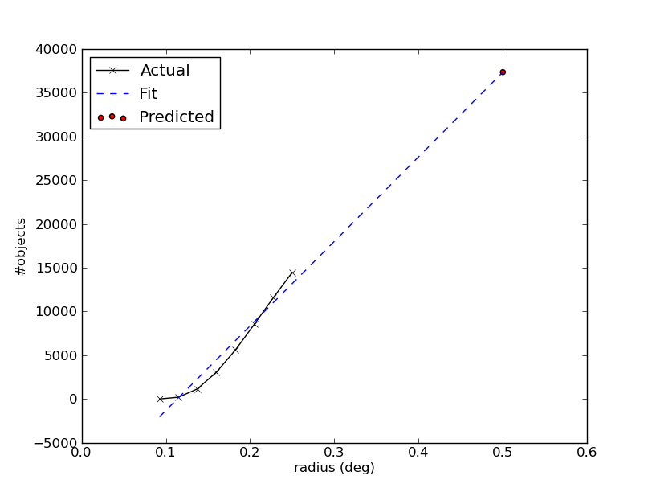

.. doctest-skip-all

Using ``astropy.vo.client``
===========================

This subpackage contains modules supporting VO client-side operations.

.. _vo-sec-client-cat-manip:

Catalog Manipulation
--------------------

You can manipulate a VO catalog using
`~astropy.vo.client.vos_catalog.VOSCatalog`, which is basically a dictionary
with added functionalities.

.. _vo-sec-client-cat-manip-examples:

Examples
^^^^^^^^

>>> from astropy.vo.client.vos_catalog import VOSCatalog

You can create a VO catalog from scratch with your own VO service by
providing its title and access URL, and optionally any other metadata
as key-value pairs:

>>> my_cat = VOSCatalog.create(
...     'My Own', 'http://ex.org/cgi-bin/cs.pl?',
...     description='My first VO service.', creator='J. Doe', year=2013)
>>> print(my_cat)
title: My Own
url: http://ex.org/cgi-bin/cs.pl?
>>> print(my_cat.dumps())
{
    "creator": "J. Doe",
    "description": "My first VO service.",
    "title": "My Own",
    "url": "http://ex.org/cgi-bin/cs.pl?",
    "year": 2013
}

You can modify and add fields:

>>> my_cat['year'] = 2014
>>> my_cat['new_field'] = 'Hello world'
>>> print(my_cat.dumps())
{
    "creator": "J. Doe",
    "description": "My first VO service.",
    "new_field": "Hello world",
    "title": "My Own",
    "url": "http://ex.org/cgi-bin/cs.pl?",
    "year": 2014
}

In addition, you can also delete an existing field, except the compulsory
title and access URL:

>>> my_cat.delete_attribute('description')
>>> print(my_cat.dumps())
{
    "creator": "J. Doe",
    "new_field": "Hello world",
    "title": "My Own",
    "url": "http://ex.org/cgi-bin/cs.pl?",
    "year": 2014
}

.. _vo-sec-client-db-manip:

Database Manipulation
---------------------

You can manipulate VO database using
`~astropy.vo.client.vos_catalog.VOSDatabase`, which is basically a nested
dictionary with added functionalities.

.. _vo-sec-client-db-manip-examples:

Examples
^^^^^^^^

>>> from astropy.vo.client.vos_catalog import VOSDatabase

You can choose to start with an empty database:

>>> my_db = VOSDatabase.create_empty()
>>> print(my_db.dumps())
{
    "__version__": 1,
    "catalogs": {}
}

Add the custom catalog from
:ref:`VO catalog examples <vo-sec-client-cat-manip-examples>` to database:

>>> my_db.add_catalog('My Catalog 1', my_cat)
>>> print(my_db)
My Catalog 1
>>> print(my_db.dumps())
{
    "__version__": 1,
    "catalogs": {
        "My Catalog 1": {
            "creator": "J. Doe",
            "new_field": "Hello world",
            "title": "My Own",
            "url": "http://ex.org/cgi-bin/cs.pl?",
            "year": 2014
        }
    }
}

You can write/read the new database to/from a JSON file:

>>> my_db.to_json('my_vo_database.json', clobber=True)
>>> my_db = VOSDatabase.from_json('my_vo_database.json')

You can also load a database from a VO registry. The process is described in
:ref:`vo-sec-validator-build-db`, except that here, validation is not done,
so ``validate_xxx`` keys are not added. This might generate a lot of warnings,
especially if the registry has duplicate entries of similar services, so
here, we silently ignore all the warnings:

>>> import warnings
>>> from astropy.vo.validator.validate import CS_MSTR_LIST
>>> with warnings.catch_warnings():
...     warnings.simplefilter('ignore')
...     registry_db = VOSDatabase.from_registry(
...         CS_MSTR_LIST(), encoding='binary', cache=False)
Downloading http://vao.stsci.edu/directory/NVORegInt.asmx/...
|===========================================|  25M/ 25M (100.00%)        00s
>>> len(registry_db)
11937

Find catalog names containing ``'usno*a2'`` in the registry database:

>>> usno_a2_list = registry_db.list_catalogs(pattern='usno*a2')
>>> usno_a2_list
[u'ROSAT All-Sky Survey Bright Source Catalog USNO A2 Cross-Associations 1',
 u'The USNO-A2.0 Catalogue (Monet+ 1998) 1',
 u'USNO-A2 Catalogue 1',
 u'USNO-A2.0 1',
 u'USNO-SA2.0 1']

Find access URLs containing ``'stsci'`` in the registry database:

>>> stsci_urls = registry_db.list_catalogs_by_url(pattern='stsci')
>>> stsci_urls
['http://archive.stsci.edu/befs/search.php?',
 'http://archive.stsci.edu/copernicus/search.php?', ...,
 'http://galex.stsci.edu/gxWS/ConeSearch/gxConeSearch.aspx?',
 'http://gsss.stsci.edu/webservices/vo/ConeSearch.aspx?CAT=GSC23&']

Extract a catalog titled ``'USNO-A2 Catalogue 1'`` from the registry:

>>> usno_a2 = registry_db.get_catalog('USNO-A2 Catalogue 1')
>>> print(usno_a2)
title: USNO-A2 Catalogue
url: http://www.nofs.navy.mil/cgi-bin/vo_cone.cgi?CAT=USNO-A2&

Extract a catalog by known access URL from the registry (the iterator version
of this functionality is
:func:`~astropy.vo.client.vos_catalog.VOSDatabase.get_catalogs_by_url`,
which is useful in the case of multiple entries with same access URL):

>>> gsc = registry_db.get_catalog_by_url(
...     'http://vizier.u-strasbg.fr/viz-bin/votable/-A?-source=I/305/out&')
>>> print(gsc)
title: The Guide Star Catalog, Version 2.3.2 (GSC2.3) (STScI, 2006)
url: http://vizier.u-strasbg.fr/viz-bin/votable/-A?-source=I/305/out&

Add all ``'usno*a2'`` catalogs from registry to your database:

>>> for name, cat in registry_db.get_catalogs():
...     if name in usno_a2_list:
...         my_db.add_catalog(name, cat)
>>> my_db.list_catalogs()
[u'My Catalog 1',
 u'ROSAT All-Sky Survey Bright Source Catalog USNO A2 Cross-Associations 1',
 u'The USNO-A2.0 Catalogue (Monet+ 1998) 1',
 u'USNO-A2 Catalogue 1',
 u'USNO-A2.0 1',
 u'USNO-SA2.0 1']

You can delete a catalog from the database either by name or access URL:

>>> my_db.delete_catalog('USNO-SA2.0 1')
>>> my_db.delete_catalog_by_url(
...     'http://www.nofs.navy.mil/cgi-bin/vo_cone.cgi?CAT=USNO-A2&')
>>> my_db.list_catalogs()
[u'My Catalog 1',
 u'ROSAT All-Sky Survey Bright Source Catalog USNO A2 Cross-Associations 1',
 u'The USNO-A2.0 Catalogue (Monet+ 1998) 1',
 u'USNO-A2.0 1']

You can also merge two database together. In this example, the second database
contains a simple catalog that only has given name and access URL:

>>> other_db = VOSDatabase.create_empty()
>>> other_db.add_catalog_by_url(
...     'My Guide Star Catalogue',
...     'http://vizier.u-strasbg.fr/viz-bin/votable/-A?-source=I/305/out&')
>>> print(other_db.dumps())
{
    "__version__": 1,
    "catalogs": {
        "My Guide Star Catalogue": {
            "title": "My Guide Star Catalogue",
            "url": "http://vizier.u-strasbg.fr/viz-bin/votable/-A?-source=I/305/out&"
        }
    }
}
>>> merged_db = my_db.merge(other_db)
>>> merged_db.list_catalogs()
[u'My Catalog 1',
 u'My Guide Star Catalogue',
 u'ROSAT All-Sky Survey Bright Source Catalog USNO A2 Cross-Associations 1',
 u'The USNO-A2.0 Catalogue (Monet+ 1998) 1',
 u'USNO-A2.0 1']

.. _vo-sec-client-vos:

General VO Services Access
--------------------------

`astropy.vo.client.vos_catalog` also contains common utilities for accessing
simple VO services already validated by STScI (see
:ref:`vo-sec-validator-validate`).

.. _vo-sec-vos-config:

Configurable Items
^^^^^^^^^^^^^^^^^^

These parameters are set via :ref:`astropy_config`:

* `astropy.io.votable.Conf.pedantic`
  Set strictness of VO table parser (`False` is recommended).
* `astropy.utils.data.Conf.remote_timeout`
  Timeout for remote service access.
* `astropy.vo.Conf.vos_baseurl`
  URL (or path) where VO Service database is stored.

Examples
^^^^^^^^

>>> from astropy.vo.client import vos_catalog

Get all catalogs from a database named ``'conesearch_good'`` (this contains
cone search services that cleanly passed daily validations;
also see :ref:`Cone Search Examples <vo-sec-scs-examples>`):

>>> my_db = vos_catalog.get_remote_catalog_db('conesearch_good')
Downloading http://stsdas.stsci.edu/astrolib/vo_databases/conesearch_good.json
|============================================|  56/ 56k (100.00%)        00s
>>> print(my_db)
Guide Star Catalog 2.3 1
SDSS DR7 - Sloan Digital Sky Survey Data Release 7 1
SDSS DR7 - Sloan Digital Sky Survey Data Release 7 2
# ...
USNO-A2 Catalogue 1
USNO-A2.0 1

If you get timeout error, you need to use a custom timeout as follows:

>>> from astropy.utils import data
>>> with data.conf.set_temp('remote_timeout', 30):
...     my_db = vos_catalog.get_remote_catalog_db('conesearch_good')

To see validation warnings generated by :ref:`vo-sec-validator-validate`
for the one of the catalogs above:

>>> my_cat = my_db.get_catalog('Guide Star Catalog 2.3 1')
>>> for w in my_cat['validate_warnings']:
...     print(w)
/.../vo.xml:136:0: W50: Invalid unit string 'pixel'
/.../vo.xml:155:0: W48: Unknown attribute 'nrows' on TABLEDATA

By default, pedantic is ``False``:

>>> from astropy.io.votable import conf
>>> conf.pedantic
False

To call a given VO service; In this case, a Cone Search
(also see :ref:`Cone Search Examples <vo-sec-scs-examples>`):

>>> from astropy import coordinates as coord
>>> from astropy import units as u
>>> c = coord.SkyCoord.from_name('47 Tuc')
>>> c
<SkyCoord (ICRS): ra=6.0223292 deg, dec=-72.0814444 deg>
>>> sr = 0.5 * u.degree
>>> sr
<Quantity 0.5 deg>
>>> result = vos_catalog.call_vo_service(
...     'conesearch_good',
...     kwargs={'RA': c.ra.degree, 'DEC': c.dec.degree, 'SR': sr.value},
...     catalog_db='The PMM USNO-A1.0 Catalogue (Monet 1997) 1')
Trying http://vizier.u-strasbg.fr/viz-bin/votable/-A?-source=I/243/out&
Downloading ...
WARNING: W22: ... The DEFINITIONS element is deprecated in VOTable 1.1...
WARNING: W03: ... Implictly generating an ID from a name 'RA(ICRS)'...
WARNING: W03: ... Implictly generating an ID from a name 'DE(ICRS)'...
>>> result
<Table rows=36184 names=('_r','_RAJ2000','_DEJ2000', ...>

To repeat the above and suppress *all* the screen outputs (not recommended):

>>> import warnings
>>> with warnings.catch_warnings():
...     warnings.simplefilter('ignore')
...     result = vos_catalog.call_vo_service(
...         'conesearch_good',
...         kwargs={'RA': c.ra.degree, 'DEC': c.dec.degree, 'SR': sr.value},
...         catalog_db='The PMM USNO-A1.0 Catalogue (Monet 1997) 1',
...         verbose=False)

You can also use custom VO database, say, ``'my_vo_database.json'`` from
:ref:`VO database examples <vo-sec-client-db-manip-examples>`:

>>> import os
>>> from astropy.vo.client.vos_catalog import BASEURL
>>> with BASEURL.set_temp(os.curdir):
...     try:
...         result = vos_catalog.call_vo_service(
...             'my_vo_database',
...             kwargs={'RA': c.ra.degree, 'DEC': c.dec.degree,
...                     'SR': sr.value})
...     except Exception as e:
...         print(e)
Trying http://ex.org/cgi-bin/cs.pl?
Downloading http://ex.org/cgi-bin/cs.pl?SR=0.5&DEC=-72.0814444&RA=6.0223292
|===========================================| 1.8k/1.8k (100.00%)        00s
None of the available catalogs returned valid results.

.. _vo-sec-client-scs:

Simple Cone Search
------------------

`astropy.vo.client.conesearch` supports VO Simple Cone Search capabilities.

Available databases are generated on the server-side hosted by STScI
using :ref:`vo-sec-validator-validate`. The database used is
controlled by `astropy.vo.Conf.conesearch_dbname`, which can be
changed in :ref:`vo-sec-scs-config` below. Here are the available
options:

#. ``'conesearch_good'``
     Default. Passed validation without critical warnings and exceptions.
#. ``'conesearch_warn'``
     Has critical warnings but no exceptions. Use at your own risk.
#. ``'conesearch_exception'``
     Has some exceptions. *Never* use this.
#. ``'conesearch_error'``
     Has network connection error. *Never* use this.

In the default setting, it searches the good Cone Search services one by one,
stops at the first one that gives non-zero match(es), and returns the result.
Since the list of services are extracted from a Python dictionary, the search
order might differ from call to call.

There are also functions, both synchronously and asynchronously, available to
return *all* the Cone Search query results. However, this is not recommended
unless one knows what one is getting into, as it could potentially take up
significant run time and computing resources.

:ref:`vo-sec-scs-examples` below show how to use non-default search behaviors,
where the user has more control of which catalog(s) to search, et cetera.

.. note::

    Most services currently fail to parse when ``pedantic=True``.

.. warning::

    When Cone Search returns warnings, you should decide
    whether the results are reliable by inspecting the
    warning codes in `astropy.io.votable.exceptions`.

.. _vo-sec-scs-config:

Configurable Items
^^^^^^^^^^^^^^^^^^

These parameters are set via :ref:`astropy_config`:

* `astropy.vo.Conf.conesearch_dbname`
  Cone Search database name to query.

Also depends on
:ref:`General VO Services Access Configurable Items <vo-sec-vos-config>`.

.. _vo-sec-scs-examples:

Examples
^^^^^^^^

>>> from astropy.vo.client import conesearch

Shows a sorted list of Cone Search services to be searched:

>>> conesearch.list_catalogs()
[u'Guide Star Catalog 2.3 1',
 u'SDSS DR7 - Sloan Digital Sky Survey Data Release 7 1',
 u'SDSS DR7 - Sloan Digital Sky Survey Data Release 7 2',
 u'SDSS DR7 - Sloan Digital Sky Survey Data Release 7 3',
 u'SDSS DR7 - Sloan Digital Sky Survey Data Release 7 4',
 u'SDSS DR8 - Sloan Digital Sky Survey Data Release 8 1',
 u'SDSS DR8 - Sloan Digital Sky Survey Data Release 8 2',
 u'The HST Guide Star Catalog, Version 1.1 (Lasker+ 1992) 1',
 u'The HST Guide Star Catalog, Version 1.2 (Lasker+ 1996) 1',
 u'The HST Guide Star Catalog, Version GSC-ACT (Lasker+ 1996-99) 1',
 u'The PMM USNO-A1.0 Catalogue (Monet 1997) 1',
 u'The USNO-A2.0 Catalogue (Monet+ 1998) 1',
 u'Two Micron All Sky Survey (2MASS) 1',
 u'Two Micron All Sky Survey (2MASS) 2',
 u'USNO-A2 Catalogue 1',
 u'USNO-A2.0 1']

To inspect them in detail, do the following and then refer to the examples in
:ref:`vo-sec-client-db-manip`:

>>> from astropy.vo.client import vos_catalog
>>> good_db = vos_catalog.get_remote_catalog_db('conesearch_good')

Select a catalog to search:

>>> my_catname = 'The PMM USNO-A1.0 Catalogue (Monet 1997) 1'

By default, pedantic is ``False``:

>>> from astropy.io.votable import conf
>>> conf.pedantic
False

Perform Cone Search in the selected catalog above for 0.5 degree radius
around 47 Tucanae with minimum verbosity, if supported.
The ``catalog_db`` keyword gives control over which catalog(s) to use.
If running this for the first time, a copy of the catalogs database will be
downloaded to local cache. To run this again without
using cached data, set ``cache=False``:

>>> from astropy import coordinates as coord
>>> from astropy import units as u
>>> c = coord.SkyCoord.from_name('47 Tuc')
>>> c
<SkyCoord (ICRS): ra=6.0223292 deg, dec=-72.0814444 deg>
>>> sr = 0.5 * u.degree
>>> sr
<Quantity 0.5 deg>
>>> result = conesearch.conesearch(c, sr, catalog_db=my_catname)
Trying http://vizier.u-strasbg.fr/viz-bin/votable/-A?-source=I/243/out&
Downloading ...
WARNING: W22: ... The DEFINITIONS element is deprecated in VOTable 1.1...

To run the command above using custom timeout of
30 seconds for each Cone Search service query:

>>> from astropy.utils import data
>>> with data.conf.set_temp('remote_timeout', 30):
...     result = conesearch.conesearch(c, sr, catalog_db=my_catname)

To suppress *all* the screen outputs (not recommended):

>>> import warnings
>>> with warnings.catch_warnings():
...     warnings.simplefilter('ignore')
...     result = conesearch.conesearch(c, sr, catalog_db=my_catname,
...                                    verbose=False)

Extract Numpy array containing the matched objects. See
`numpy` for available operations:

>>> cone_arr = result.array.data
>>> cone_arr
array([(0.499298, 4.403473, -72.124045, '0150-00088188'),
       (0.499075, 4.403906, -72.122762, '0150-00088198'),
       (0.499528, 4.404531, -72.045198, '0150-00088210'), ...,
       (0.4988, 7.641731, -72.113156, '0150-00225965'),
       (0.499554, 7.645489, -72.103167, '0150-00226134'),
       (0.499917, 7.6474, -72.0876, '0150-00226223')],
      dtype=[('_r', '<f8'), ('_RAJ2000', '<f8'), ('_DEJ2000', '<f8'),
             ('USNO-A1.0', '|S13')])
>>> cone_arr.dtype.names
('_r', '_RAJ2000', '_DEJ2000', 'USNO-A1.0')
>>> cone_arr.size
36184
>>> ra_list = cone_arr['_RAJ2000']
>>> ra_list
array([ 4.403473,  4.403906,  4.404531, ...,  7.641731,  7.645489,  7.6474  ])
>>> cone_arr[0]  # First row
(0.499298, 4.403473, -72.124045, '0150-00088188')
>>> cone_arr[-1]  # Last row
(0.499917, 7.6474, -72.0876, '0150-00226223')
>>> cone_arr[:10]  # First 10 rows
array([(0.499298, 4.403473, -72.124045, '0150-00088188'),
       (0.499075, 4.403906, -72.122762, '0150-00088198'),
       (0.499528, 4.404531, -72.045198, '0150-00088210'),
       (0.497252, 4.406078, -72.095045, '0150-00088245'),
       (0.499739, 4.406462, -72.139545, '0150-00088254'),
       (0.496312, 4.410623, -72.110492, '0150-00088372'),
       (0.49473, 4.415053, -72.071217, '0150-00088494'),
       (0.494171, 4.415939, -72.087512, '0150-00088517'),
       (0.493722, 4.417678, -72.0972, '0150-00088572'),
       (0.495147, 4.418262, -72.047142, '0150-00088595')],
      dtype=[('_r', '<f8'), ('_RAJ2000', '<f8'), ('_DEJ2000', '<f8'),
             ('USNO-A1.0', '|S13')])

Sort the matched objects by angular separation in ascending order:

>>> import numpy as np
>>> sep = cone_arr['_r']
>>> i_sorted = np.argsort(sep)
>>> cone_arr[i_sorted]
array([(0.081971, 5.917787, -72.006075, '0150-00145335'),
       (0.083181, 6.020339, -72.164623, '0150-00149799'),
       (0.089166, 5.732798, -72.077698, '0150-00137181'), ...,
       (0.499981, 7.024962, -72.477503, '0150-00198745'),
       (0.499987, 6.423773, -71.597364, '0150-00168596'),
       (0.499989, 6.899589, -72.5043, '0150-00192872')],
      dtype=[('_r', '<f8'), ('_RAJ2000', '<f8'), ('_DEJ2000', '<f8'),
             ('USNO-A1.0', '|S13')])

Result can also be manipulated as :ref:`astropy-io-votable`
and its unit can be manipulated as :ref:`astropy-units`.
In this example, we convert RA values from degree to arcsec:

>>> from astropy import units as u
>>> ra_field = result.get_field_by_id('_RAJ2000')
>>> ra_field.title
u'Right ascension (FK5, Equinox=J2000.0) (computed by VizieR, ...)'
>>> ra_field.unit
Unit("deg")
>>> ra_field.unit.to(u.arcsec) * ra_list
array([ 15852.5028,  15854.0616,  15856.3116, ...,  27510.2316,
        27523.7604,  27530.64  ])

Perform the same Cone Search as above but asynchronously using
`~astropy.vo.client.conesearch.AsyncConeSearch`.  Queries to
individual Cone Search services are still governed by
`astropy.utils.data.Conf.remote_timeout`. Cone Search is forced to run
in silent mode asynchronously, but warnings are still controlled by
:py:mod:`warnings`:

>>> async_search = conesearch.AsyncConeSearch(c, sr, catalog_db=my_catname)

Check asynchronous search status:

>>> async_search.running()
True
>>> async_search.done()
False

Get search results after a 30-second wait (not to be confused with
`astropy.utils.data.Conf.remote_timeout` that governs individual Cone
Search queries). If search is still not done after 30 seconds,
``TimeoutError`` is raised. Otherwise, Cone Search result is returned
and can be manipulated as above. If no ``timeout`` keyword given, it
waits until completion:

>>> async_result = async_search.get(timeout=30)
>>> cone_arr = async_result.array.data
>>> cone_arr.size
36184

Estimate the execution time and the number of objects for
the Cone Search service URL from above. The prediction naively
assumes a linear model, which might not be accurate for some cases.
It also uses the normal :func:`~astropy.vo.client.conesearch.conesearch`,
not the asynchronous version. This example uses a custom
timeout of 30 seconds and runs silently (except for warnings):

>>> result.url
u'http://vizier.u-strasbg.fr/viz-bin/votable/-A?-source=I/243/out&'
>>> with data.conf.set_temp('remote_timeout', 30):
...     t_est, n_est = conesearch.predict_search(
...         result.url, c, sr, verbose=False, plot=True)
WARNING: W22: ... The DEFINITIONS element is deprecated in VOTable 1.1...
# ...
>>> t_est  # Predicted execution time
10.757875269998323
>>> n_est  # Predicted number of objects
37340

.. image:: images/client_predict_search_t.png
    :width: 450px
    :alt: Example plot from conesearch.predict_search() for t_est

For debugging purpose, one can obtain the actual execution time
and number of objects, and compare them with the predicted values
above. The INFO message shown in controlled by `astropy.logger`.
Keep in mind that running this for every prediction
would defeat the purpose of the prediction itself:

>>> t_real, tab = conesearch.conesearch_timer(
...     c, sr, catalog_db=result.url, verbose=False)
INFO: conesearch_timer took 11.5103080273 s on AVERAGE for 1 call(s). [...]
>>> t_real  # Actual execution time
9.33926796913147
>>> tab.array.size  # Actual number of objects
36184

One can also search in a list of catalogs instead of a single one.
In this example, we look for all catalogs containing ``'guide*star'`` in their
titles and only perform Cone Search using those services.
The first catalog in the list to successfully return non-zero result is used.
Therefore, the order of catalog names given in ``catalog_db`` is important:

>>> gsc_cats = conesearch.list_catalogs(pattern='guide*star')
>>> gsc_cats
[u'Guide Star Catalog 2.3 1',
 u'The HST Guide Star Catalog, Version 1.1 (Lasker+ 1992) 1',
 u'The HST Guide Star Catalog, Version 1.2 (Lasker+ 1996) 1',
 u'The HST Guide Star Catalog, Version GSC-ACT (Lasker+ 1996-99) 1']
>>> gsc_result = conesearch.conesearch(c, sr, catalog_db=gsc_cats)
Trying http://gsss.stsci.edu/webservices/vo/ConeSearch.aspx?CAT=GSC23&
WARNING: W50: ... Invalid unit string 'pixel' [...]
WARNING: W48: ... Unknown attribute 'nrows' on TABLEDATA [...]
>>> gsc_result.array.size
74276
>>> gsc_result.url
u'http://gsss.stsci.edu/webservices/vo/ConeSearch.aspx?CAT=GSC23&'

To repeat the Cone Search above with the services listed in a
different order:

>>> gsc_cats_reordered = [gsc_cats[i] for i in (3, 1, 2, 0)]
>>> gsc_cats_reordered
[u'The HST Guide Star Catalog, Version GSC-ACT (Lasker+ 1996-99) 1',
 u'The HST Guide Star Catalog, Version 1.1 (Lasker+ 1992) 1',
 u'The HST Guide Star Catalog, Version 1.2 (Lasker+ 1996) 1',
 u'Guide Star Catalog 2.3 1']
>>> gsc_result = conesearch.conesearch(c, sr, catalog_db=gsc_cats_reordered)
Trying http://vizier.u-strasbg.fr/viz-bin/votable/-A?-source=I/255/out&
Downloading ...
WARNING: W22: ... The DEFINITIONS element is deprecated in VOTable 1.1...
>>> gsc_result.array.size
2997
>>> gsc_result.url
u'http://vizier.u-strasbg.fr/viz-bin/votable/-A?-source=I/255/out&'

To obtain results from *all* the services above:

>>> all_gsc_results = conesearch.search_all(c, sr, catalog_db=gsc_cats)
Trying http://gsss.stsci.edu/webservices/vo/ConeSearch.aspx?CAT=GSC23&
Downloading ...
Trying http://vizier.u-strasbg.fr/viz-bin/votable/-A?-source=I/220/out&
Downloading ...
WARNING: W22: ... The DEFINITIONS element is deprecated in VOTable 1.1...
Trying http://vizier.u-strasbg.fr/viz-bin/votable/-A?-source=I/254/out&
Downloading ...
WARNING: W22: ... The DEFINITIONS element is deprecated in VOTable 1.1...
Trying http://vizier.u-strasbg.fr/viz-bin/votable/-A?-source=I/255/out&
Downloading ...
>>> len(all_gsc_results)
4
>>> for url, tab in all_gsc_results.items():
...     print('{0} has {1} results'.format(url, tab.array.size))
http://vizier.u-strasbg.fr/viz-bin/votable/-A?-source=I/254/out& has 2998 results
http://vizier.u-strasbg.fr/viz-bin/votable/-A?-source=I/255/out& has 2997 results
http://gsss.stsci.edu/webservices/vo/ConeSearch.aspx?CAT=GSC23& has 74276 results
http://vizier.u-strasbg.fr/viz-bin/votable/-A?-source=I/220/out& has 2997 results

To repeat the above asynchronously:

>>> async_search_all = conesearch.AsyncSearchAll(c, sr, catalog_db=gsc_cats)
>>> async_search_all.running()
True
>>> async_search_all.done()
False
>>> all_gsc_results = async_search_all.get()

If one is unable to obtain any results using the default
Cone Search database, ``'conesearch_good'``, that only contains
sites that cleanly passed validation, one can use :ref:`astropy_config`
to use another database, ``'conesearch_warn'``, containing sites with
validation warnings. One should use these sites with caution:

>>> from astropy.vo import conf
>>> conf.conesearch_dbname = 'conesearch_warn'
>>> conesearch.list_catalogs()
Downloading http://stsdas.stsci.edu/astrolib/vo_databases/conesearch_warn.json
|===========================================|  87k/ 87k (100.00%)        00s
[u'2MASS All-Sky Catalog of Point Sources (Cutri+ 2003) 1',
 u'2MASS All-Sky Point Source Catalog 1',
 u'Data release 7 of Sloan Digital Sky Survey catalogs 1',
 u'Data release 7 of Sloan Digital Sky Survey catalogs 2',
 u'Data release 7 of Sloan Digital Sky Survey catalogs 3',
 u'Data release 7 of Sloan Digital Sky Survey catalogs 4',
 u'Data release 7 of Sloan Digital Sky Survey catalogs 5',
 u'Data release 7 of Sloan Digital Sky Survey catalogs 6',
 u'The 2MASS All-Sky Catalog 1',
 u'The 2MASS All-Sky Catalog 2',
 u'The USNO-B1.0 Catalog (Monet+ 2003) 1',
 u'The USNO-B1.0 Catalog 1',
 u'USNO-A V2.0, A Catalog of Astrometric Standards 1',
 u'USNO-B1 Catalogue 1']
>>> result = conesearch.conesearch(c, sr)
Trying http://vizier.u-strasbg.fr/viz-bin/votable/-A?-source=I/284/out&
Downloading ...
WARNING: W22: ... The DEFINITIONS element is deprecated in VOTable 1.1...
>>> result.array.data.size
50000

You can also use custom Cone Search database, say, ``'my_vo_database.json'``
from :ref:`VO database examples <vo-sec-client-db-manip-examples>`:

>>> import os
>>> from astropy.vo.client.vos_catalog import BASEURL
>>> BASEURL.set(os.curdir)
>>> conesearch.CONESEARCH_DBNAME.set('my_vo_database')
>>> conesearch.list_catalogs()
[u'My Catalog 1']
>>> result = conesearch.conesearch(c, sr)
Trying http://ex.org/cgi-bin/cs.pl?
Downloading ...
|===========================================| 1.8k/1.8k (100.00%)        00s
# ...
VOSError: None of the available catalogs returned valid results.
