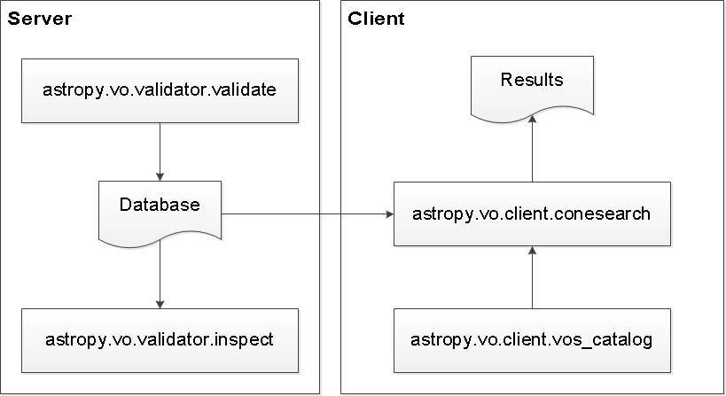

.. doctest-skip-all

.. _astropy_conesearch:

VO Simple Cone Search
=====================

Astropy offers Simple Cone Search Version 1.03 as defined in IVOA
Recommendation (February 22, 2008). Cone Search queries an
area encompassed by a given radius centered on a given RA and DEC and returns
all the objects found within the area in the given catalog.

.. _vo-sec-default-scs-services:

Default Cone Search Services
----------------------------

Currently, the default Cone Search services used are a subset of those found in
the STScI VAO Registry. They were hand-picked to represent commonly used
catalogs below:

* 2MASS All-Sky
* HST Guide Star Catalog
* SDSS Data Release 7
* SDSS-III Data Release 8
* USNO A1
* USNO A2
* USNO B1

This subset undergoes daily validations hosted by STScI using
:ref:`vo-sec-validator-validate`. Those that pass without critical
warnings or exceptions are used by :ref:`vo-sec-client-scs` by
default. They are controlled by `astropy.vo.Conf.conesearch_dbname`:

#. ``'conesearch_good'``
   Default. Passed validation without critical warnings and exceptions.
#. ``'conesearch_warn'``
   Has critical warnings but no exceptions. Use at your own risk.
#. ``'conesearch_exception'``
   Has some exceptions. *Never* use this.
#. ``'conesearch_error'``
   Has network connection error. *Never* use this.

If you are a Cone Search service provider and would like to include your
service in the list above, please open a
`GitHub issue on Astropy <https://github.com/astropy/astropy/issues>`_.

Caching
-------

Caching of downloaded contents is controlled by `astropy.utils.data`.
To use cached data, some functions in this package have a ``cache``
keyword that can be set to ``True``.

Getting Started
---------------

This section only contains minimal examples showing how to perform
basic Cone Search.

>>> from astropy.vo.client import conesearch

List the available Cone Search catalogs:

>>> conesearch.list_catalogs()
[u'Guide Star Catalog 2.3 1',
 u'SDSS DR7 - Sloan Digital Sky Survey Data Release 7 1',
 u'SDSS DR7 - Sloan Digital Sky Survey Data Release 7 2',
 u'SDSS DR7 - Sloan Digital Sky Survey Data Release 7 3',
 u'SDSS DR7 - Sloan Digital Sky Survey Data Release 7 4',
 u'SDSS DR8 - Sloan Digital Sky Survey Data Release 8 1',
 u'SDSS DR8 - Sloan Digital Sky Survey Data Release 8 2',
 u'The HST Guide Star Catalog, Version 1.1 (Lasker+ 1992) 1',
 u'The HST Guide Star Catalog, Version 1.2 (Lasker+ 1996) 1',
 u'The HST Guide Star Catalog, Version GSC-ACT (Lasker+ 1996-99) 1',
 u'The PMM USNO-A1.0 Catalogue (Monet 1997) 1',
 u'The USNO-A2.0 Catalogue (Monet+ 1998) 1',
 u'Two Micron All Sky Survey (2MASS) 1',
 u'Two Micron All Sky Survey (2MASS) 2',
 u'USNO-A2 Catalogue 1',
 u'USNO-A2.0 1']

Select a 2MASS catalog from the list above that is to be searched:

>>> my_catname = 'Two Micron All Sky Survey (2MASS) 1'

Query the selected 2MASS catalog around M31 with a 0.1-degree search radius:

>>> from astropy.coordinates import SkyCoord
>>> from astropy import units as u
>>> c = SkyCoord.from_name('M31')  # doctest: +REMOTE_DATA
>>> c.ra, c.dec
(<Longitude 10.6847083 deg>, <Latitude 41.26875 deg>)
>>> result = conesearch.conesearch(c, 0.1 * u.degree, catalog_db=my_catname)
Trying http://wfaudata.roe.ac.uk/twomass-dsa/DirectCone?DSACAT=TWOMASS&...
Downloading ...
WARNING: W06: ... UCD has invalid character '?' in '??' [...]
WARNING: W50: ... Invalid unit string 'yyyy-mm-dd' [...]
WARNING: W50: ... Invalid unit string 'Julian days' [...]
>>> result
<Table rows=2008 names=('cx','cy', ...>
>>> result.url
u'http://wfaudata.roe.ac.uk/twomass-dsa/DirectCone?DSACAT=TWOMASS&DSATAB=twomass_psc&'

Get the number of matches and returned column names:

>>> result.array.size
2008
>>> result.array.dtype.names
('cx',
 'cy',
 'cz',
 'htmID',
 'ra',
 'dec', ...,
 'coadd_key',
 'coadd')

Extract RA and DEC of the matches:

>>> result.array['ra']
masked_array(data = [10.620983 10.672264 10.651166 ..., 10.805599],
             mask = [False False False ..., False],
       fill_value = 1e+20)
>>> result.array['dec']
masked_array(data = [41.192303 41.19426 41.19445 ..., 41.262123],
             mask = [False False False ..., False],
       fill_value = 1e+20)

Using `astropy.vo`
------------------

This package has four main components across two subpackages:

.. toctree::
   :maxdepth: 2

   client
   validator

They are designed to be used in a work flow as illustrated below:

The one that a typical user needs is the :ref:`vo-sec-client-scs` component
(see :ref:`Cone Search Examples <vo-sec-scs-examples>`).

See Also
--------

- `NVO Directory <http://nvo.stsci.edu/vor10/index.aspx>`_

- `Simple Cone Search Version 1.03, IVOA Recommendation (22 February 2008) <http://www.ivoa.net/Documents/REC/DAL/ConeSearch-20080222.html>`_

- `STScI VAO Registry <http://vao.stsci.edu/directory/NVORegInt.asmx?op=VOTCapabilityPredOpt>`_

- `STScI VO Databases <http://stsdas.stsci.edu/astrolib/vo_databases/>`_

Reference/API
-------------

.. automodapi:: astropy.vo
   :no-inheritance-diagram:

.. automodapi:: astropy.vo.client.vos_catalog
   :no-inheritance-diagram:

.. automodapi:: astropy.vo.client.conesearch
   :no-inheritance-diagram:

.. automodapi:: astropy.vo.client.async
   :no-inheritance-diagram:

.. automodapi:: astropy.vo.client.exceptions

.. automodapi:: astropy.vo.validator

.. automodapi:: astropy.vo.validator.validate
   :no-inheritance-diagram:

.. automodapi:: astropy.vo.validator.inspect
   :no-inheritance-diagram:

.. automodapi:: astropy.vo.validator.exceptions
