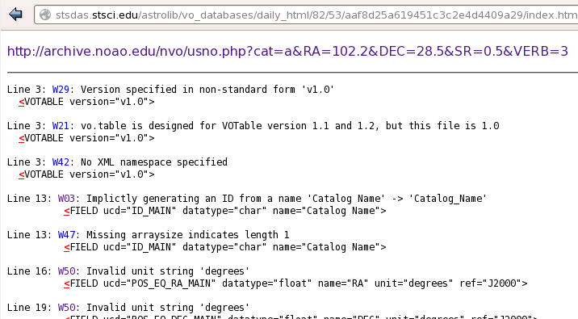

.. _astropy_vo:

*******************************************
Virtual Observatory Access (``astropy.vo``)
*******************************************

Introduction
============

The ``astropy.vo`` subpackage handles simple access for Virtual Observatory
(VO) services.

Currently, only Simple Cone Search Version 1.03 as defined in IVOA
Recommendation (February 22, 2008) is supported. Cone Search queries an
area encompassed by a given radius centered on a given RA and DEC and returns
all the objects found within the area in the given catalog.

.. _vo-sec-default-scs-services:

Default Cone Search Services
----------------------------

Currently, the default Cone Search services used are a subset of those found in
the STScI VAO Registry. They were hand-picked to represent commonly used
catalogs below:

    * 2MASS All-Sky
    * HST Guide Star Catalog
    * SDSS Data Release 7
    * SDSS-III Data Release 8
    * USNO A1
    * USNO A2
    * USNO B1

This subset undergoes daily validations hosted by STScI using
:ref:`vo-sec-validator-validate`. Those that pass without
critical warnings or exceptions are used by :ref:`vo-sec-client-scs` by
default. They are controlled by
``astropy.vo.client.conesearch.CONESEARCH_DBNAME``):

    #. 'conesearch_good'
           Default. Passed validation without critical warnings and exceptions.
    #. 'conesearch_warn'
           Has critical warnings but no exceptions. Use at your own risk.
    #. 'conesearch_exception'
           Has some exceptions. *Never* use this.
    #. 'conesearch_error'
           Has network connection error. *Never* use this.

If you are a Cone Search service provider and would like to include your
service in the list above, please open a
`GitHub issue on Astropy <https://github.com/astropy/astropy/issues>`_.

Caching
-------

Caching of downloaded contents is controlled by `astropy.utils.data`.
To *not* use cached data, some functions in this package have a ``cache``
keyword that can be set to `False`.

Getting Started
===============

This section only contains minimal examples showing how to perform
basic Cone Search.

>>> from astropy.vo.client import conesearch

List the available Cone Search catalogs:

>>> conesearch.list_catalogs()
[u'Guide Star Catalog 2.3 1',
 u'SDSS DR7 - Sloan Digital Sky Survey Data Release 7 1',
 u'SDSS DR7 - Sloan Digital Sky Survey Data Release 7 2',
 u'SDSS DR7 - Sloan Digital Sky Survey Data Release 7 3',
 u'SDSS DR7 - Sloan Digital Sky Survey Data Release 7 4',
 u'SDSS DR8 - Sloan Digital Sky Survey Data Release 8 1',
 u'SDSS DR8 - Sloan Digital Sky Survey Data Release 8 2',
 u'The HST Guide Star Catalog, Version 1.1 (Lasker+ 1992) 1',
 u'The HST Guide Star Catalog, Version 1.2 (Lasker+ 1996) 1',
 u'The HST Guide Star Catalog, Version GSC-ACT (Lasker+ 1996-99) 1',
 u'The PMM USNO-A1.0 Catalogue (Monet 1997) 1',
 u'The USNO-A2.0 Catalogue (Monet+ 1998) 1',
 u'Two Micron All Sky Survey (2MASS) 1',
 u'Two Micron All Sky Survey (2MASS) 2',
 u'USNO-A2 Catalogue 1',
 u'USNO-A2.0 1']

Select a 2MASS catalog from the list above that is to be searched:

>>> my_catname = 'Two Micron All Sky Survey (2MASS) 1'

Query the selected 2MASS catalog around M31 with a 0.1-degree search radius:

>>> from astropy import coordinates as coord
>>> c = coord.ICRSCoordinates.from_name('M31')
>>> c.ra, c.dec
(<RA 10.68471 deg>, <Dec 41.26875 deg>)
>>> result = conesearch.conesearch(
...     c.ra.degrees, c.dec.degrees, 0.1, catalog_db=my_catname)
Trying http://wfaudata.roe.ac.uk/twomass-dsa/DirectCone?DSACAT=TWOMASS&...
Downloading ...
WARNING: W06: ... UCD has invalid character '?' in '??' [...]
WARNING: W50: ... Invalid unit string 'yyyy-mm-dd' [...]
WARNING: W50: ... Invalid unit string 'Julian days' [...]
>>> result
<astropy.io.votable.tree.Table at 0x41e8610>
>>> result.url
u'http://wfaudata.roe.ac.uk/twomass-dsa/DirectCone?DSACAT=TWOMASS&DSATAB=twomass_psc&'

Get the number of matches and returned column names:

>>> result.array.size
2008
>>> result.array.dtype.names
('cx',
 'cy',
 'cz',
 'htmID',
 'ra',
 'dec', ...,
 'coadd_key',
 'coadd')

Extract RA and DEC of the matches:

>>> result.array['ra']
masked_array(data = [10.620983 10.672264 10.651166 ..., 10.805599],
             mask = [False False False ..., False],
       fill_value = 1e+20)
>>> result.array['dec']
masked_array(data = [41.192303 41.19426 41.19445 ..., 41.262123],
             mask = [False False False ..., False],
       fill_value = 1e+20)

Using ``astropy.vo``
====================

This package has four main components across two subpackages:

    * ``astropy.vo.client``:
          * :ref:`vo-sec-client-vos` (``astropy.vo.client.vos_catalog``)
          * :ref:`vo-sec-client-scs` (``astropy.vo.client.conesearch``)
    * ``astropy.vo.validator``:
          * :ref:`vo-sec-validator-validate` (``astropy.vo.validator.validate``)
          * :ref:`vo-sec-validator-inspect` (``astropy.vo.validator.inspect``)

They are designed to be used in a work flow as illustrated below:

The one that a typical user needs is the :ref:`vo-sec-client-scs` component
(see :ref:`Cone Search Examples <vo-sec-scs-examples>`).

Using ``astropy.vo.client``
===========================

This subpackage contains modules supporting VO client-side operations.

.. _vo-sec-client-vos:

General VO Services Access
--------------------------

`astropy.vo.client.vos_catalog` contains common utilities for accessing
simple VO services.

.. _vo-sec-vos-config:

Configurable Items
^^^^^^^^^^^^^^^^^^

These parameters are set via :ref:`astropy_config`:

    * ``astropy.io.votable.table.PEDANTIC``
    * ``astropy.utils.data.REMOTE_TIMEOUT``
    * ``astropy.vo.client.vos_catalog.BASEURL``

Examples
^^^^^^^^

>>> from astropy.vo.client import vos_catalog

Get all catalogs from a database named 'conesearch_good' (this contains
Cone Search services that cleanly passed daily validations;
also see :ref:`Cone Search Examples <vo-sec-scs-examples>`):

>>> my_db = vos_catalog.get_remote_catalog_db('conesearch_good')
Downloading http://stsdas.stsci.edu/astrolib/vo_databases/conesearch_good.json
|============================================|  56/ 56k (100.00%)        00s
>>> my_db
<astropy.vo.client.vos_catalog.VOSDatabase at 0x2b0f3d0>
>>> print(str(my_db))
Guide Star Catalog 2.3 1
SDSS DR7 - Sloan Digital Sky Survey Data Release 7 1
SDSS DR7 - Sloan Digital Sky Survey Data Release 7 2
# ...
USNO-A2 Catalogue 1
USNO-A2.0 1

If you get timeout error, you need to use a custom timeout as follows:

>>> from astropy.utils.data import REMOTE_TIMEOUT
>>> with REMOTE_TIMEOUT.set_temp(30):
...     my_db = vos_catalog.get_remote_catalog_db('conesearch_good')

Find catalog names containing 'usno*a2':

>>> my_db.list_catalogs(pattern='usno*a2')
[u'The USNO-A2.0 Catalogue (Monet+ 1998) 1', u'USNO-A2 Catalogue 1']

Get information for a catalog titled 'USNO-A2 Catalogue 1':

>>> my_cat = my_db.get_catalog('USNO-A2 Catalogue 1')
>>> my_cat
<astropy.vo.client.vos_catalog.VOSCatalog at 0x1f78150>
>>> print(str(my_cat))
title: USNO-A2 Catalogue
url: http://www.nofs.navy.mil/cgi-bin/vo_cone.cgi?CAT=USNO-A2&
>>> print(my_cat.dumps())
{
    "capabilityClass": "ConeSearch", 
    "capabilityStandardID": "ivo://ivoa.net/std/ConeSearch", 
    "capabilityValidationLevel": "", 
    "contentLevel": "#University#Research#Amateur#", 
    # ...
    "version": "", 
    "waveband": "#Optical#"
}
>>> my_cat.keys()
[u'validate_network_error',
 u'capabilityClass',
 u'updated',
 # ...
 u'identifier',
 u'validate_xmllint']
>>> my_cat['url']
u'http://www.nofs.navy.mil/cgi-bin/vo_cone.cgi?CAT=USNO-A2&'
>>> my_cat['maxRadius']
1.0

One can also get information for a catalog using its URL.
If a URL yields multiple catalogs (this can happen when the service provider
re-register the URL with a different title), only the first match is returned:

>>> my_cat2 = my_db.get_catalog_by_url(
...     'http://vizier.u-strasbg.fr/viz-bin/votable/-A?-source=I/255/out&')
>>> print(my_cat2.dumps())
{
    "capabilityClass": "ConeSearch", 
    "capabilityStandardID": "ivo://ivoa.net/std/ConeSearch", 
    "capabilityValidationLevel": "", 
    "contentLevel": "#Research#", 
    # ...
    "version": "15-Sep-1999", 
    "waveband": "#Optical#"
}

To see validation warnings generated by :ref:`vo-sec-validator-validate`
for the catalog above:

>>> for w in my_cat2['validate_warnings']:
...     print(w)
/.../vo.xml:13:0: W22: The DEFINITIONS element is deprecated in VOTable 1.1...

To get all the matching catalogs by URL:

>>> matched_cats = [cat for key, cat in my_db.get_catalogs_by_url(
...     'http://vizier.u-strasbg.fr/viz-bin/votable/-A?-source=I/255/out&')]
>>> for c in matched_cats:
...     print(str(c))
title: The HST Guide Star Catalog, Version GSC-ACT (Lasker+ 1996-99)
url: http://vizier.u-strasbg.fr/viz-bin/votable/-A?-source=I/255/out&

To get all catalogs in the database:

>>> all_cats = [cat for key, cat in my_db.get_catalogs()]

By default, pedantic is `False`:

>>> from astropy.io.votable.table import PEDANTIC
>>> PEDANTIC()
False

To call a given VO service; In this case, a Cone Search
(also see :ref:`Cone Search Examples <vo-sec-scs-examples>`):

>>> result = vos_catalog.call_vo_service(
...     'conesearch_good', kwargs={'RA':6.088, 'DEC':-72.086, 'SR':0.5})
Trying http://wfaudata.roe.ac.uk/sdssdr7-dsa/DirectCone?DSACAT=SDSS_DR7&...
WARNING: W25: ... failed with: timed out [...]
# ...
Trying http://vizier.u-strasbg.fr/viz-bin/votable/-A?-source=I/243/out&
Downloading ... [Done]
WARNING: W22: ... The DEFINITIONS element is deprecated in VOTable 1.1...
>>> result
<astropy.io.votable.tree.Table at 0x6311f50>

To repeat the above and suppress *all* the screen outputs (not recommended):

>>> import warnings
>>> with warnings.catch_warnings():
...     warnings.simplefilter('ignore')
...     result = vos_catalog.call_vo_service(
...         'conesearch_good', kwargs={'RA':6.088, 'DEC':-72.086, 'SR':0.5},
...         verbose=False)

.. _vo-sec-client-scs:

Simple Cone Search
------------------

`astropy.vo.client.conesearch` supports VO Simple Cone Search capabilities.

Available databases are generated on the server-side hosted by STScI using
:ref:`vo-sec-validator-validate`. The database used is controlled by
``astropy.vo.client.conesearch.CONESEARCH_DBNAME``, which can be changed
in :ref:`vo-sec-scs-config` below. Here are the available options:

    #. 'conesearch_good'
           Default. Passed validation without critical warnings and exceptions.
    #. 'conesearch_warn'
           Has critical warnings but no exceptions. Use at your own risk.
    #. 'conesearch_exception'
           Has some exceptions. *Never* use this.
    #. 'conesearch_error'
           Has network connection error. *Never* use this.

In the default setting, it searches the good Cone Search services one by one,
stops at the first one that gives non-zero match(es), and returns the result.
Since the list of services are extracted from a Python dictionary, the search
order might differ from call to call. :ref:`vo-sec-scs-examples` below show
how to use non-default search behaviors, where the user has more control of
which catalog(s) to search.

.. note::

    Most services currently fail to parse when ``pedantic=True``.

.. warning::

    When Cone Search returns warnings, user should decide
    whether the results are reliable by inspecting the
    warning codes in `astropy.io.votable.exceptions`.

.. _vo-sec-scs-config:

Configurable Items
^^^^^^^^^^^^^^^^^^

These parameters are set via :ref:`astropy_config`:

    * ``astropy.utils.data.REMOTE_TIMEOUT``
    * ``astropy.vo.client.conesearch.CONESEARCH_DBNAME``
    * Also depends on
      :ref:`General VO Services Access Configurable Items <vo-sec-vos-config>`

.. _vo-sec-scs-examples:

Examples
^^^^^^^^

>>> from astropy.vo.client import conesearch

Shows a sorted list of Cone Search services to be searched
(to inspect them in detail, see :ref:`vo-sec-client-vos`):

>>> conesearch.list_catalogs()
[u'Guide Star Catalog 2.3 1',
 u'SDSS DR7 - Sloan Digital Sky Survey Data Release 7 1',
 u'SDSS DR7 - Sloan Digital Sky Survey Data Release 7 2',
 u'SDSS DR7 - Sloan Digital Sky Survey Data Release 7 3',
 u'SDSS DR7 - Sloan Digital Sky Survey Data Release 7 4',
 u'SDSS DR8 - Sloan Digital Sky Survey Data Release 8 1',
 u'SDSS DR8 - Sloan Digital Sky Survey Data Release 8 2',
 u'The HST Guide Star Catalog, Version 1.1 (Lasker+ 1992) 1',
 u'The HST Guide Star Catalog, Version 1.2 (Lasker+ 1996) 1',
 u'The HST Guide Star Catalog, Version GSC-ACT (Lasker+ 1996-99) 1',
 u'The PMM USNO-A1.0 Catalogue (Monet 1997) 1',
 u'The USNO-A2.0 Catalogue (Monet+ 1998) 1',
 u'Two Micron All Sky Survey (2MASS) 1',
 u'Two Micron All Sky Survey (2MASS) 2',
 u'USNO-A2 Catalogue 1',
 u'USNO-A2.0 1']

Select a catalog to search:

>>> my_catname = 'The PMM USNO-A1.0 Catalogue (Monet 1997) 1'

By default, pedantic is `False`:

>>> from astropy.io.votable.table import PEDANTIC
>>> PEDANTIC()
False

Perform Cone Search in the selected catalog above for 0.5 degree radius
around 47 Tucanae with minimum verbosity, if supported.
The ``catalog_db`` keyword gives control over which catalog(s) to use.
If running this for the first time, a copy of the catalogs database will be
downloaded to local cache. To run this again without
using cached data, set ``cache=False``:

>>> from astropy import coordinates as coord
>>> c = coord.ICRSCoordinates.from_name('47 Tuc')
>>> c
<ICRSCoordinates RA=6.02233 deg, Dec=-72.08144 deg>
>>> result = conesearch.conesearch(
...     c.ra.degrees, c.dec.degrees, 0.5, catalog_db=my_catname)
Trying http://vizier.u-strasbg.fr/viz-bin/votable/-A?-source=I/243/out&
Downloading ...
WARNING: W22: ... The DEFINITIONS element is deprecated in VOTable 1.1...

To run the command above using custom timeout of
30 seconds for each Cone Search service query:

>>> from astropy.utils.data import REMOTE_TIMEOUT
>>> with REMOTE_TIMEOUT.set_temp(30):
...     result = conesearch.conesearch(
...         c.ra.degrees, c.dec.degrees, 0.5, catalog_db=my_catname)

To suppress *all* the screen outputs (not recommended):

>>> import warnings
>>> with warnings.catch_warnings():
...     warnings.simplefilter('ignore')
...     result = conesearch.conesearch(
...         c.ra.degrees, c.dec.degrees, 0.5, catalog_db=my_catname,
...         verbose=False)

Extract Numpy array containing the matched objects. See
`numpy` for available operations:

>>> cone_arr = result.array.data
>>> cone_arr
array([(0.499298, 4.403473, -72.124045, '0150-00088188'),
       (0.499075, 4.403906, -72.122762, '0150-00088198'),
       (0.499528, 4.404531, -72.045198, '0150-00088210'), ...,
       (0.4988, 7.641731, -72.113156, '0150-00225965'),
       (0.499554, 7.645489, -72.103167, '0150-00226134'),
       (0.499917, 7.6474, -72.0876, '0150-00226223')], 
      dtype=[('_r', '<f8'), ('_RAJ2000', '<f8'), ('_DEJ2000', '<f8'),
             ('USNO-A1.0', '|S13')])
>>> cone_arr.dtype.names
('_r', '_RAJ2000', '_DEJ2000', 'USNO-A1.0')
>>> cone_arr.size
36184
>>> ra_list = cone_arr['_RAJ2000']
>>> ra_list
array([ 4.403473,  4.403906,  4.404531, ...,  7.641731,  7.645489,  7.6474  ])
>>> cone_arr[0]  # First row
(0.499298, 4.403473, -72.124045, '0150-00088188')
>>> cone_arr[-1]  # Last row
(0.499917, 7.6474, -72.0876, '0150-00226223')
>>> cone_arr[:10]  # First 10 rows
array([(0.499298, 4.403473, -72.124045, '0150-00088188'),
       (0.499075, 4.403906, -72.122762, '0150-00088198'),
       (0.499528, 4.404531, -72.045198, '0150-00088210'),
       (0.497252, 4.406078, -72.095045, '0150-00088245'),
       (0.499739, 4.406462, -72.139545, '0150-00088254'),
       (0.496312, 4.410623, -72.110492, '0150-00088372'),
       (0.49473, 4.415053, -72.071217, '0150-00088494'),
       (0.494171, 4.415939, -72.087512, '0150-00088517'),
       (0.493722, 4.417678, -72.0972, '0150-00088572'),
       (0.495147, 4.418262, -72.047142, '0150-00088595')],
      dtype=[('_r', '<f8'), ('_RAJ2000', '<f8'), ('_DEJ2000', '<f8'),
             ('USNO-A1.0', '|S13')])

Sort the matched objects by angular separation in ascending order:

>>> import numpy as np
>>> sep = cone_arr['_r']
>>> i_sorted = np.argsort(sep)
>>> cone_arr[i_sorted]
array([(0.081971, 5.917787, -72.006075, '0150-00145335'),
       (0.083181, 6.020339, -72.164623, '0150-00149799'),
       (0.089166, 5.732798, -72.077698, '0150-00137181'), ...,
       (0.499981, 7.024962, -72.477503, '0150-00198745'),
       (0.499987, 6.423773, -71.597364, '0150-00168596'),
       (0.499989, 6.899589, -72.5043, '0150-00192872')], 
      dtype=[('_r', '<f8'), ('_RAJ2000', '<f8'), ('_DEJ2000', '<f8'),
             ('USNO-A1.0', '|S13')])

Result can also be manipulated as :ref:`astropy-io-votable`
and its unit can be manipulated as :ref:`astropy-units`.
In this example, we convert RA values from degree to arcsec:

>>> from astropy import units as u
>>> ra_field = result.get_field_by_id('_RAJ2000')
>>> ra_field.title
u'Right ascension (FK5, Equinox=J2000.0) (computed by VizieR, ...)'
>>> ra_field.unit
Unit("deg")
>>> ra_field.unit.to(u.arcsec) * ra_list
array([ 15852.5028,  15854.0616,  15856.3116, ...,  27510.2316,
        27523.7604,  27530.64  ])

Perform the same Cone Search as above but asynchronously using
`~astropy.vo.client.conesearch.AsyncConeSearch`.
Queries to individual Cone Search services are still governed by
``astropy.utils.data.REMOTE_TIMEOUT``. Cone Search is forced
to run in silent mode asynchronously, but warnings are still
controlled by :py:mod:`warnings`:

>>> async_search = conesearch.AsyncConeSearch(
...     c.ra.degrees, c.dec.degrees, 0.5, catalog_db=my_catname)

Check asynchronous search status:

>>> async_search.running()
True
>>> async_search.done()
False

Get search results after a 30-second wait (not to be
confused with ``astropy.utils.data.REMOTE_TIMEOUT`` that
governs individual Cone Search queries). If search is still not
done after 30 seconds, ``TimeoutError`` is raised. Otherwise,
Cone Search result is returned and can be manipulated as
above. If no ``timeout`` keyword given, it waits until
completion:

>>> async_result = async_search.get(timeout=30)
>>> cone_arr = async_result.array.data
>>> cone_arr.size
36184

Estimate the execution time and the number of objects for
the Cone Search service URL from above. The prediction naively
assumes a linear model, which might not be accurate for some cases.
It also uses the normal :func:`~astropy.vo.client.conesearch.conesearch`,
not the asynchronous version. This example uses a custom
timeout of 30 seconds and runs silently (except for warnings):

>>> result.url
u'http://vizier.u-strasbg.fr/viz-bin/votable/-A?-source=I/243/out&'
>>> with REMOTE_TIMEOUT.set_temp(30):
...     t_est, n_est = conesearch.predict_search(
...         result.url, c.ra.degrees, c.dec.degrees, 0.5,
...         verbose=False, plot=True)
WARNING: W22: ... The DEFINITIONS element is deprecated in VOTable 1.1...
# ...
>>> t_est  # Predicted execution time
19.272144977377838
>>> n_est  # Predicted number of objects
37340

.. image:: images/client_predict_search_t.png
    :width: 450px
    :alt: Example plot from conesearch.predict_search() for t_est

.. image:: images/client_predict_search_n.png
    :width: 450px
    :alt: Example plot from conesearch.predict_search() for n_est

For debugging purpose, one can obtain the actual execution time
and number of objects, and compare them with the predicted values
above. The INFO message shown in controlled by `astropy.logger`.
Keep in mind that running this for every prediction
would defeat the purpose of the prediction itself:

>>> t_real, tab = conesearch.conesearch_timer(
...     c.ra.degrees, c.dec.degrees, 0.5, catalog_db=result.url, verbose=False)
INFO: conesearch_timer took 11.5103080273 s on AVERAGE for 1 call(s). [...]
>>> t_real  # Actual execution time
11.510308027267456
>>> tab.array.size  # Actual number of objects
36184

One can also search in a list of catalogs instead of a single one.
In this example, we look for all catalogs containing 'guide*star' in their
titles and only perform Cone Search using those services.
The first catalog in the list to successfully return non-zero result is used.
Therefore, the order of catalog names given in ``catalog_db`` is important:

>>> gsc_cats = conesearch.list_catalogs(pattern='guide*star')
>>> gsc_cats
[u'Guide Star Catalog 2.3 1',
 u'The HST Guide Star Catalog, Version 1.1 (Lasker+ 1992) 1',
 u'The HST Guide Star Catalog, Version 1.2 (Lasker+ 1996) 1',
 u'The HST Guide Star Catalog, Version GSC-ACT (Lasker+ 1996-99) 1']
>>> gsc_result = conesearch.conesearch(
...     c.ra.degrees, c.dec.degrees, 0.5, catalog_db=gsc_cats)
Trying http://gsss.stsci.edu/webservices/vo/ConeSearch.aspx?CAT=GSC23&
WARNING: W25: ... failed with: timed out [...]
Trying http://vizier.u-strasbg.fr/viz-bin/votable/-A?-source=I/220/out&
Downloading ...
WARNING: W22: ... The DEFINITIONS element is deprecated in VOTable 1.1...
>>> gsc_result.array.size
2997
>>> gsc_result.url
u'http://vizier.u-strasbg.fr/viz-bin/votable/-A?-source=I/220/out&'

To repeat the Cone Search above with the services listed in a
different order:

>>> gsc_cats_reordered = [gsc_cats[i] for i in (3, 1, 2, 0)]
>>> gsc_cats_reordered
[u'The HST Guide Star Catalog, Version GSC-ACT (Lasker+ 1996-99) 1',
 u'The HST Guide Star Catalog, Version 1.1 (Lasker+ 1992) 1',
 u'The HST Guide Star Catalog, Version 1.2 (Lasker+ 1996) 1',
 u'Guide Star Catalog 2.3 1']
>>> gsc_result = conesearch.conesearch(
...     c.ra.degrees, c.dec.degrees, 0.5, catalog_db=gsc_cats_reordered)
Trying http://vizier.u-strasbg.fr/viz-bin/votable/-A?-source=I/255/out&
Downloading ...
WARNING: W22: ... The DEFINITIONS element is deprecated in VOTable 1.1...
>>> gsc_result.array.size
2997
>>> gsc_result.url
u'http://vizier.u-strasbg.fr/viz-bin/votable/-A?-source=I/255/out&'

If one is unable to obtain any results using the default
Cone Search database, 'conesearch_good.json', that only contains
sites that cleanly passed validation, one can use :ref:`astropy_config`
to use another database, 'conesearch_warn.json', containing sites with
validation warnings. One should use these sites with caution:

>>> conesearch.CONESEARCH_DBNAME.set('conesearch_warn')
>>> conesearch.list_catalogs()
Downloading http://stsdas.stsci.edu/astrolib/vo_databases/conesearch_warn.json
|===========================================|  87k/ 87k (100.00%)        00s
[u'2MASS All-Sky Catalog of Point Sources (Cutri+ 2003) 1',
 u'2MASS All-Sky Point Source Catalog 1',
 u'Data release 7 of Sloan Digital Sky Survey catalogs 1',
 u'Data release 7 of Sloan Digital Sky Survey catalogs 2',
 u'Data release 7 of Sloan Digital Sky Survey catalogs 3',
 u'Data release 7 of Sloan Digital Sky Survey catalogs 4',
 u'Data release 7 of Sloan Digital Sky Survey catalogs 5',
 u'Data release 7 of Sloan Digital Sky Survey catalogs 6',
 u'The 2MASS All-Sky Catalog 1',
 u'The 2MASS All-Sky Catalog 2',
 u'The USNO-B1.0 Catalog (Monet+ 2003) 1',
 u'The USNO-B1.0 Catalog 1',
 u'USNO-A V2.0, A Catalog of Astrometric Standards 1',
 u'USNO-B1 Catalogue 1']

Using ``astropy.vo.validator``
==============================

VO services validator is used by STScI to support :ref:`vo-sec-client-scs`.
Currently, only Cone Search services are supported.
A typical user should not need the validator. However, this could be used by
VO service providers to validate their services. Currently, any service
to be validated has to be registered in STScI VAO Registry.

.. _vo-sec-validator-validate:

Validation for Simple Cone Search
---------------------------------

`astropy.vo.validator.validate` validates VO services.
Currently, only Cone Search validation is done using
:func:`~astropy.vo.validator.validate.check_conesearch_sites`,
which utilizes underlying `astropy.io.votable.validator` library.

A master list of all available Cone Search services is
obtained from ``astropy.vo.validator.validate.CS_MSTR_LIST``, which
is a URL query to STScI VAO Registry by default.
However, by default, only the ones in ``astropy.vo.validator.validate.CS_URLS``
are validated (also see :ref:`vo-sec-default-scs-services`),
while the rest are skipped. There are also options to validate
a user-defined list of services or all of them.

All Cone Search queries are done using RA, DEC, and SR given by
``<testQuery>`` XML tag in the registry, and maximum verbosity.

The results are separated into 4 groups below. Each group
is stored as a JSON database:

    #. *conesearch_good.json*
           Passed validation without critical warnings and
           exceptions. This database residing in
           ``astropy.vo.client.vos_catalog.BASEURL`` is the one used
           by :ref:`vo-sec-client-scs` by default.
    #. *conesearch_warn.json*
           Has critical warnings but no exceptions. Users
           can manually set
           ``astropy.vo.client.conesearch.CONESEARCH_DBNAME``
           to use this at their own risk.
    #. *conesearch_exception.json*
           Has some exceptions. *Never* use this.
           For informational purpose only.
    #. *conesearch_error.json*
           Has network connection error. *Never* use this.
           For informational purpose only.

HTML pages summarizing the validation results are stored in
'results' sub-directory, which also contains downloaded XML
files from individual Cone Search queries.

Warnings and Exceptions
^^^^^^^^^^^^^^^^^^^^^^^

A subset of `astropy.io.votable.exceptions` that is considered
non-critical is defined by ``astropy.vo.validator.validate.NONCRIT_WARNINGS``,
which will not be flagged as bad by the validator. However,
this does not change the behavior of ``astropy.io.votable.table.PEDANTIC``,
which still needs to be set to `False` for them not to be thrown out
by :func:`~astropy.vo.client.conesearch.conesearch`.
Despite being listed as non-critical, user is responsible
to check whether the results are reliable; They should not be
used blindly.

Some
`units recognized by VizieR <http://cdsarc.u-strasbg.fr/vizier/Units.htx>`_
are considered invalid by Cone Search standards. As a result,
they will give the warning 'W50', which is non-critical by default.

User can also modify ``astropy.vo.validator.validate.NONCRIT_WARNINGS`` to
include or exclude any warnings or exceptions, as desired.
However, this should be done with caution. Adding exceptions
to non-critical list is not recommended.

Building the Database
^^^^^^^^^^^^^^^^^^^^^

Each Cone Search service is a catalog in the JSON database,
which is represented by a nested dictionary::

    {
        "__version__": 1,
        "catalogs": {
            "catalog 1": {
                "some key": "some value",
                # ...
            },
            "catalog 2": {
                "some key": "some value",
                # ...
            },
            # ...
        }
    }

In the master registry, there are duplicate catalog titles with
different access URLs, duplicate access URLs with different titles,
duplicate catalogs with slightly different descriptions, etc.

A Cone Search service is really defined by its access URL
regardless of title, description, etc. The validator ensures
each access URL is unique across all the output databases.
However, for user-friendly catalog listing, its title will be
the catalog key, not the access URL.

In the case of two different access URLs sharing the same title,
each URL will have its own database entry, with a sequence number
appended to their titles (e.g., 'Title 1' and 'Title 2'). For
consistency, even if the title does not repeat, it will still be
renamed to 'Title 1'.

In the case of the same access URL appearing multiple times in
the registry, the validator will store the first catalog with
that access URL and throw out the rest. However, it will keep
count of the number of duplicates thrown out in the
'duplicatesIgnored' dictionary key of the catalog kept in the
database.

All the existing catalog tags will be copied over as dictionary
keys, except 'accessURL' that is renamed to 'url' for simplicity.
In addition, new keys named 'validate_xxx' are added; 'xxx' will
be the original attribute names of
`astropy.io.votable.validator.result.Result`.

Configurable Items
^^^^^^^^^^^^^^^^^^

These parameters are set via :ref:`astropy_config`:

    * ``astropy.utils.data.REMOTE_TIMEOUT``
    * ``astropy.vo.validator.validate.CS_MSTR_LIST``
    * ``astropy.vo.validator.validate.CS_URLS``
    * ``astropy.vo.validator.validate.NONCRIT_WARNINGS``
    * Also depends on properties in
      :ref:`Simple Cone Search Configurable Items <vo-sec-scs-config>`

.. _vo-sec-validate-examples:

Examples
^^^^^^^^

>>> from astropy.vo.validator import validate

Validate default Cone Search sites with multiprocessing
and write results in the current directory. Reading the
master registry can be slow, so setting timeout to at least
30 seconds is recommended:

>>> from astropy.utils.data import REMOTE_TIMEOUT
>>> with REMOTE_TIMEOUT.set_temp(30):
...     validate.check_conesearch_sites()
Downloading http://vao.stsci.edu/directory/NVORegInt.asmx/...
WARNING: W20: None:2:0: W20: No version number specified in file...
# ...
INFO: Only 31/11144 site(s) are validated [astropy.vo.server.validate]
Downloading http://nvo.stsci.edu/vor10/getRecord.aspx?...
# ...
INFO: warn: 15 catalog(s) [astropy.vo.server.validate]
INFO: good: 15 catalog(s) [astropy.vo.server.validate]
INFO: nerr: 1 catalog(s) [astropy.vo.server.validate]
INFO: excp: 0 catalog(s) [astropy.vo.server.validate]
INFO: total: 31 catalog(s) [astropy.vo.server.validate]
INFO: Validation of 31 site(s) took 129.094 s [astropy.vo.server.validate]

From the master registry, select Cone Search access URLs
hosted by 'stsci.edu':

>>> import numpy as np
>>> from astropy.io.votable import parse_single_table
>>> from astropy.utils.data import get_readable_fileobj
>>> with REMOTE_TIMEOUT.set_temp(30):
...     with get_readable_fileobj(validate.CS_MSTR_LIST(),
...                               encoding='binary') as fd:
...         tab_all = parse_single_table(fd)
Downloading http://vao.stsci.edu/directory/NVORegInt.asmx/...
|===========================================|  23M/ 23M (100.00%)        00s
WARNING: W20: None:2:0: W20: No version number specified in file...
# ...
>>> arr = tab_all.array.data[
...     np.where(tab_all.array['capabilityClass'] == b'ConeSearch')]
>>> urls = [s for s in arr['accessURL'] if b'stsci.edu' in s]
>>> urls
['http://archive.stsci.edu/hst/search.php?sci_data_set_name=Y*&amp;',
 'http://archive.stsci.edu/tues/search.php?',
 'http://archive.stsci.edu/hst/search.php?sci_data_set_name=J*&amp;',
 'http://archive.stsci.edu/hut/search.php?', ...,
 'http://archive.stsci.edu/kepler/kepler_fov/search.php?',
 'http://archive.stsci.edu/kepler/confirmed_planets/search.php?']

Validate only the URLs found above without verbose
outputs or multiprocessing, and write results in
'subset' sub-directory instead of the current directory:

>>> with REMOTE_TIMEOUT.set_temp(30):
...     validate.check_conesearch_sites(
...         destdir='./subset', verbose=False, parallel=False, url_list=urls)
WARNING: W49: ... Empty cell illegal for integer fields...
# ...

Add 'W24' from `astropy.io.votable.exceptions` to the list of
non-critical warnings to be ignored and re-run default validation.
This is *not* recommended unless you know exactly what you are doing:

>>> validate.NONCRIT_WARNINGS.set(validate.NONCRIT_WARNINGS() + ['W24'])
>>> with REMOTE_TIMEOUT.set_temp(30):
...     validate.check_conesearch_sites()

Reset the list of ignored warnings back to default value.
Validate *all* Cone Search services in the master registry
(this will take a while) and write results in 'all' sub-directory:

>>> validate.NONCRIT_WARNINGS.set(validate.NONCRIT_WARNINGS.defaultvalue)
>>> with REMOTE_TIMEOUT.set_temp(30):
...     validate.check_conesearch_sites(destdir='./all', url_list=None)

To look at the HTML pages of the validation results in the current
directory using Firefox browser (images shown are from STScI server
but your own results should look similar)::

    firefox results/index.html

.. image:: images/validator_html_1.png
    :width: 600px
    :alt: Main HTML page of validation results

When you click on 'All tests' from the page above, you will see all the
Cone Search services validated with a summary of validation results:

.. image:: images/validator_html_2.png
    :width: 600px
    :alt: All tests HTML page

When you click on any of the listed URLs from above, you will see
detailed validation warnings and exceptions for the selected URL:

When you click on the URL on top of the page above, you will see
the actual VO Table returned by the Cone Search query:

.. _vo-sec-validator-inspect:

Inspection of Validation Results
--------------------------------

`astropy.vo.validator.inspect` inspects results from
:ref:`vo-sec-validator-validate`. It reads in JSON databases
residing in ``astropy.vo.client.vos_catalog.BASEURL``, which
can be changed to point to a different location.

Configurable Items
^^^^^^^^^^^^^^^^^^

This parameter is set via :ref:`astropy_config`:

    * ``astropy.vo.client.vos_catalog.BASEURL``

Examples
^^^^^^^^

Load Cone Search validation results from
``astropy.vo.client.vos_catalog.BASEURL``
(by default, the one used by :ref:`vo-sec-client-scs`):

>>> from astropy.vo.validator import inspect
>>> r = inspect.ConeSearchResults()
Downloading .../conesearch_good.json
|============================================|  56/ 56k (100.00%)        00s
Downloading .../conesearch_warn.json
|============================================|  94/ 94k (100.00%)        00s
Downloading .../conesearch_exception.json
|============================================|  45/ 45  (100.00%)        00s
Downloading .../conesearch_error.json
|============================================|   1/  1k (100.00%)        00s

Print tally. In this example, there are 15 Cone Search services that
passed validation with non-critical warnings, 15 with critical warnings,
none with exceptions, and 1 with network error:

>>> r.tally()
good: 15 catalog(s)
warn: 15 catalog(s)
exception: 0 catalog(s)
error: 1 catalog(s)
total: 31 catalog(s)

Print a list of good Cone Search catalogs, each with title, access URL,
warning codes collected, and individual warnings:

>>> r.list_cats('good')
Guide Star Catalog 2.3 1
http://gsss.stsci.edu/webservices/vo/ConeSearch.aspx?CAT=GSC23&
W48,W50
.../vo.xml:136:0: W50: Invalid unit string 'pixel'
.../vo.xml:155:0: W48: Unknown attribute 'nrows' on TABLEDATA
# ...
USNO-A2 Catalogue 1
http://www.nofs.navy.mil/cgi-bin/vo_cone.cgi?CAT=USNO-A2&
W17,W42,W21
.../vo.xml:4:0: W21: vo.table is designed for VOTable version 1.1 and 1.2...
.../vo.xml:4:0: W42: No XML namespace specified
.../vo.xml:15:15: W17: VOTABLE element contains more than one DESCRIPTION...

List Cone Search catalogs with warnings, excluding warnings that
were ignored in ``astropy.vo.validator.validate.NONCRIT_WARNINGS``,
and writes the output to a file named 'warn_cats.txt' in the current
directory. This is useful to see why the services failed validations:

>>> with open('warn_cats.txt', 'w') as fout:
...     r.list_cats('warn', fout=fout, ignore_noncrit=True)

List the titles of all good Cone Search catalogs:

>>> r.catkeys['good']
[u'Guide Star Catalog 2.3 1',
 u'SDSS DR7 - Sloan Digital Sky Survey Data Release 7 1',
 u'SDSS DR7 - Sloan Digital Sky Survey Data Release 7 2',
 u'SDSS DR7 - Sloan Digital Sky Survey Data Release 7 3', ...,
 u'USNO-A2 Catalogue 1']

Print the details of catalog titled 'USNO-A2 Catalogue 1':

>>> r.print_cat('USNO-A2 Catalogue 1')
{
    "capabilityClass": "ConeSearch", 
    "capabilityStandardID": "ivo://ivoa.net/std/ConeSearch", 
    "capabilityValidationLevel": "", 
    "contentLevel": "#University#Research#Amateur#", 
    # ...
    "version": "", 
    "waveband": "#Optical#"
}
Found in good

Load Cone Search validation results from a local directory named 'subset'.
This is useful if you ran your own :ref:`vo-sec-validator-validate`
and wish to inspect the output databases. This example reads in
validation of STScI Cone Search services done in
:ref:`Validation for Simple Cone Search Examples <vo-sec-validate-examples>`:

>>> from astropy.vo.client.vos_catalog import BASEURL
>>> with BASEURL.set_temp('./subset/'):
>>>     r = inspect.ConeSearchResults()
>>> r.tally()
good: 21 catalog(s)
warn: 7 catalog(s)
exception: 0 catalog(s)
error: 0 catalog(s)
total: 28 catalog(s)
>>> r.catkeys['good']
[u'Advanced Camera for Surveys 1',
 u'Berkeley Extreme and Far-UV Spectrometer 1',
 u'Copernicus Satellite 1',
 u'Extreme Ultraviolet Explorer 1', ...,
 u'Wisconsin Ultraviolet Photo-Polarimeter Experiment 1']

See Also
========

- `NVO Directory <http://nvo.stsci.edu/vor10/index.aspx>`_

- `Simple Cone Search Version 1.03, IVOA Recommendation (22 February 2008) <http://www.ivoa.net/Documents/REC/DAL/ConeSearch-20080222.html>`_

- `STScI VAO Registry <http://vao.stsci.edu/directory/NVORegInt.asmx?op=VOTCapabilityPredOpt>`_

- `STScI VO Databases <http://stsdas.stsci.edu/astrolib/vo_databases/>`_

Reference/API
=============

.. automodapi:: astropy.vo.client.vos_catalog
   :no-inheritance-diagram:

.. automodapi:: astropy.vo.client.conesearch
   :no-inheritance-diagram:

.. automodapi:: astropy.vo.validator.validate
   :no-inheritance-diagram:

.. automodapi:: astropy.vo.validator.inspect
   :no-inheritance-diagram:
