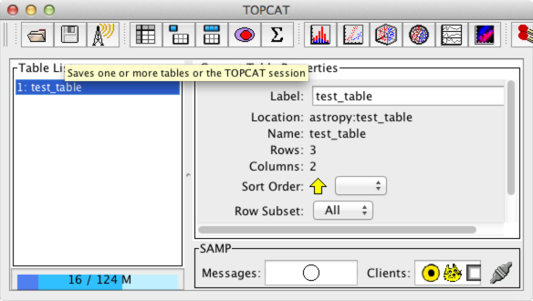
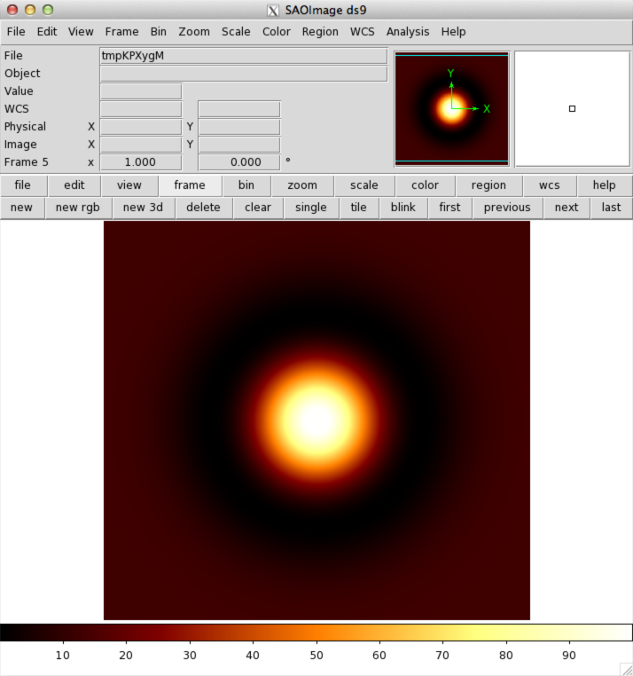

.. include:: references.txt

.. doctest-skip-all

.. _vo-samp:

***************************************************************
SAMP (Simple Application Messaging Protocol (`astropy.vo.samp`)
***************************************************************

Introduction
============

`astropy.vo.samp` is an IVOA SAMP (Simple Application Messaging Protocol)
messaging system implementation in Python. It provides functions and classes
to easily:

1. seamlessly send and receive data over SAMP
2. instantiate one or multiple Hubs
3. interface an application or script to a running Hub
4. create and manage a SAMP client

`astropy.vo.samp` provides also a stand-alone program ``samp_hub`` capable to
instantiate a persistent hub.

SAMP is a protocol that is used by a number of other tools such as
`TOPCAT <http://www.star.bris.ac.uk/~mbt/topcat/>`_,
`SAO Ds9 <http://hea-www.harvard.edu/RD/ds9>`_,
and `Aladin <http://aladin.u-strasbg.fr>`_, which means that it is possible to
send and receive data to and from these tools. The `astropy.vo.samp` package
also supports the 'web profile' for SAMP, which means that it can be used to
communicate with web SAMP clients. See the `sampjs
<http://astrojs.github.io/sampjs/>`_ library examples for more details.

.. _IVOA Simple Application Messaging Protocol: http://www.ivoa.net/Documents/latest/SAMP.html

.. _getting-started-samp:

Getting started
===============

This section describes how to easily send and receive images and tables using
of the high-level :func:`~astropy.vo.samp.high_level.send` and
:func:`~astropy.vo.samp.high_level.receive` functions. If you are interested
in using the SAMP client or hub classes, then jump ahead to :ref:`using-samp`.

The :func:`~astropy.vo.samp.high_level.send` function typically takes two
arguments: the data itself, and the name the dataset should be given in other
SAMP clients. A number of different Astropy data objects can be sent (such as
`~astropy.table.table.Table`, `~astropy.nddata.nddata.NDData`,
`~astropy.io.fits.PrimaryHDU`, `~astropy.io.fits.ImageHDU`,
`~astropy.io.fits.BinTableHDU`, `~astropy.io.fits.TableHDU` and other similar
objects). We can start off by creating a table using `astropy.table`:

    >>> from astropy.table import Table
    >>> t = Table()
    >>> t['a'] = [1, 2, 3]
    >>> t['b'] = [4, 5, 6]

We can now open up `TOPCAT
<http://www.star.bris.ac.uk/~mbt/topcat/>`_, which is a graphical tool for
table manipulation. Once TOPCAT is open, we can easily send the table to it over SAMP using::

    >>> from astropy.vo.samp import send
    >>> send(t, 'test_table')

You should now see the table appear in TOPCAT:

Similarly, images can be sent to image clients such as `SAO Ds9
<http://hea-www.harvard.edu/RD/ds9>`_ or `Aladin <http://aladin.u-strasbg.fr>`_.
We can first generate an image using a kernel from `astropy.convolution`::

    >>> from astropy.convolution import MexicanHat2DKernel
    >>> a = MexicanHat2DKernel(60).array

and we can once again easily send it to DS9 or Aladin over SAMP:

    >>> send(a, 'test_image')

The image should immediately appear in the clients:

By default, the :func:`~astropy.vo.samp.high_level.send` function will send
data to all the clients, but you can use the ``destination=`` keyword argument
to specifiy a particular client. You can use ``'ds9'``, ``'topcat'``, and
``'aladin'`` for these three popular clients::

    >>> send(a, 'test_image', destination='ds9')

You can also use :func:`~astropy.vo.samp.high_level.list_clients` to get a
complete list of available clients (as an :class:`~astropy.table.table.Table`)
object::

    >>> list_clients()
     id alias      name     table image
    --- ------ ------------ ----- -----
     c1 topcat       topcat   Yes    No
     c2 aladin       Aladin   Yes   Yes
     c3    ds9 SAOImage DS9   Yes   Yes

The ``destination`` argument should then either be given the ``id``, or one of
the aliases as described above.

Similarly, you can use the :func:`~astropy.vo.samp.high_level.receive`
function to receive data from another SAMP client. Unlike sending data, in
order to receive data there are two steps. First, from the Python console or
script you need to call the :func:`~astropy.vo.samp.high_level.receive`
function, which will automatically start a SAMP client that will be waiting
for the data. Second, from a running application like Topcat or Ds9, you need
to select a dataset and then find the appropriate menu option that sends or
broadcasts the data. For instance in Topcat, choose the menu item ``Interop``
=> ``Send table to ...`` => ``Astropy``. These options won't be available
until you have started the astropy Python client listening, which is done
with::

    >>> from astropy.vo.samp import receive
    >>> data = receive()

The above call to :func:`~astropy.vo.samp.high_level.receive` will hang until
you send data from one of the other SAMP clients to the Astropy client. The function will either return an
:class:`~astropy.table.table.Table` instance or a
:class:`~astropy.io.fits.HDUList` instance, depending on the data sent by the
other client.

The :func:`~astropy.vo.samp.high_level.send` and
:func:`~astropy.vo.samp.high_level.receive` functions provide easy ways to
exchange images and tables between applications, which are two of the most
common tasks for SAMP. However, SAMP is a general purpose mechanism for
exchanging data or control between participating clients, and it supports a
range of other operations. To perform these, send a message using the
low-level SAMP client classes described in detail in :ref:`using-samp`, with
an message type ("MType") that specifies the operation. A list of well-known
MTypes for operations like exchanging spectra, communicating sky positions,
and marking table rows can be found from `http://www.ivoa.net/samp/
<http://www.ivoa.net/samp/>`_. Clients are also free to define custom MTypes,
such as ``ds9.set``/``ds9.get``, used for full external control of SAOImage
Ds9.

.. _using-samp:

Using `astropy.vo.samp`
=======================

.. toctree::
   :maxdepth: 2

   example_hub
   example_single_client
   example_clients
   advanced_embed_samp_hub

Reference/API
=============

.. automodapi:: astropy.vo.samp

Acknowledgments
===============

This code is adapted from the `SAMPy <https://pypi.python.org/pypi/sampy>`__
package written by Luigi Paioro, who has granted the Astropy project permission
to use the code under a BSD license.
